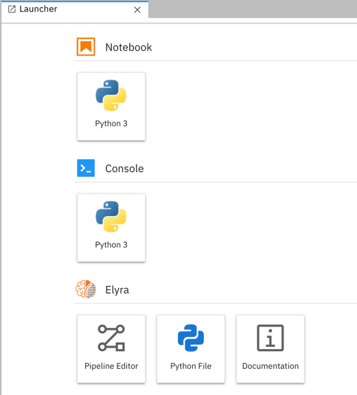

# Elyra quickstart

This short interactive quickstart provides an introduction to Elyra - an AI centric extension for JupyterLab. Note that this tour does not include features requiring software that is not bundled with Elyra or JupyterLab, such as the Notebook pipeline editor, which requires a KubeFlow Pipelines installation. 

A complete list of features can be found in [the documentation](https://elyra.readthedocs.io/en/latest/getting_started/overview.html).

An easy way to determine whether Elyra is installed in your JupyterLab is to look for the logo.

## Enhanced Notebook Support

### Run notebooks interactively in remote environments

The Elyra extension supports interactive notebook execution in remote environments, enabling you to take advantage of environments with special purpose hardware, such as GPUs and TPUs. This feature requires the [Jupyter Enterprise Gateway](https://jupyter-enterprise-gateway.readthedocs.io/en/latest/).

1. Open the "File Browser" tab on the left hand side.
1. Open a notebook (`.ipynb`). The currently selected kernel is displayed next to the kernel state indicator, which depicts a circle if the kernel is idle.
1. Click on the kernel name to choose a different one. If the only available options are local kernels, such as `python3`, your JupyterLab is not connected to an Enterprise Gateway.

   

Note that if your JupyterLab is connected to an Enterprise Gateway only remote kernels can be used.   

### Run notebooks as batch jobs in remote environments

You can run a notebook as a batch job in remote environments. This feature requires access to [Kubeflow Pipelines](https://www.kubeflow.org/docs/pipelines/overview/pipelines-overview/).

1. Open the "File Browser" tab on the left hand side.
1. Open a notebook (`.ipynb`).
1. Click "Submit notebook ..." and select a kubeflow pipeline configuration. If no [Kubeflow pipelines runtime is configured in your JupyterLab](https://elyra.readthedocs.io/en/latest/user_guide/runtime-conf.html) an error is raised.

   

## Table of Contents

In JupyterLab you can view a dynamically generated table of contents for notebooks and markdown files, making it easier to navigate through large files. Elyra will soon add similar functionality for Python scripts.

1. Open the "File Browser" tab on the left hand side.
1. Open a notebook (`.ipynb`) or markdown (`.md`) file.
1. Select the "Table of Contents" tab on the left hand side. Click on a heading to navigate to the corresponding location in the file.

   

   The Table of Contents functionality depends on the open file type. For example, you can hide (or unhide) code cells in notebooks by clicking on the twistie. 

## Python Editor

Elyra adds a basic Python script editor, which supports running in a local kernel or a remote kernel for offloading of compute intensive tasks. Remote execution requires a [Jupyter Enterprise Gateway](https://jupyter-enterprise-gateway.readthedocs.io/en/latest/). 

1. Open the "File Browser" tab on the left hand side.
1. Open a Python script or create a new script ("File" > "New" > "Python File")
1. Select a kernel from the drop down and click "Run" to execute the script.

   

## Code Snippets

Elyra introduces a re-usable code snippets feature, which enables you to define and insert custom pieces of code. 

1. Open the "File Browser" tab on the left hand side.
1. Open the `getting_started.ipynb` notebook.
1. Scroll to the bottom.
1. Position the cursor in the code cell that reads `# TODO: insert ...`.
1. Select the "Code Snippets" tab on the left hand side. 
1. Click on the plus sign next to the predefined code snippet to insert it.

   
