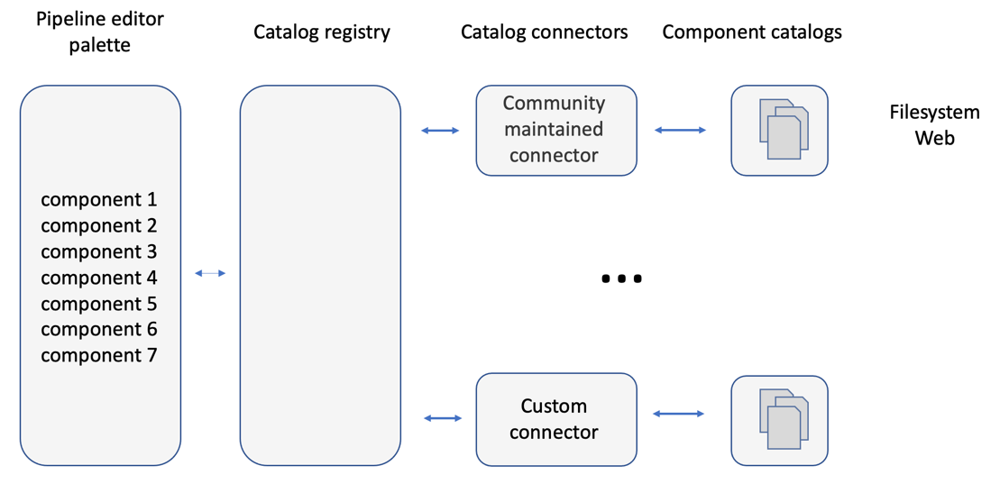

## How to build a component catalog connector

This content is under development.

### Catalog connector overview

Catalog connectors provide access to local or remote catalogs that store pipeline component definitions. 

The Elyra examples repository includes two types of catalog connectors:
 - Connectors for server-based catalogs: These types of connectors use an API to communicate with local or remote catalogs. 

   

   An example of such a connector is the [Machine Learning Exchange (MLX)](mlx-connector/) connector. This connector uses the MLX API to query the catalog and to retrieve the components that this catalog makes available.

 - Connectors with a built-in catalog: These connectors include a built-in static catalog, eliminating the need for network connectivity once they are installed. This makes them suitable for air gapped environments, but also rather inflexible because a catalog content refresh requires a connector rebuild.

   

   The [Apache Airflow component examples connector](airflow-example-components-connector/) and the [Kubeflow Pipelines component examples connector](kfp-example-components-connector/) are two examples. They make a static set of components available.

Irrespective of which type of connector you plan to implement, you need to complete the following tasks:
 - create a catalog connector schema
 - create a schema provider
 - implement the catalog connector
 - package the catalog connector

To get you started quickly with catalog connector development, the Elyra examples repository includes [quickstart catalog connector template files](connector-template/), which
are referenced in the instructions below.

The quickstart connector contains a built-in catalog, which contains only a single component. The aforementioned Kubeflow Pipelines and Apache Airflow component examples connectors are more flexible versions of this connector, which can serve many components.

All connectors have in common that they use a schema to define their properties and they implement the same APIs, enabling Elyra to query the catalogs and retrieve the stored components.

### Create a catalog connector schema

A catalog connector schema defines ...

Example catalog connector schemas:
 - [Kubeflow Pipelines example components connector schema](kfp-example-components-connector/kfp_examples_connector/elyra-kfp-catalog.json)
 - [MLX connector schema](mlx-connector/mlx_catalog_connector/mlx-catalog.json)

### Create a schema provider

To make your catalog connector schema available to Elyra you need to implement a custom [SchemasProvider](https://github.com/elyra-ai/elyra/blob/1dbfd09e99ae37a998616d193d9b10cdf2bd297b/elyra/metadata/schema.py#L379) and its `get_schemas(self) -> List[Dict]` method.
The method should read your catalog connector schema JSON file and return it as a dictionary. 

Example `SchemasProvider` implementations:
 - [Kubeflow Pipelines example components connector](kfp-example-components-connector/kfp_examples_connector/examples_schema_provider.py)
 - [MLX connector](mlx-connector/mlx_catalog_connector/mlx_schema_provider.py)

### Implement the catalog connector

Lorem Ipsum

### Package the catalog connector

Lorem Ipsum

### Troubleshooting

Inspect the JupyterLab log file for error messages to troubleshoot connector issues during development:

**The catalog connector is not displayed in the new component catalog list.**
 - TODO

**No catalog components are displayed in the Visual Pipeline Editor palette.**
  - `No definition content found for catalog entry with identifying information: {'...': '...'}. Skipping...` - 
  - TODO

