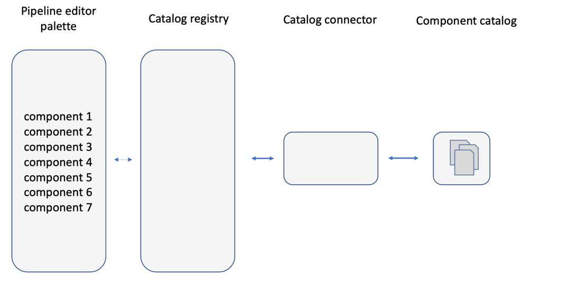
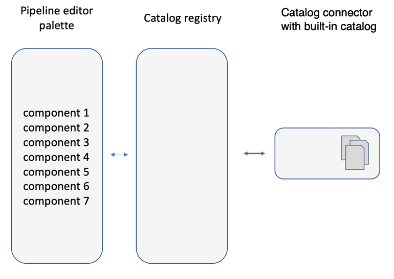
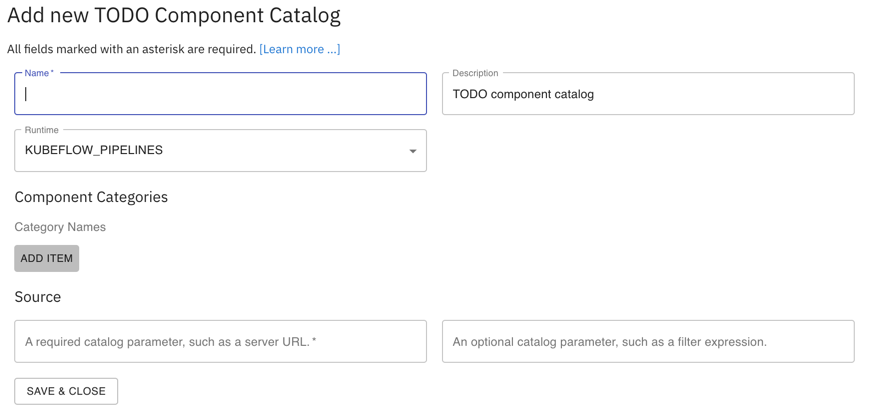

## How to build a component catalog connector

### Catalog connector overview

Catalog connectors provide access to local or remote catalogs that store pipeline component definitions. 


The Elyra examples repository includes two types of catalog connectors:
 - Connectors for server-based or service-based catalogs: These types of connectors use an API to communicate with local or remote catalogs. 

   

   An example of such a connector is the [Machine Learning Exchange (MLX)](mlx-connector/) connector. This connector uses the MLX API to query the catalog and to retrieve the components that this catalog makes available.

 - Connectors with a built-in catalog: These connectors include a built-in static catalog, eliminating the need for network connectivity once they are installed. This makes them suitable for air gapped environments, but also rather inflexible since any content changes in the catalog will require a connector rebuild.

   

   The [Apache Airflow component examples connector](airflow-example-components-connector/) and the [Kubeflow Pipelines component examples connector](kfp-example-components-connector/) are two examples. Each connector provides a static set components for each respective runtime.

Irrespective of which type of connector you plan to implement, you need to complete the following tasks:
 - create a catalog connector schema
 - create a schema provider
 - implement the catalog connector, which queries the catalog and retrieves components from the catalog
 - package the catalog connector

To get you started quickly with catalog connector development, the Elyra examples repository includes [quickstart catalog connector template files](connector-template/), which are referenced in the instructions below.

The quickstart connector contains a built-in catalog, which contains only a single component. The aforementioned Kubeflow Pipelines and Apache Airflow component examples connectors are more flexible versions of this connector, which can serve many components.

### Prepare for development

1. Install Elyra version 3.3 or later from PyPI or source.
1. Clone or fork the [Elyra examples repository](https://github.com/elyra-ai/examples).
1. Change into the `component-catalog-connectors/connector-template` directory. The directory contains a fully functional connector implementation that can be customized to meet your needs.
1. Verify that the quickstart template connector works as expected by completing the [installation and usage instructions in the README](/component-catalog-connectors/connector-template/README.md).

### Create a catalog connector schema

All catalog connectors have in common that they use a schema to define their internal and public properties. The public properties are exposed to the user in the catalog connector configuration, as shown for the quickstart template connector below:



The common public properties are:
 - "learn more" link, providing access to to connector documentation
 - catalog instance name
 - catalog instance description
 - runtime type filter, which governs the kind of components the connector makes available
 - component categories, which group the components together in the pipeline editor

Connector schemas can optionally also include custom public properties. For illustrative purposes, the quickstart template connector defines a required custom property and an optional custom property. Required properties are typically used to collect catalog connectivity information, such as a server URL, or API token. 

#### Customize the schema

The quickstart connector default schema file `TODO-catalog.json` is located in the [`todo_catalog_connector`](/component-catalog-connectors/connector-template/todo_catalog_connector/) directory.
1. Rename the file to reflect your catalog type.
1. Using an IDE of your choice, find and replace all occurrences of '`TODO-catalog.json`' in all files in the `component-catalog-connectors/connector-template` directory. (There should be seven.)
1. Open the renamed `TODO-catalog.json` schema file in an editor.
1. To avoid breaking the connector, do not: 
     - Remove existing properties, unless indicated otherwise in the comments
     - Change existing property names, unless indicated otherwise in the comments
     - Change existing property values, unless indicated otherwise in the comments
1. Customize the following common catalog connector schema properties:
   - `$id`: replace the URL with a valid URL for the renamed schema file.
   - `title`: Replace the placeholder value, as desired
   - `name`: Replace the placeholder value `todo-catalog` with a unique identifier for your catalog connector type.
   - `uihints.title`: Replace the placeholder value with the value of the `title` property.
   - `uihints.reference_url`: This is the "Learn more" link mentioned earlier. Replace the placeholder as desired.
   - `properties.schemaname.const`: Replace with the new value of `name`.
   - `properties.metadata.properties.description.default`: This is the default value for the catalog instance description. Replace the placeholder as desired. (Empty value is okay.)  
   - `properties.metadata.runtime_type.enum`: This list defines the runtime types that the connector supports. The quickstart connector is configured for Kubeflow Pipelines only. Specify `["KUBEFLOW_PIPELINES"]`, `["APACHE_AIRFLOW"]`, or `["KUBEFLOW_PIPELINES", "APACHE_AIRFLOW]`, as appropriate. 
   - `properties.metadata.runtime_type.default`: The value defines the default selection for `properties.metadata.runtime_type.enum`. (Empty value is okay.)
   - `properties.metadata.categories.default`: This list defines the categories to which the retrieved components will be assigned by default. The user can override the default selection in the connector's configuration screen.
1. Customize the custom catalog connector schema properties. As mentioned earlier, the quickstart connector defines for illustrative purposes a required property (`properties.metadata.todo_required_parm`) and an optional property (`properties.metadata.todo_optional_parm`). 
   - Remove the properties if your connector does not require any user input to fetch the connector list from the catalog or to retrieve components. This typically only applies to connectors with built-in catalogs, such as the [Kubeflow Pipelines example components connector](/component-catalog-connectors/kfp-example-components-connector/kfp_examples_connector/elyra-kfp-catalog.json).
   - Otherwise, customize the properties as desired. (You can add as many properties as necessary) You typically need to do this for connectors that access remote catalogs, such as the [MLX connector](/component-catalog-connectors/mlx-connector/mlx_catalog_connector/mlx-catalog.json).
1. Specify which custom catalog connector schema properties are required. If marked required, the user must provide a non-empty input in the connector configuration.
   - `properties.metadata.required`: Update this list as appropriate, leaving `"runtime_type"` as is.
1. Perform a case-insensitive search for `todo` in the file. If one or more matches are still present inthe file verify that you completed all instructions. 
1. Save the updated schema file.

Next, you implement a schema provider that makes the content of the updated schema file available to Elyra.

### Create a schema provider

To make your catalog connector schema available to Elyra you need to implement a custom [SchemasProvider](https://github.com/elyra-ai/elyra/blob/1dbfd09e99ae37a998616d193d9b10cdf2bd297b/elyra/metadata/schema.py#L379) and its `get_schemas(self) -> List[Dict]` method. The method should read your catalog connector schema JSON file and return it as a dictionary. 

The quickstart connector schema provider source code `todo_schema_provider.py` is located in the [`todo_catalog_connector`](connector-template/todo_catalog_connector) directory.

Example `SchemasProvider` implementations:
 - [Kubeflow Pipelines example components connector](/component-catalog-connectors/kfp-example-components-connector/kfp_examples_connector/examples_schema_provider.py)
 - [MLX connector](/component-catalog-connectors/mlx-connector/mlx_catalog_connector/mlx_schema_provider.py)

### Implement the catalog connector

A catalog connector class implements the API that Elyra uses to query the component catalog and retrieve components. The quickstart connector class source code `todo_catalog_connector.py` is located in the [`todo_catalog_connector`](connector-template/todo_catalog_connector) directory.

1. Customize the class name.
1. Implement the `get_catalog_entries`, `read_catalog_entry`, and `get_hash_keys` methods.

Example catalog connector implementations:
 - [Kubeflow Pipelines example components connector](/component-catalog-connectors/kfp-example-components-connector/kfp_examples_connector/examples_connector.py)
 - [MLX connector](/component-catalog-connectors/mlx-connector/mlx_catalog_connector/mlx_component_catalog_connector.py)

### Customize the setup script

The quickstart `setup.py` is located in the [`connector-template`](/component-catalog-connectors/connector-template/) directory.

1. Customize the metadata as required, by replacing all `TODO` placeholder values.
1. Customize the `metadata.schemas_providers` [entrypoint](https://packaging.python.org/en/latest/specifications/entry-points/). Elyra uses this entrypoint to detect and access available component catalog schemata. 
   - Replace `todo-catalog-schema` name
   - Replace `todo_catalog_connector.todo_schema_provider:TODOSchemasProvider`
1. Customize the `elyra.component.catalog_types` entrypoint:
   - Replace the `todo-catalog` name with the `name` property value you've specified in the customized `TODO-catalog.json` schema file. 
   - In the `todo_catalog_connector.todo_catalog_connector:TODOComponentCatalogConnector` object reference replace the placeholders as follows:
     - `todo_catalog_connector.todo_catalog_connector` with your customized catalog connector's package name and customized Python class filename
     - `TODOComponentCatalogConnector` with your customized catalog connector's class name.

Example customized setup scripts:
 - [Kubeflow Pipelines example components connector](/component-catalog-connectors/kfp-example-components-connector/setup.py)
 - [MLX connector](/component-catalog-connectors/mlx-connector/setup.py)

### Build the catalog connector package

You can use the included `Makefile` to build the connector package.

```
$ make
dist                  Build distribution
install               Install component connector package from PyPI
publish               Upload package to PyPI
source-install        Install component connector package from source 
test-publish          Upload package to test PyPI
```

1. Customize the `Makefile`:
   - Update variable `PACKAGE_NAME` to match the value you've specified in `setup.py`.
   - Set variable `PACKAGE_PATH` to the directory where the connector's source code is stored. The linter is configured to scan the specified directory

1. Build and install the connector package from source.

   ```
   $ make source-install
   ```   

### Test the catalog connector package

Confirm that the connector works as expected.

1. Launch JupyterLab.
1. [Open the `Catalog components` panel](https://elyra.readthedocs.io/en/latest/user_guide/pipeline-components.html#managing-custom-components-using-the-jupyterlab-ui).
1. Click `+` and confirm that your connector is displayed in the installed list.
1. Enable the connector by configuring an instance.
1. Test the connector.

Refer to the [_Troubleshooting_](#troubleshooting) section for a list of common issues.

### Update the user documentation

A connector should include documentation that informs users how to: install and uninstall the connector, configure the connector, and any other important information you wish to relay to the user.

1. Customize the `README.md` in the `connector-template` directory 

Example customized `README.md`:
 - [Kubeflow Pipelines example components connector](/component-catalog-connectors/kfp-example-components-connector/README.md)
 - [MLX connector](/component-catalog-connectors/mlx-connector/README.md)

### Publish and share your connector

If you would like to share your connector with the community, follow the [instructions on this page](connector-directory.md).

### Troubleshooting

Inspect the JupyterLab log file for error messages to troubleshoot connector issues during development. Below is a list of common problems we've observed during initial development. If you are unable to identify the root cause, [get in touch with us using one of these community channels](https://elyra.readthedocs.io/en/stable/getting_started/getting-help.html).

**The catalog connector is not displayed in the new component catalog list.**

  - Message:

    ```
    Error loading schemas for SchemasProvider 'my-catalog-schema' - module 'my_catalog_connector.my_schema_provider' has no attribute 'MySchemasProvider'
    ```
    Action: Verify the `metadata.schemas_providers` entrypoint in `setup.py`. The entrypoint object reference cannot be resolved to an existing Python class. 

  - Message:
 
    ```
    Error loading schemas for SchemasProvider 'todo-catalog-schema' - No module named 'todo_catalog_connector'
    ```
    Action: Verify the `metadata.schemas_providers` entrypoint in `setup.py`. The entrypoint object reference is invalid. 

**No catalog components are displayed in the Visual Pipeline Editor palette.**

The JupyterLab log file should include an error message that explains what happened. If there is no message, make sure the connector implementation class's `get_catalog_entries` method returns results.

  - Message:

    ```
    No entrypoint with name 'my-catalog' was found in group 'elyra.component.catalog_types' to match the 'schema_name' given in catalog 'mytestcatalog'. Skipping...
    ```

    Action:  Verify that `elyra.component.catalog_types` _entrypoint name_ ("my-catalog" in the example above) in `setup.py` matches the value of the `schema_name` property in the connector's schema file.
   
  - Message:

    ```
    No definition content found for catalog entry with identifying information: {'...': '...'}. Skipping... 
    ```

    Action: The connector implementation class's `read_catalog_entry` method did not return a component for the provided identifying information. This identifying information was returned by the connector implementation class's `get_catalog_entries` method. Make sure that the information is correct and that the component exists in the catalog.


