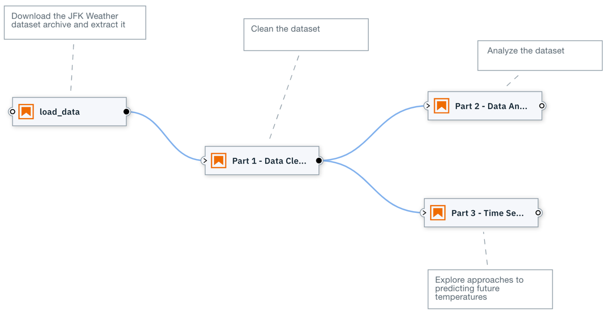
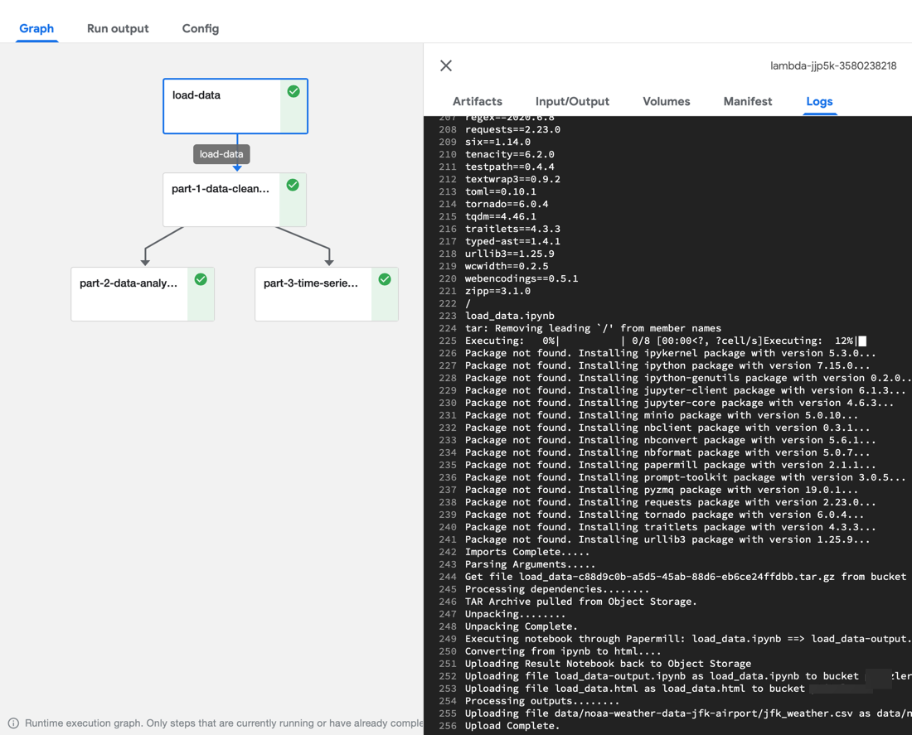
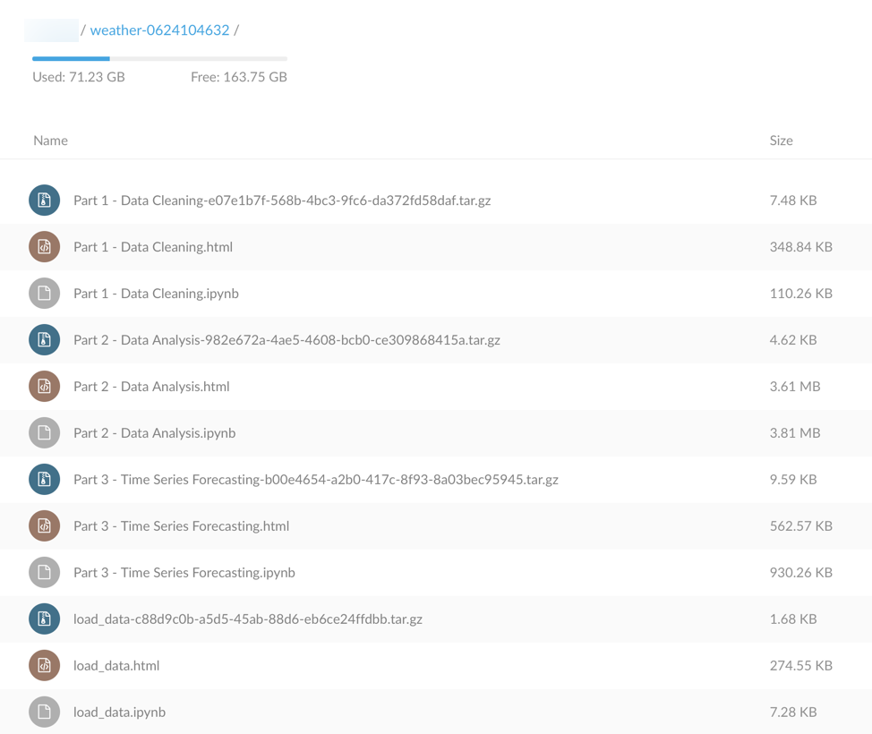

## Overview

This notebook pipeline downloads [a free NOAA weather time series data set archive from the Data Asset Exchange](https://developer.ibm.com/exchanges/data/all/jfk-weather-data/), extracts, cleanses and analyzes the data file. The data file is subsequently used to predict the weather. 

This pipeline illustrates the following concepts:
 - **Execute notebooks sequentially**. Notebook `Part 1 - Data Cleaning` runs after notebook `load_data` completed successfully.
 - **Execute notebooks in parallel**. Notebooks `Part 2 - Data Analysis` and `Part 3 - Time Series Forecasting` run in parallel after notebook `Part 1 - Data Cleaning` completed successfully.
 - **Pass input parameters to a notebook**. The generic `load_data` notebook requires an environment variable to be defined that identifies the public dataset download URL.
 - **Share data between notebooks**. Notebook `Part 1 - Data Cleaning` generates a data file `jfk_weather_cleaned.csv`, which is consumed in notebook `Part 2 - Data Analysis` and `Part 3 - Time Series Forecasting`.

 ## Exploring the pipeline

 1. [Configure a KubeFlow runtime environment in Elyra](https://elyra.readthedocs.io/en/latest/user_guide/runtime-conf.html) 
 1. Clone the sample repository.
 1. Navigate to the pipeline directory.
 1. Launch JupyterLab, which has the Elyra extension installed.
 1. Open the `analyze_NOAA_weather_data.pipeline`.
 1. Review the notebook properties (right click > "Properties").
 1. Review the notebooks (right click > "Open notebook").
 1. Run the pipeline. Two links are displayed.
 1. Open the Kubeflow console link in a new browser window. You can monitor the pipeline execution progress by clicking on a node and opening the "Logs" tab. 
    
 1. Open the object storage link in another browser window to download the completed notebooks.
     
 

