## Getting started with notebook pipelines

A notebook pipeline comprises of notebook nodes that are connected with each other. 

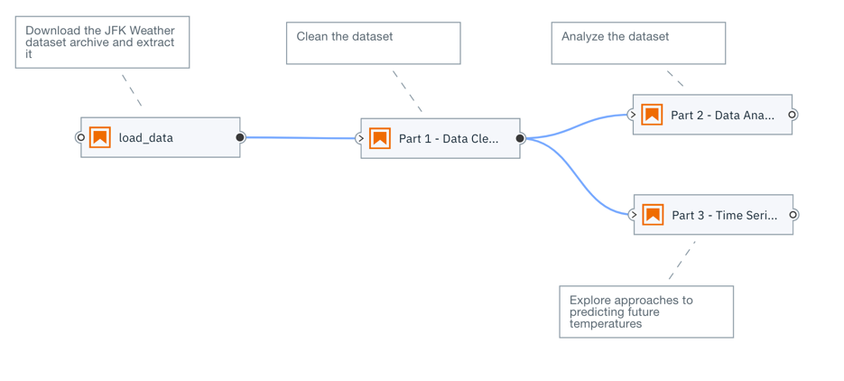

In this tutorial you will learn how to create a notebook pipeline and run it in your local development environment. When you run a notebook pipeline in your local environment, each notebook is executed on the machine where JupyterLab is running, such as your laptop. Since resources on that machine might be limited local pipeline execution might not always be a viable option.

A companion tutorial will cover how to run pipelines on Kubeflow Pipelines, enabling you to take advantage of shared compute resources that might dramatically reduce pipeline processing time or allow for processing of much larger data volumes.

### Prerequisites

- JupyterLab 2.x with the Elyra extension v1.1.x (or newer) installed

### Setup

This tutorial uses the `Hello world` sample from the https://github.com/elyra-ai/examples GitHub repository.
1. Launch JupyterLab
1. Open the _Git clone_ wizard (Git > Clone)
1. Enter `https://github.com/elyra-ai/examples.git` as URI.
1. In the _File Browser_ navigate to `examples/pipelines/hello_world`

   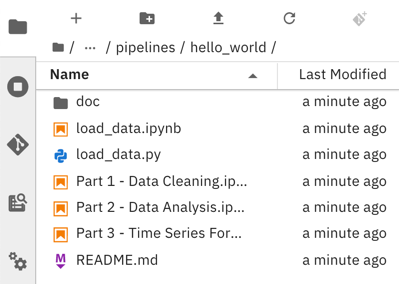

You are ready to start the tutorial.

### Creating a notebook pipeline

1. Open the _Launcher_ (File > New Launcher) if it is not already open.

   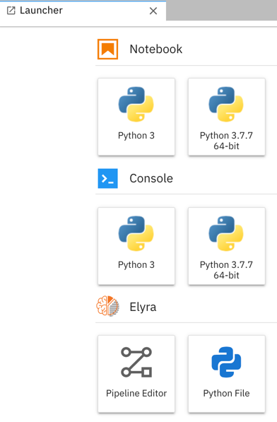

1. Open the _Pipeline Editor_ (Elyra > Pipeline Editor) to create a new untitled pipeline.

   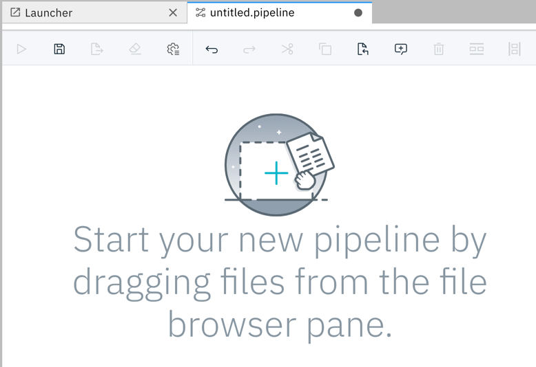

1. In the _File Browser_ pane, right click on the untitled pipeline and select &#x270E; _Rename_.

   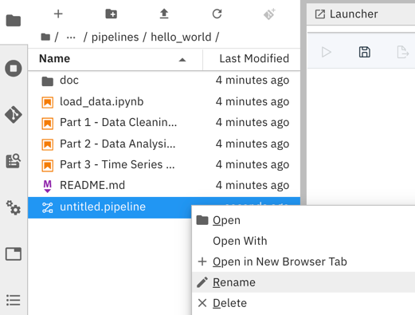

1. Change the pipeline name to `hello_world`.

Next, you'll add a notebook to the pipeline that downloads an open data set archive from public cloud storage.

### Adding a notebook to the pipeline

1. From the _File Browser_ pane drag the `load_data.ipynb` notebook onto the canvas.

   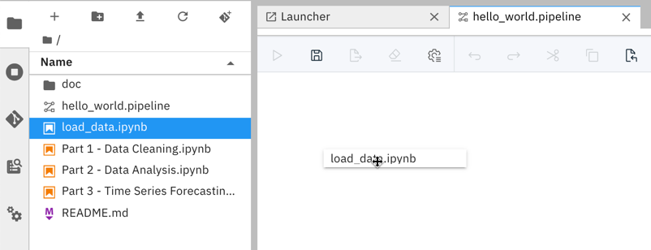

1. Right click on the `load_data` notebook node to customize its execution properties.

   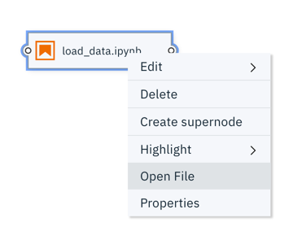

   Some of the properties are only required when you plan to run the pipeline on Kubeflows Pipelines. However, it is considered good practice to specify those properties to allow for easy migration from development to test and production. Details are in the instructions below.

1. As _Runtime Image_ choose `Pandas`. The runtime image identifies the Docker image that is used to execute the notebook when the pipeline is run on Kubeflows Pipelines. This setting is ignored when you run the pipeline locally. This setting must always be specified.

   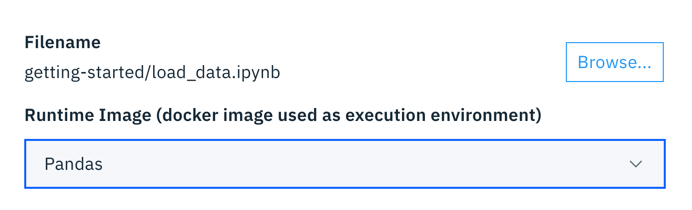

   If a notebook requires access to local files, such as python scripts, you can specify them as _File Dependencies_. When you run a pipeline locally this setting is ignored because the notebook can access all (readable) files in your workspace. However, it is considered good practise to explicitly declare file dependencies to make the pipeline also runnable in environments where notebooks are executed isolated from each other.

1. The `load_data.ipynb` notebook does not have any file dependencies. Leave the input field empty.

    

    If desired, you can customize additional notebook inputs by defining environment variables. The `load_data.ipynb` notebook requires environment variable `DATASET_URL`. This variable identifies the name and location of a data set file, which the code in this notebook will download and decompress. 
    
1. Assign environment variable `DATASET_URL` the value `https://dax-cdn.cdn.appdomain.cloud/dax-noaa-weather-data-jfk-airport/1.1.4/noaa-weather-data-jfk-airport.tar.gz`.

   ```
   DATASET_URL=https://dax-cdn.cdn.appdomain.cloud/dax-noaa-weather-data-jfk-airport/1.1.4/noaa-weather-data-jfk-airport.tar.gz
   ```

    

    If the notebook generates files that other notebooks require access to, specify them as _Output Files_. This setting is ignored if you are running a pipeline locally because all notebooks have access to the same shared file system. However, it is considered good practise to declare these files to make the pipeline also runnable in environments where notebooks are executed in isoluation from each other.

1.  The notebook generates output file `data/noaa-weather-data-jfk-airport/jfk_weather.csv`, which other notebooks in this pipeline process.

    

    > It is considered good pratice to specify paths that are relative to the notebook location.

1. Select the `load_data` node and attach a comment to it.

   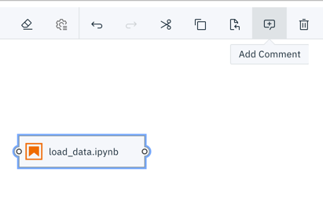

   The comment is automatically associated with the node.

   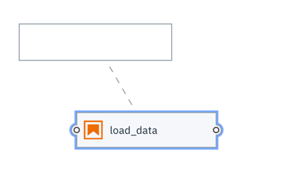

1. In the comment node enter a descriptive text, such as `Download the JFK Weather dataset archive and extract it`.

   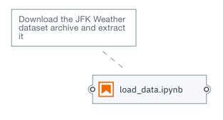

Next, you'll add a second notebook to the pipeline and connect it with the first notebook in such a way that it is executed _after_ the first notebook. This notebook cleans the data in  `data/noaa-weather-data-jfk-airport/jfk_weather.csv`, which the `load_data` notebook produced.

### Adding a second notebook to the pipeline

1. Drag the `Part 1 - Data Cleaning.ipynb` notebook onto the canvas.
1. Customize its execution properties as follows:
   - Runtime image: `Pandas`
   - Output files: `data/noaa-weather-data-jfk-airport/jfk_weather_cleaned.csv`
1. Attach a comment node to the `Part 1 - Data Cleaning` node and provide a description, such as `Clean the dataset`. 
1. Connect the _output port_ of the `load_data` node to the _input port_ of the `Part 1 - Data Cleaning` node to establish a depency between the two notebooks.

   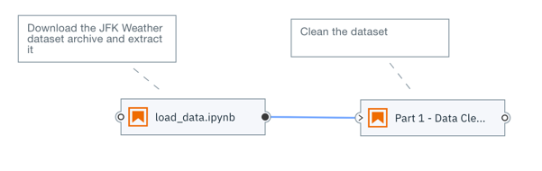

1. Save the pipeline.

    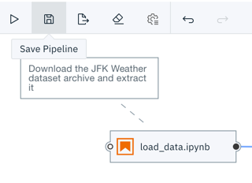

You are ready to run the pipeline.

### Running a notebook pipeline locally

When you run a notebook pipeline locally the notebooks are executed on the machine where JupyterLab is running.

1. Run the pipeline.

   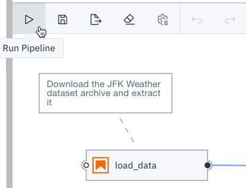

1. Enter `hello_world_pipeline` as _Pipeline name_.
1. From the _Runtime configuration_ drop down select `Run in-place locally`.

   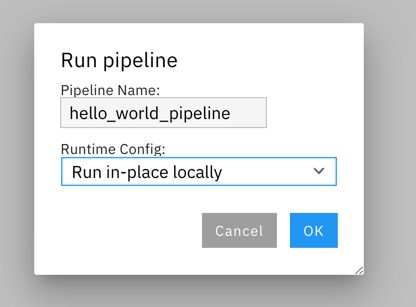

1. Start the pipeline run. A message similar to the following is displayed after the run completed.

    


You can monitor the run progress in the JupyterLab console.

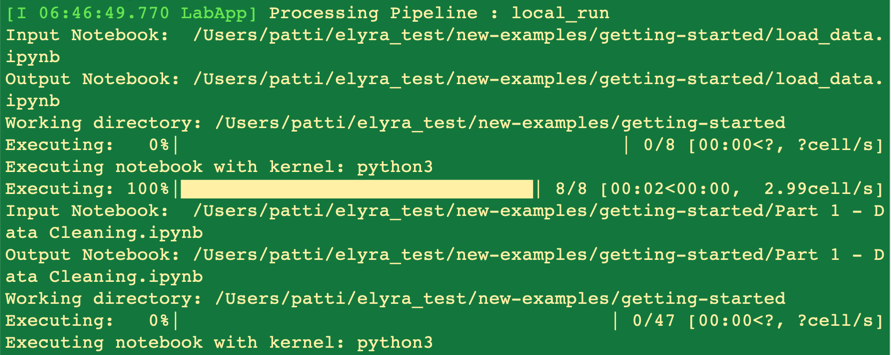

### Inspecting the pipeline run results

A _local pipeline run_ produces the following output artifacts:
- Each executed notebook is updated and includes the run results in the output cells.
- If any notebook persists data/files they are stored in the local file system.

You can access output artifacts from the _File Browser_. In the screen capture below the `hello_world` pipeline output artifacts are highlighted in green.

 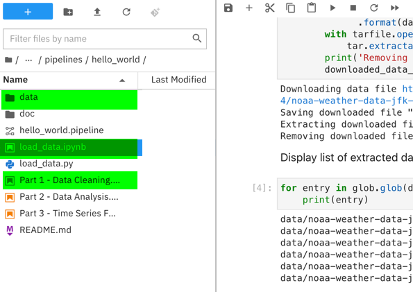

### Next steps

This concludes the Hello World tutorial. You've learned how to 
- create a notebook pipeline
- add and configure notebooks
- run a notebook pipeline in a local environment
- monitor the pipeline run progress
- inspect the pipeline run results

If you'd like you can extend the pipeline by adding two more notebooks, which can be executed in parallel after notebook `Part 1 - Data Cleaning.ipynb` was processed:
 - `Part 2 - Data Analysis.ipynb`
 - `Part 3 - Time Series Forecasting.ipynb`

Each of the notebooks can run in the `Pandas` Docker image and doesn't have any input dependencies, doesn't require any environment variables and doesn't produce an additional output files.

 
