<!--

Copyright 2018-2020 Elyra Authors

Licensed under the Apache License, Version 2.0 (the "License");
you may not use this file except in compliance with the License.
You may obtain a copy of the License at

http://www.apache.org/licenses/LICENSE-2.0

Unless required by applicable law or agreed to in writing, software
distributed under the License is distributed on an "AS IS" BASIS,
WITHOUT WARRANTIES OR CONDITIONS OF ANY KIND, either express or implied.
See the License for the specific language governing permissions and
limitations under the License.

-->
## Getting started with AI pipelines

In Elyra, an AI pipeline comprises of Jupyter notebook nodes or Python script nodes that are connected with each other. You can use pipelines to automate the complete machine learning lifecycle (e.g. load data, pre-process data, analyze data, train model, ...), parts of the lifecycle (e.g. pre-process and analyze data), or to run any kind of Jupyter notebook or Python script as a batch job. 

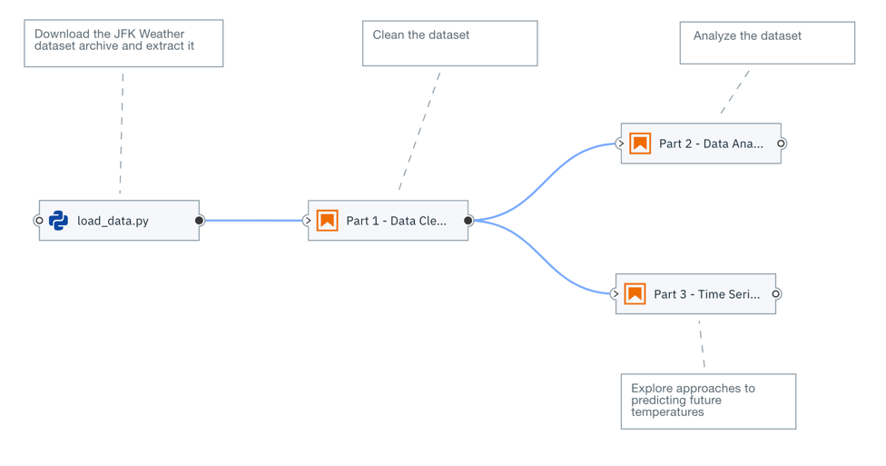

You can run pipelines locally in JupyterLab or remotely on [Apache Airflow](https://airflow.apache.org/) and [Kubeflow Pipelines](https://www.kubeflow.org/docs/components/pipelines/).

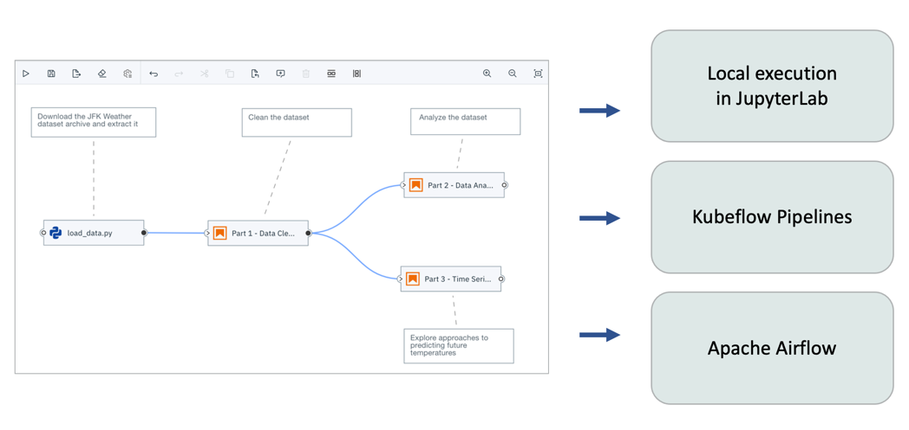

In this tutorial you will learn how to create a pipeline and run it on Apache Airflow. Two additional tutorials are available that illustrate the process for pipeline execution [in JupyterLab](https://github.com/elyra-ai/examples/tree/master/pipelines/introduction-to-generic-pipelines) and [on Kubeflow Pipelines](https://github.com/elyra-ai/examples/tree/master/pipelines/hello_world_kubeflow_pipelines).

### Prerequisites

To complete this tutorial you need
- [JupyterLab 3.x with the Elyra extension v2.1 (or newer) installed](https://elyra.readthedocs.io/en/latest/getting_started/installation.html).
- Access to a local or cloud deployment of Apache Airflow that has been [configured for use with Elyra](https://elyra.readthedocs.io/en/latest/recipes/configure-airflow-as-a-runtime.html).

This tutorial was tested with Elyra 2.1.x and Apache Airflow v1.10.12.

> Apache Airflow version 2.x is currently not supported.

#### Information to collect before starting

Gather the following information:

- Apache Airflow API endpoint, e.g. `https://your-airflow-webserver:port`

Elyra currently supports Apache Airflow deployments that utilize GitHub or GitHub Enterprise for Directed Acyclic Graph ([DAG](https://airflow.apache.org/docs/apache-airflow/stable/concepts.html#dags)) storage. Collect the following information:

- GitHub server API endpoint, e.g. `https://api.github.com`
- Name and owner of the repository where DAGs are stored, e.g. `your-git-org/your-dag-repo`. This repository must exist.
- Branch in named repository, e.g. `test-dags`. This branch must exist.
- [Personal access token](https://docs.github.com/en/github/authenticating-to-github/creating-a-personal-access-token) that Elyra can use to push DAGs to the repository, e.g. `4d79206e616d6520697320426f6e642e204a616d657320426f6e64`

Elyra utilizes S3-compatible cloud storage to make data available to notebooks and Python scripts while they are executed. Any kind of cloud storage should work (e.g. IBM Cloud Object Storage or Minio) as long as it can be accessed from the machine where JupyterLab is running and the Apache Airflow cluster. Collect the following information:
- S3 compatible object storage endpoint, e.g. `http://minio-service.kubernetes:9000`
- S3 object storage username, e.g. `minio`
- S3 object storage password, e.g. `minio123`
- S3 object storage bucket, e.g. `airflow-task-artifacts`

### Setup

This tutorial uses the `hello_world_apache_airflow` sample from the https://github.com/elyra-ai/examples GitHub repository.

1. Launch JupyterLab.
1. Open the _Git clone_ wizard (Git > Clone A Repository).
1. Enter `https://github.com/elyra-ai/examples.git` as _Clone URI_.
1. In the _File Browser_ navigate to `examples/pipelines/hello_world_apache_airflow`.

   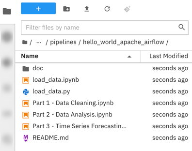
   
   The cloned repository includes a set of Jupyter notebooks and a Python script that download a weather data set from an [open data directory called the Data Asset Exchange](https://developer.ibm.com/exchanges/data/all/jfk-weather-data/), cleanse the data, analyze the data, and perform time-series predictions. In this tutorial you create a pipeline that runs these files as a batch  in the appropriate order. 

You are ready to start the tutorial.

### Creating a pipeline

Generally speaking, a pipeline in Elyra is an abstract representation of a workflow, which is in this tutorial executed using an Apache Airflow DAG.

1. Open the _Launcher_ (File > New Launcher) if it is not already open.

   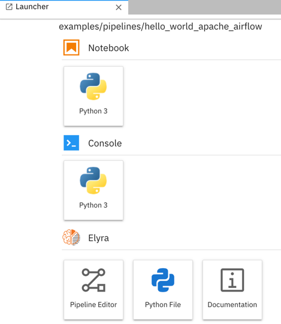

1. Open the _Pipeline Editor_ (Elyra > Pipeline Editor) to create a new untitled pipeline.

   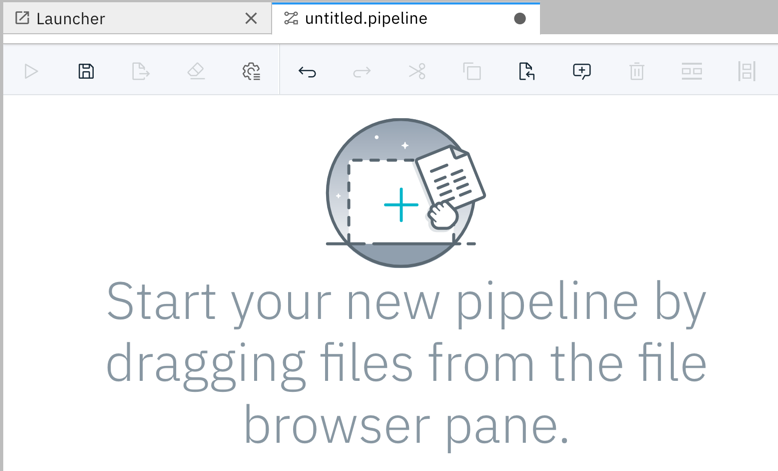

1. In the _File Browser_ pane, right click on the untitled pipeline and select &#x270E; _Rename_.

   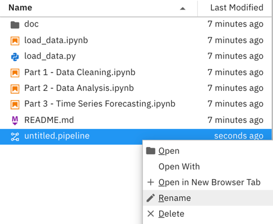

1. Change the pipeline name to `hello_world_apache_airflow`.

Next, you'll add a file to the pipeline that downloads an open data set archive from public cloud storage.

### Adding a notebook or Python script to the pipeline

Python scripts and notebooks are represented in Elyra as nodes. Each node maps to task in Apache Airflow, which is executed with the help of Elyra's [`NotebookOp` operator](https://github.com/elyra-ai/airflow-notebook).

1. From the _File Browser_ pane drag the `load_data.ipynb` notebook onto the canvas. If you  like, you can add the `load_data.py` Python script instead. The script provides the same functionality as the notebook. The instructions below assume that you've added the notebook to the pipeline but the steps you need to complete if you are using the Python script are identical.

   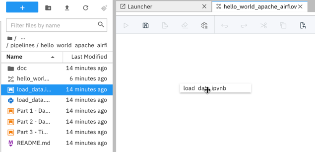

   > To open the associated notebook or Python script in an editor window, double click on the node name.

1. Right click on the `load_data` node to customize its properties.

   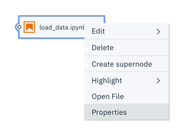

   The execution properties define the runtime environment, input artifacts (file dependencies and environment variables), and output files.

   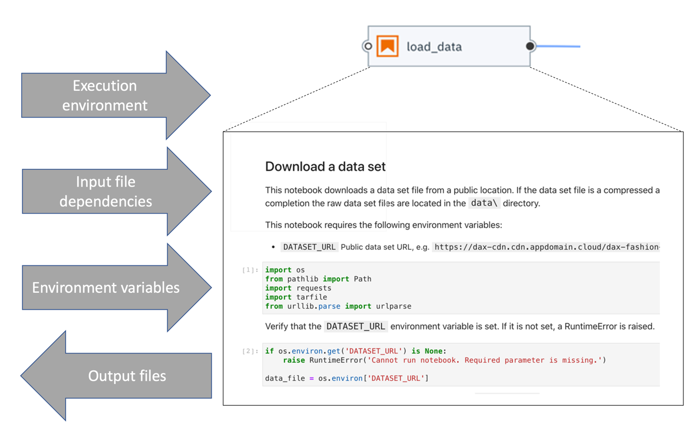

1. By default the file name is used as node label. You should customize the label text if it is too long (and therefore displayed truncated on the canvas) or not descriptive enough.

   

1. Notebooks or Python scripts are executed as tasks in Apache Airflow with the help of Elyra's [`NotebookOp` operator](https://github.com/elyra-ai/airflow-notebook).

   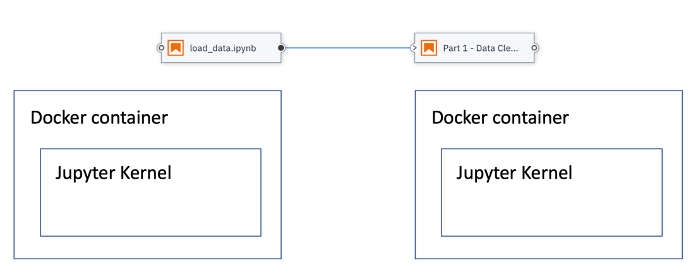

   When you configure a node you identify the _runtime image_, which will be used to instantiate the container. You can choose from a set of pre-configured public images or [register your own](https://elyra.readthedocs.io/en/latest/user_guide/runtime-image-conf.html). 

   > Custom images must meet certain requirements, as stated in the documentation, and should have all prerequisite packages pre-installed to assure the same package versions are used across multiple pipeline executions.  

   In this tutorial you'll use the stock `Pandas` container image to run the notebook or script and all other notebooks.

   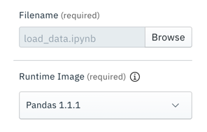

   If the container requires a specific minimum amount of resources during execution, you can specify them. For example, to speed up model training, you might want to make GPUs available. 

   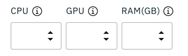

   > If no custom requirements are defined, the defaults in the Apache Airflow environment are used.

1. By default only the file that's associated with the node is made available in the container. If it requires access to other files that are stored on your local machine you have to specify them as _file dependencies_. Files that have been declared as a dependency are packaged together with the notebook or Python script, uploaded to a cloud storage bucket and downloaded into the running container prior to execution. In this tutorial we are referring to these files as input artifacts.

   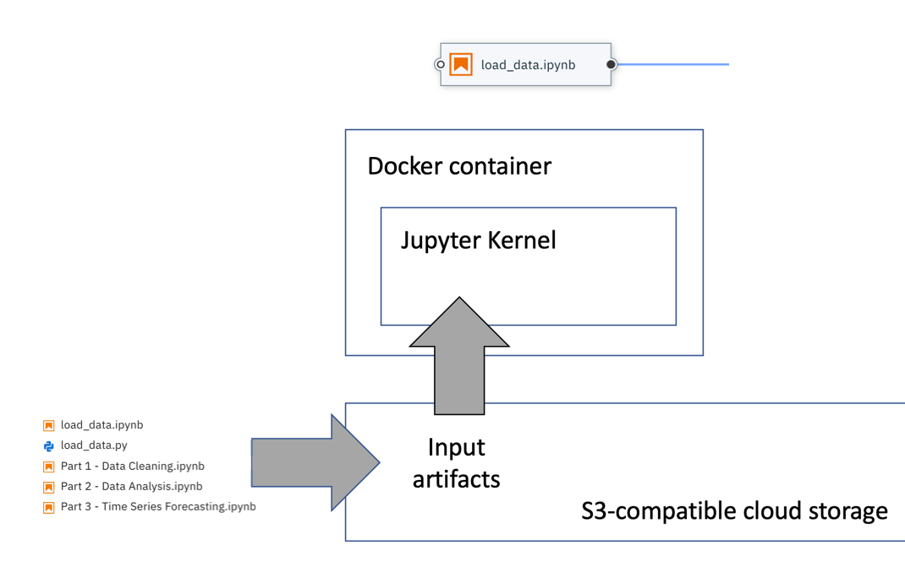

   The `load_data` files do not have any input file dependencies. Leave the input field empty.

   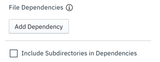

1. You can customize additional inputs by defining environment variables. For illustrative purposes the `load_data` files query environment variable `DATASET_URL` to determine which data set archive to download and process. Define the variable as follows:

   ```
   DATASET_URL=https://dax-cdn.cdn.appdomain.cloud/dax-noaa-weather-data-jfk-airport/1.1.4/noaa-weather-data-jfk-airport.tar.gz
   ```

   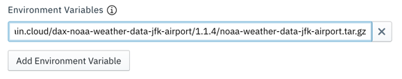

1. Each pipeline node is executed in Apache Airflow as a task in an isolated container. These containers do not have access to a shared local file system and persisted output artifacts (such as data files or trained model files) that a notebook or Python script might produce. To make output artifacts accessible to other notebooks or scripts you have to declare them as _output files_ in the configuration of the node that produces them. Declared output artifacts are automatically uploaded to the pre-configured cloud object storage bucket after node  processing has completed and can subsequently be accessed by other notebooks or scripts in the pipeline by referencing the declared name.

   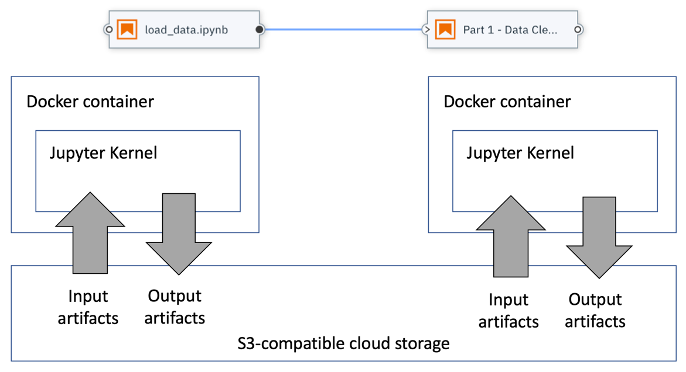
    
   The `load_data` node produces a data file named `data/noaa-weather-data-jfk-airport/jfk_weather.csv`, which we'll declare to make it accessible to the other nodes in this pipeline.

    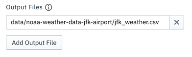

    > It is considered good pratice to specify paths that are relative to the notebook or script location.

1. Close the node configuration.

   > Changes you make to the node configuration are saved only when the pipeline is saved. The Pipeline Editor does not auto-save work in progress.

1. Select the `load_data` node and attach a comment to it.

   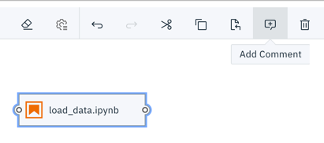

   The comment is automatically associated with the node.

   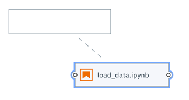

1. In the comment node enter a descriptive text, such as `Download the JFK Weather dataset archive and extract it`. 

   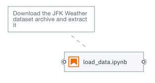

Next, you'll add a data pre-processing notebook to the pipeline and connect it with the first node in such a way that it is executed _after_ the first node. This notebook cleans the data in  `data/noaa-weather-data-jfk-airport/jfk_weather.csv`, which the `load_data` node produced, and stores the data in another CSV file.

### Adding a second notebook to the pipeline

1. Drag the `Part 1 - Data Cleaning.ipynb` notebook from the File Browser onto the canvas.
1. Customize the node's execution properties as follows:
   - Runtime image: `Pandas`
   - Output files: `data/noaa-weather-data-jfk-airport/jfk_weather_cleaned.csv`
1. Attach a comment node to the `Part 1 - Data Cleaning` node and provide a description, such as `Clean the dataset`. 
1. Connect the _output port_ of the `load_data` node to the _input port_ of the `Part 1 - Data Cleaning` node to establish a depency between the two notebooks.

   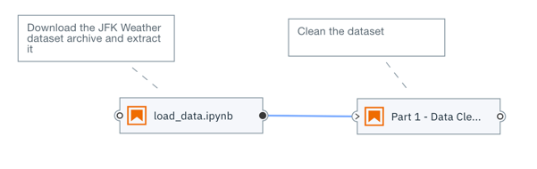

1. Save the pipeline.

   

Before you can run a pipeline on Apache Airflow, you have to define a runtime environment configuration.

> You can run a pipeline locally right away using the default `run in-place locally` configuration, as illustrated in the [_Hello World_ tutorial](https://github.com/elyra-ai/examples/tree/master/pipelines/introduction-to-generic-pipelines).

### Defining a runtime environment configuration

A runtime environment configuration contains information that Elyra requires to prepare and submit pipelines for execution in the target environment, which in this tutorial is an Apache Airflow deployment. 

In this tutorial you will use the GUI to define the runtime environment configuration, but you can also use the CLI [as described in the documentation](https://elyra.readthedocs.io/en/latest/user_guide/runtime-conf.html).

1. From the sidebar on the left side (or the Pipeline editor tool bar) choose _Runtimes_ to open the runtime configuration panel.

   

1. Click **+** and _New Apache Airflow runtime_ to create a new configuration for your Apache Airflow deployment. 

   

1. Enter a _name_ and _description_ for the configuration and optionally assign _tags_ to support searching.

   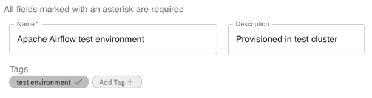

1. Enter the connectivity information for your Apache Airflow deployment.

   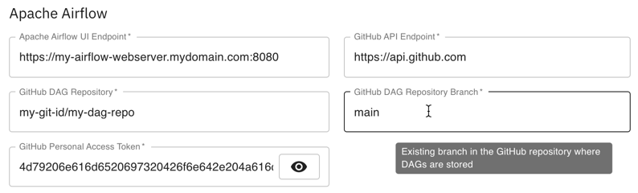

   > Hover over an input field to display a brief description of the input.

   Refer to the [runtime configuration documentation](https://elyra.readthedocs.io/en/latest/user_guide/runtime-conf.html) for a description of each input field.

   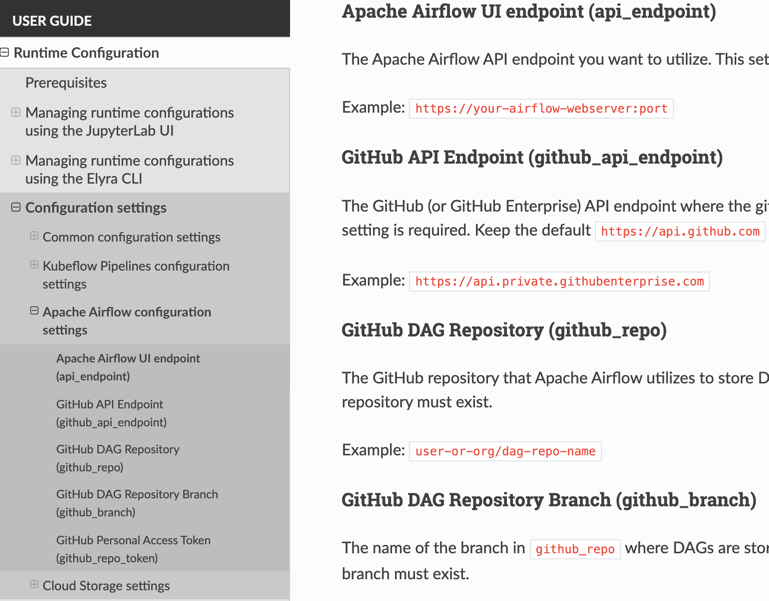

1. Enter the connectivity information for your  S3-compatible cloud storage, where pipeline input and output artifacts will be stored.
   - The cloud storage endpoint URL, e.g. `https://minio-service.kubernetes:9000`
   - Username, e.g. `minio`
   - Password, e.g. `minio123`
   - Bucket where Elyra will store the pipeline input and output artifacts, e.g. `airflow-pipeline-artifacts`

   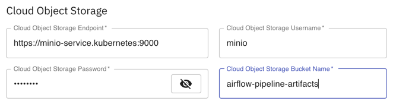

1. Save the runtime configuration.

1. Expand the twistie in front of the configuration entry. The displayed links provide access to the configured Apache Airflow GUI and the Cloud Storage GUI. Open the links to confirm connectivity.

   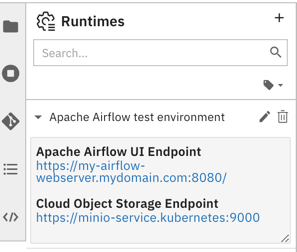

You are ready to run the pipeline. 

### Running a notebook pipeline on Apache Airflow

1. Open the run wizard.

   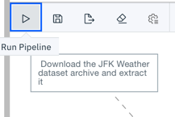  

1. The _Pipeline Name_ is pre-populated with the pipeline file name. The specified name is used to identify the DAG in Apache Airflow.

1. Select `Apache Airflow` as _Runtime type_.

1. From the _Runtime configuration_ drop down select the runtime configuration you just created.

   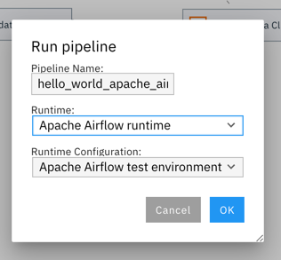

1. Start the pipeline run. The pipeline artifacts (notebooks, Python scripts, and file input dependencies) are gathered, packaged, and uploaded to the cloud storage bucket. The pipeline is compiled into an Apache Airflow DAG and uploaded to the configured GitHub repository.

   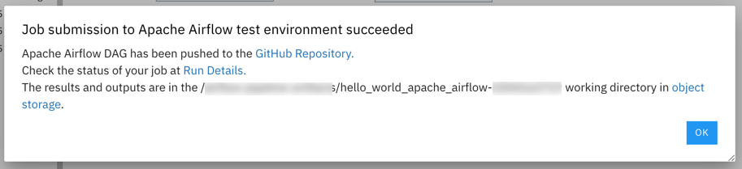

   The confirmation message contains three links:
    - _GitHub repository_: Opens the GitHub repository location where the DAG was saved.

      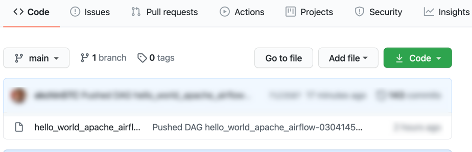

      > If this link returns a 404 error, make sure you are logged in to GitHub and your id is authorized to access the repository.

    - _Run details_: Links to the Apache Airflow GUI where you monitor the pipeline execution progress.
    - _Object storage_: Links to cloud storage bucket where the input artifacts and output artifacts are stored.

1. Open the run details and object storage links in a new browser tab or window.

### Monitoring the pipeline run

The uploaded DAG is configured to run only once. When the DAG is executed depends on how frequently Apache Airflow polls the GitHub repository for changes. 

1. Open the _Run Details_ link to access the Apache Airflow GUI. 

   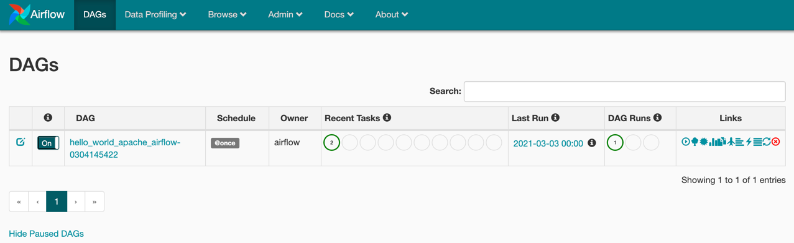

1. Click on the `hello_world_apache_airflow` DAG and select the _Graph View_ to access the task information.

   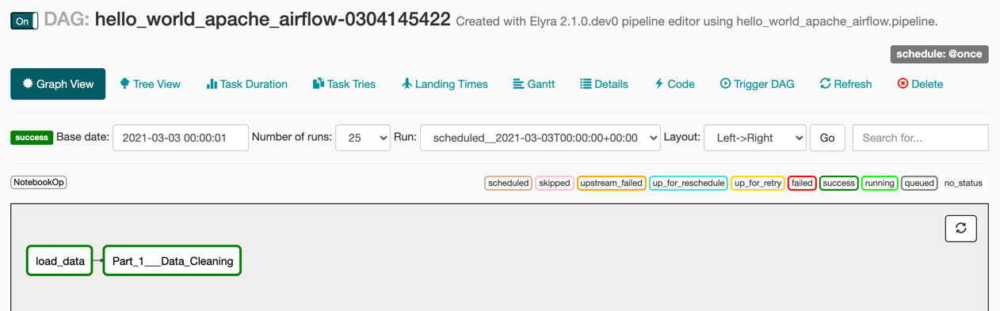

1. Click on a task and open the log file.

   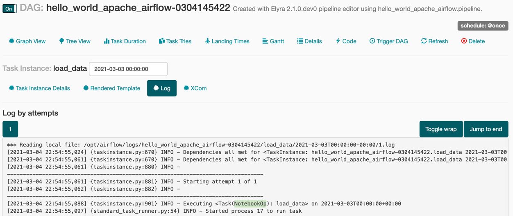

   Note that each task is implemented using the [`NotebookOp` operator](https://github.com/elyra-ai/airflow-notebook), which downloads the compressed input artifact archive from the cloud storage bucket, extracts the archive, processes the notebook or Python script, and uploads the output artifacts to the cloud storage bucket.

1. Wait for the DAG run to finish.

### Accessing the pipeline run outputs

Elyra does not automatically download the output artifacts from the cloud storage bucket after DAG execution has completed.

1. Open the object storage link and, if required, log in. 

   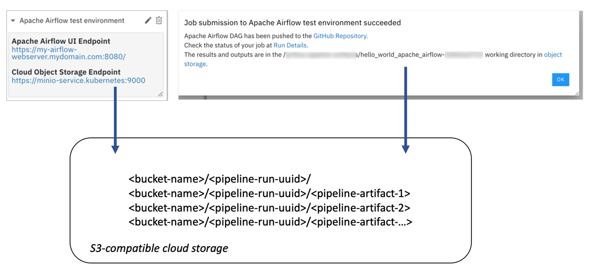

1. Navigate to the bucket you've specified in the runtime configuration to review the content.

   

   If pipeline execution completed successfully the bucket contains for each node the following artifacts:
      - a `tar.gz` archive containing the input notebook or Python script and, if applicable, its declared file dependencies
      - if the node is associated with a notebook, the artifacts include the completed notebook with it's populated output cells and an HTML version of the completed notebook
      - if the node is associated with a Python script, the artifacts include the console output that the script produced
      - if applicable, the declared output files 

   For example, for the `load_data` notebook the following artifacts should be present:

   - `load_data-<UUID>.tar.gz` (input artifacts)
   - `load_data.ipynb` (output artifact) 
   - `load_data.html` (output artifact) 
   - `data/noaa-weather-data-jfk-airport/jfk_weather.csv` (output artifact)

   If you've included the `load_data` Python script in the pipeline, the following artifacts should be present:

   - `load_data-<UUID>.tar.gz` (input artifacts)
   - `load_data.log` (output artifact) 
   - `data/noaa-weather-data-jfk-airport/jfk_weather.csv` (output artifact)

1. Download the output artifacts to your local machine and inspect them.

### Customizing the generated DAG

When you run a pipeline from the Pipeline Editor, Elyra generates a DAG and uploads it to the configured GitHub repository. If desired, you can customize the DAG by exporting the pipeline:

1. Open the pipeline in the Pipeline Editor.
1. Click the _Export Pipeline_ button.

   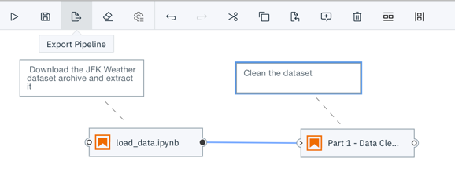

1. Select _Apache Airflow_ and the _Runtime configuration_ you've created and export the pipeline.

   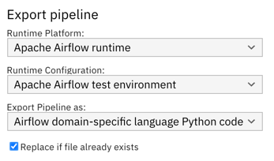

   > An exported pipeline comprises of two parts: the DAG Python code and the input artifact archives that were uploaded to cloud storage.

1. Locate the generated `hello_world_apache_airflow.py` Python script in the File Browser.

1. Open the Python script and briefly review the generated code in the Python editor.

   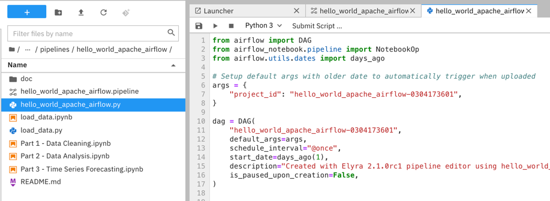

1. Optionally push the DAG manually to the GitHub repository to schedule the run.

### Running notebooks and scripts ad-hoc

In Elyra you can also run a single Python script or notebook as an Apache Airflow task without having to create a pipeline first:
 - open the file
 - click the _Submit ..._ button
 - provide the requested information.

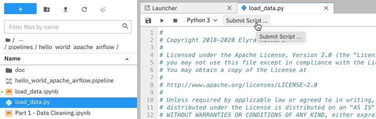

Elyra creates a transient one node pipeline on the fly and processes it as if it had been manually created using the Pipeline Editor.

### Next steps

This concludes the _Hello World Apache Airflow_ tutorial. You've learned how to 
- create a pipeline using Elyra's Pipeline Editor
- add a node and configure its execution properties
- connect nodes to define the execution dependencies
- create an Apache Airflow runtime configuration
- run a pipeline on Apache Airflow
- monitor the pipeline run progress in the Apache Airflow GUI 
- access the pipeline run output on cloud storage
- export a pipeline as an Apache Airflow DAG

If you'd like you can extend the pipeline by adding two more notebooks, which can be executed in parallel after notebook `Part 1 - Data Cleaning.ipynb` was processed:
 - `Part 2 - Data Analysis.ipynb`
 - `Part 3 - Time Series Forecasting.ipynb`

Each of the notebooks can run in the `Pandas` container image, doesn't have any input dependencies, doesn't require any environment variables and doesn't produce an additional output files.

 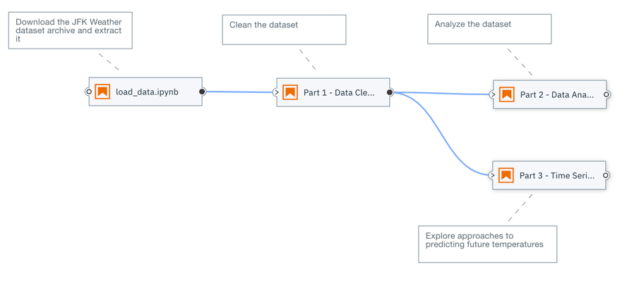
