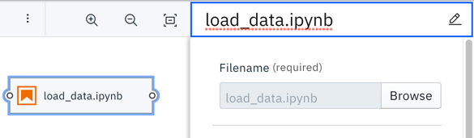
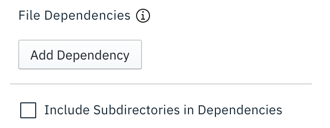
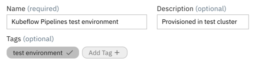
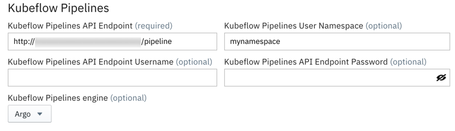
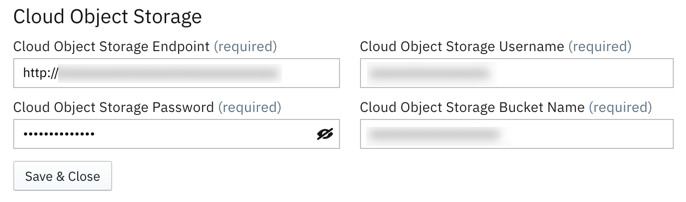
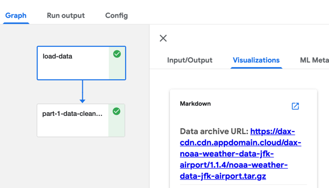
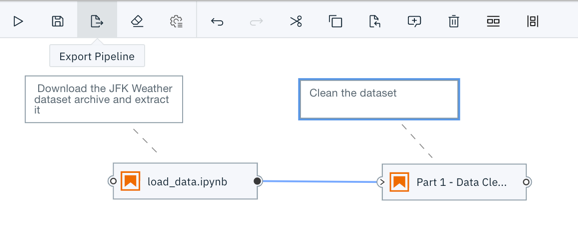
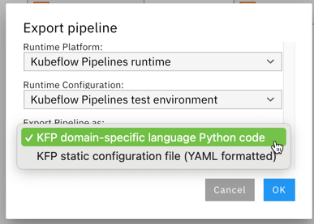

<!--

Copyright 2018-2020 Elyra Authors

Licensed under the Apache License, Version 2.0 (the "License");
you may not use this file except in compliance with the License.
You may obtain a copy of the License at

http://www.apache.org/licenses/LICENSE-2.0

Unless required by applicable law or agreed to in writing, software
distributed under the License is distributed on an "AS IS" BASIS,
WITHOUT WARRANTIES OR CONDITIONS OF ANY KIND, either express or implied.
See the License for the specific language governing permissions and
limitations under the License.

-->
## Getting started with AI pipelines

In Elyra, an AI pipeline, also referred to as workflow pipeline, comprises of notebook nodes or Python script nodes that are connected with each other. 


In Elyra, an AI pipeline comprises of Jupyter notebook nodes or Python script nodes that are connected with each other. You can use pipelines to automate the complete machine learning lifecycle (e.g. load data, pre-process data, analyze data, train model, ...), parts of the lifecycle (e.g. pre-process and analyze data), or to run any kind of Jupyter notebook or Python script as a batch job. 


In this tutorial you will learn how to create a pipeline and run it on Kubeflow Pipelines. Two additional tutorials are available that illustrate the process for pipeline execution [locally in JupyterLab ](https://github.com/elyra-ai/examples/tree/master/pipelines/introduction-to-generic-pipelines) and [on Apache Airflow](https://github.com/elyra-ai/examples/tree/master/pipelines/hello_world_apache_airflow).

### Prerequisites

To complete this tutorial you need
- [JupyterLab 3.x with the Elyra extension v2.x (or newer) installed](https://elyra.readthedocs.io/en/latest/getting_started/installation.html).
- Access to a [local](https://elyra.readthedocs.io/en/latest/recipes/deploying-kubeflow-locally-for-dev.html) or [cloud](https://www.kubeflow.org/docs/started/cloud/) Kubeflow Pipelines deployment

#### Information to collect before starting

Collect the following information for your Kubeflow Pipelines installation:
- API endpoint, e.g. `http://kubernetes-service.ibm.com/pipeline`
- Namespace, for a multi-user, auth-enabled Kubeflow installation, e.g. `mynamespace`
- Username for a multi-user, auth-enabled Kubeflow installation, e.g. `jdoe`
- Password for a multi-user, auth-enabled Kubeflow installation, e.g. `passw0rd`
- Workflow engine type, which should be `Argo` or `Tekton`. Contact your administrator if you are unsure which engine your deployment utilizes.

Elyra utilizes S3-compatible cloud storage to make data available to notebooks and Python scripts while they are executed. Any kind of cloud storage should work (e.g. IBM Cloud Object Storage or Minio) as long as it can be accessed from the machine where JupyterLab is running and the Kubeflow Pipelines cluster. Collect the following information:
- S3 compatible object storage endpoint, e.g. `http://minio-service.kubernetes:9000`
- S3 object storage username, e.g. `minio`
- S3 object storage password, e.g. `minio123`
- S3 object storage bucket, e.g. `pipelines-artifacts`

### Setup

This tutorial uses the `hello_world_kubeflow_pipelines` sample from the https://github.com/elyra-ai/examples GitHub repository.

1. Launch JupyterLab.
1. Open the _Git clone_ wizard (Git > Clone A Repository).
1. Enter `https://github.com/elyra-ai/examples.git` as _Clone URI_.
1. In the _File Browser_ navigate to `examples/pipelines/hello_world_kubeflow_pipelines`.

   
   
   The cloned repository includes a set of Jupyter notebooks and a Python script that download a weather data set from an [open data directory called the Data Asset Exchange](https://developer.ibm.com/exchanges/data/all/jfk-weather-data/), cleanse the data, analyze the data, and perform time-series predictions. In this tutorial you create a pipeline that runs these files as a batch in the appropriate order.

You are ready to start the tutorial.

### Creating a pipeline

1. Open the _Launcher_ (File > New Launcher) if it is not already open.

   

1. Open the _Pipeline Editor_ (Elyra > Pipeline Editor) to create a new untitled pipeline.

   

1. In the _File Browser_ pane, right click on the untitled pipeline and select &#x270E; _Rename_.

   

1. Change the pipeline name to `hello_world_kubeflow_pipelines`.

Next, you'll add a notebook to the pipeline that downloads an open data set archive from public cloud storage.

### Adding a notebook or Python script to the pipeline

Python scripts and notebooks are represented in Elyra as nodes. Each node maps to a component in Kubeflow Pipelines, which is executed with the help of Elyra's [`NotebookOp` operator](https://github.com/elyra-ai/kfp-notebook).

1. From the _File Browser_ pane drag the `load_data.ipynb` notebook onto the canvas. If you  like, you can add the `load_data.py` Python script instead. The script provides the same functionality as the notebook. The instructions below assume that you've added the notebook to the pipeline but the steps you need to complete are identical.

   

1. Right click on the `load_data` node to customize its properties.

   

   The execution properties define the runtime environment, input artifacts (file dependencies and environment variables), and output files.

   

1. By default the file name is used as node label. You should customize the label text if it is too long (and therefore displayed truncated on the canvas) or not descriptive enough.

   

1. Notebooks or Python scripts are executed in containers. 
   

   When you configure a node you identify the _runtime image_, which will be used to instantiate the container. You can choose from a set of pre-configured public images or [register your own](https://elyra.readthedocs.io/en/latest/user_guide/runtime-image-conf.html). 

   > Custom images must meet certain requirements, as stated in the documentation, and should have all prerequisite packages pre-installed to assure the same package versions are used across multiple pipeline executions.  

   In this tutorial you'll use the stock `Pandas` container image to run the notebook or script and all other notebooks.

   

   If the container requires a specific minimum amount of resources during execution, you can specify them. For example, to speed up model training, you might want to make GPUs available. 

   

   > If no custom requirements are defined, the defaults in the Kubeflow Pipeline environment are used.

1. By default only the file that's associated with the node is made available in the container. If it requires access to other files that are stored on your local machine you have to specify them as _file dependencies_. Files that have been declared as a dependency are packaged together with the notebook or Python script, uploaded to a cloud storage bucket and downloaded into the running container prior to execution. In this tutorial we are referring to these files as input artifacts.

   

   The `load_data` files do not have any input file dependencies. Leave the input field empty.

   

1. You can customize additional inputs by defining environment variables. For illustrative purposes the `load_data` files query environment variable `DATASET_URL` to determine which data set archive to download and process. Define the variable as follows:

   ```
   DATASET_URL=https://dax-cdn.cdn.appdomain.cloud/dax-noaa-weather-data-jfk-airport/1.1.4/noaa-weather-data-jfk-airport.tar.gz
   ```

   

1. Each node in a pipeline is executed in an isolated container in the Kubeflow Pipelines cluster. These containers do not have access to a shared local file system and persisted output artifacts (such as data files or trained model files) that a notebook or Python script might produce. To make output artifacts accessible to other notebooks or scripts you have to declare them as _output files_ in the configuration of the node that produces them. Declared output artifacts are automatically uploaded to the pre-configured cloud object storage bucket after node  processing has completed and can subsequently be accessed by other notebooks or scripts in the pipeline by referencing the declared name.

   
    
   The `load_data` node produces a data file named `data/noaa-weather-data-jfk-airport/jfk_weather.csv`, which we'll declare to make it accessible to the other nodes in this pipeline.

    

    > It is considered good pratice to specify paths that are relative to the notebook or script location.

1. Close the node configuration.

   > Changes you make to the node configuration are saved only when the pipeline is saved. The Pipeline Editor does not auto-save work in progress.

1. Select the `load_data` node and attach a comment to it.

   

   The comment is automatically associated with the node.

   

1. In the comment node enter a descriptive text, such as `Download the JFK Weather dataset archive and extract it`.

   

Next, you'll add a data pre-processing notebook to the pipeline and connect it with the first node in such a way that it is executed _after_ the first node. This notebook cleans the data in  `data/noaa-weather-data-jfk-airport/jfk_weather.csv`, which the `load_data` node produced, and stores the data in another CSV file.

### Adding a second notebook to the pipeline

1. Drag the `Part 1 - Data Cleaning.ipynb` notebook from the File Browser onto the canvas.
1. Customize the node's execution properties as follows:
   - Runtime image: `Pandas`
   - Output files: `data/noaa-weather-data-jfk-airport/jfk_weather_cleaned.csv`
1. Attach a comment node to the `Part 1 - Data Cleaning` node and provide a description, such as `Clean the dataset`. 
1. Connect the _output port_ of the `load_data` node to the _input port_ of the `Part 1 - Data Cleaning` node to establish a depency between the two notebooks.

   

1. Save the pipeline.

   

Before you can run a pipeline on Kubeflows Pipelines, you have to define a runtime environment configuration.

> You can run a pipeline locally right away using the default `run in-place locally` configuration, as illustrated in the [_Hello World_ tutorial](https://github.com/elyra-ai/examples/tree/master/pipelines/introduction-to-generic-pipelines).

### Defining a runtime environment configuration

A runtime environment configuration in Elyra contains connectivity information for a Kubeflow Pipelines instance and S3-compatible cloud storage. In this tutorial you will use the UI to define the runtime environment configuration, but you can also use the CLI [as described in the documentation](https://elyra.readthedocs.io/en/latest/user_guide/runtime-conf.html).

1. From the sidebar on the left side (or the Pipeline editor tool bar) choose _Runtimes_ to open the runtime configuration pane.

   

1. Click **+** and _New Kubeflow Pipelines runtime_ to create a new configuration for your Kubeflow Pipelines deployment.

   

1. Enter a _name_ and a _description_ for the configuration and optionally assign _tags_ to support searching.

   

1. Enter the connectivity information for your Kubeflows Pipelines deployment:
   - Kubeflow Pipelines API endpoint, e.g. `https://kubernetes-service.ibm.com/pipeline`
     > Do not specify the namespace in the API endpoint.
   - User namespace used to run pipelines, e.g. `mynamespace`
   - User credentials if the deployment is multi-user, auth enabled using [Dex](https://www.kubeflow.org/docs/started/k8s/kfctl-istio-dex/).
   - Workflow engine type, which is either `Argo` (default) or `Tekton`. Check with an administrator if you are unsure which workflow engine your deployment utilizes.

   

   Refer to the [runtime configuration documentation](https://elyra.readthedocs.io/en/latest/user_guide/runtime-conf.html) for a description of each input field.

1. Enter the connectivity information for your  S3-compatible cloud storage:
   - The cloud storage endpoint URL, e.g. `https://minio-service.kubeflow:9000`
   - Username, e.g. `minio`
   - Password, e.g. `minio123`
   - Bucket name, where Elyra will store the pipeline input and output artifacts, e.g. `test-bucket`

   

1. Save the runtime configuration.

   

1. Expand the twistie in front of the configuration entry. The displayed links provide access to the configured Kubeflow Pipelines UI and the cloud storage UI. Open the links to confirm connectivity.

   

   > If you are accessing the Kubeflow Pipelines UI for the first time an error might be raised (e.g. "`Failed to retrieve list of pipelines`") if namespaces are configured. To resolve this issue, manually open the Kubeflow UI (e.g. `https://kubernetes-service.ibm.com/` instead of `https://kubernetes-service.ibm.com/pipeline`) and select a namespace, and then try the Kubeflow Pipelines UI link again. 

### Running a notebook pipeline on Kubeflow Pipelines

1. Open the run wizard.

     

1. The _Pipeline Name_ is pre-populated with the pipeline file name. The specified name is used to name the pipeline and experiment in Kubeflow Pipelines.

1. Select `Kubeflow Pipelines` as _Runtime type_.

1. From the _Runtime configuration_ drop down select the runtime configuration you just created.

   

1. Start the pipeline run. The pipeline artifacts (notebooks, Python scripts and file input dependencies) are gathered, packaged, and uploaded to cloud storage. The pipeline is compiled, uploaded to Kubeflow Pipelines, and executed in an experiment.

   > Elyra automatically creates a Kubeflow Pipelines experiment using the pipeline name. For example, if you named the pipeline `hello_world_kubeflow_pipelines`, the experiment name is `hello_world_kubeflow_pipelines`.

   Each time you run a pipeline with the same name, it is uploaded as a new version, allowing for comparison between pipeline runs. 

   

   The confirmation message contains two links:
    - _Run details_: provides access to the Kubeflow Pipelines UI where you monitor the pipeline execution progress.
    - _Object storage_: provides access to the cloud storage where you access the input artifacts and output artifacts.

### Monitoring a pipeline run

1. Open the _Run Details_ link. The _Experiments_ panel is displayed, depicting the in-progress execution graph for the pipeline. Only nodes that are currently executing or have already executed are displayed.

   

1. Select the first node. A side panel opens, displaying information about the node.

1. Open the _Logs_ tab to access the node's execution log file.

   

   Inspecting the log file, you'll notice that the log file does not contain any console output that the notebook or Python script might have produced. This output is captured separately and accessed outside of the Kubeflow Pipelines UI.

   If desired, you can visualize results directly in the Kubeflow Pipelines UI. For example, if a notebook trains a classification model, you could visualize its accuracy using a confusion matrix by producing metadata in Kubeflow Pipelines output viewer compatible format.

1. Wait until node processing has completed before continuing.

1. Open the _Visualizations_ tab. For illustrative purposes `load_data` produces metadata in markdown format, which identifies the data set download location.

   

   > The code that produces the metadata is located in the last code cell in the notebook and the bottom of the Python script.

   To learn more about how to generate visualizations, refer to [_Visualizing output from your notebooks or Python scripts in the Kubeflow Pipelines UI_](https://elyra.readthedocs.io/en/latest/recipes/visualizing-output-in-the-kfp-ui.html).

1. Wait for the pipeline run to finish.

   

### Accessing the pipeline run outputs

Pipelines that execute on Kubeflow Pipelines store the pipeline run outputs (completed notebooks and Python scripts output and declared output files) in the cloud storage bucket you've configured in the runtime configuration.

1. Open the object storage link and, if required, log in. 

   

1. Navigate to the bucket you've specified in the runtime configuration to review the content.

   

   If pipeline execution completed successfully the bucket contains for each node the following artifacts:
      - a `tar.gz` archive containing the input notebook or Python script and, if applicable, its declared file dependencies
      - if the node is associated with a notebook, the artifacts include the completed notebook with it's populated output cells and an HTML version of the completed notebook
      - if the node is associated with a Python script, the artifacts include the console output that the script produced
      - if applicable, the declared output files 

   For example, for the `load_data` notebook the following artifacts should be present:

   - `load_data-<UUID>.tar.gz` (input artifacts)
   - `load_data.ipynb` (output artifact) 
   - `load_data.html` (output artifact) 
   - `data/noaa-weather-data-jfk-airport/jfk_weather.csv` (output artifact)

   If you've included the `load_data` Python script in the pipeline, the following artifacts should be present:

   - `load_data-<UUID>.tar.gz` (input artifacts)
   - `load_data.log` (output artifact) 
   - `data/noaa-weather-data-jfk-airport/jfk_weather.csv` (output artifact)

1. Download the output artifacts to your local machine and inspect them.

### Customizing the generated pipeline

When you run a pipeline from the Pipeline Editor, Elyra produces a Kubeflow Pipelines compatible pipeline definition, uploads the pipeline, creates an experiment, and runs the experiment. If desired, you can customize the process by exporting the pipeline:

1. Open the pipeline in the Pipeline Editor.
1. Click the _Export Pipeline_ button.

   

1. Select _Kubeflow Pipelines_ as runtime platform, the _Runtime configuration_ you've created, and an export format:

   

   - Choose the domain-specific language Python code if you are familiar with the [Kubeflow Pipelines SDK](https://www.kubeflow.org/docs/components/pipelines/sdk/) and want to customize the code or pipeline deployment options.
   - Choose the YAML-formatted static configuration file if you want to manually upload the pipeline using the Kubeflow Pipelines GUI.

1. Export the pipline in a format of your choice.

   An exported pipeline comprises of two parts: the pipeline definition and the input artifact archives that were uploaded to cloud storage. 

1. Locate the generated `hello_world_apache_airflow.py` Python script (or `hello_world_apache_airflow.yaml` configuration file) in the _File Browser_.

1. Open the exported file and briefly review the content. Note the references to the artifacts archives and the embedded cloud storage connectivity information. Because connectivity information is currently stored in clear text, exported pipelines should be stored in an access-restricted location.


### Next steps

This concludes the _Hello World Kubeflow Pipelines_ tutorial. You've learned how to 
- create a notebook pipeline
- add a node and configure its execution properties
- connect nodes to define the execution dependencies
- create a Kubeflow Pipelines runtime configuration
- run a pipeline on Kubeflow Pipelines
- monitor the pipeline run progress in the Kubeflow Pipelines UI
- review output visualizations a notebook or script produces 
- access the pipeline run output on cloud storage

If you'd like you can extend the pipeline by adding two more notebooks, which can be executed in parallel after notebook `Part 1 - Data Cleaning.ipynb` was processed:
 - `Part 2 - Data Analysis.ipynb`
 - `Part 3 - Time Series Forecasting.ipynb`

Each of the notebooks can run in the `Pandas` Docker image, doesn't have any input dependencies, doesn't require any environment variables and doesn't produce an additional output files.

 
