## Getting started with AI pipelines

In Elyra, an AI pipeline, also referred to as workflow pipeline, comprises of notebook nodes or Python script nodes that are connected with each other. 

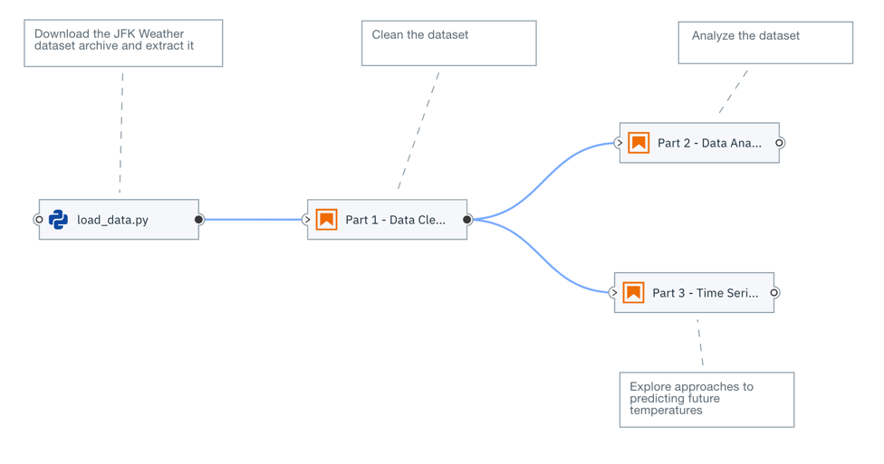

Workflow pipelines can run locally in JupyterLab or remotely on Kubeflow Pipelines, a platform for building and deploying machine learning workflows based on Docker containers.

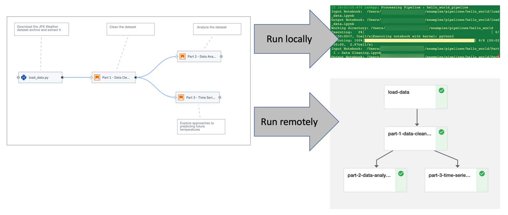

In this tutorial you will learn how to create a pipeline and run it on Kubeflow Pipelines. Take a look at the [Hello World tutorial](https://github.com/elyra-ai/examples/tree/master/pipelines/hello_world) to learn how to run notebook pipelines locally in JupyterLab. 

### Prerequisites

To complete this tutorial you need
- [JupyterLab 2.x with the Elyra extension v1.2 (or newer) installed](https://elyra.readthedocs.io/en/latest/getting_started/installation.html)
- Access to a [local](https://elyra.readthedocs.io/en/latest/recipes/deploying-kubeflow-locally-for-dev.html) or [cloud](https://www.kubeflow.org/docs/started/cloud/) Kubeflow Pipelines deployment

#### Information to collect before starting

Collect the following information for your Kubeflow Pipelines installation:
- API endpoint, e.g. `http://kubernetes-service.ibm.com/pipeline`
- Username for a multi-user, auth-enabled Kubeflow installation, e.g. `jdoe`
- Password for a multi-user, auth-enabled Kubeflow installation, e.g. `passw0rd`

Notebook pipelines use S3-compatible cloud storage at runtime to make data available to notebooks. Any kind of cloud storage should work (e.g. IBM Cloud Object Storage or Minio - which is installed with Kubeflow Pipelines by default) as long as it can be accessed from your local machine and the Kubeflow Pipelines installation:
- S3 compatible object storage endpoint, e.g. `http://minio-service.kubeflow:9000`
- S3 object storage username, e.g. `minio`
- S3 object storage password, e.g. `minio123`

### Setup

This tutorial uses the `hello_world_kubeflow_pipelines` sample from the https://github.com/elyra-ai/examples GitHub repository.
1. Launch JupyterLab.
1. Open the _Git clone_ wizard (Git > Clone).

   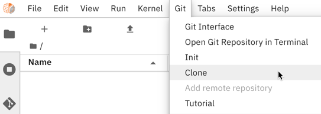

1. Enter `https://github.com/elyra-ai/examples.git` as _Clone URI_.
1. In the _File Browser_ navigate to `examples/pipelines/hello_world_kubeflow_pipelines`.

   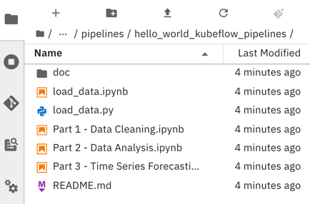
   
   The cloned repository includes a set of notebooks and a Python script that download an open [weather data set from the Data Asset Exchange](https://developer.ibm.com/exchanges/data/all/jfk-weather-data/), cleanse the data, analyze the data, and perform time-series predictions. In this tutorial you create a pipeline that runs these notebooks in the appropriate order. 

You are ready to start the tutorial.

### Creating a pipeline

1. Open the _Launcher_ (File > New Launcher) if it is not already open.

   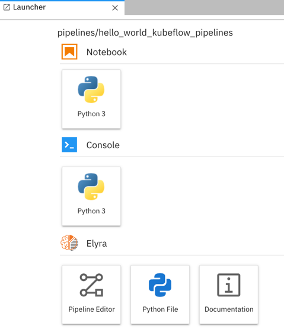

1. Open the _Pipeline Editor_ (Elyra > Pipeline Editor) to create a new untitled pipeline.

   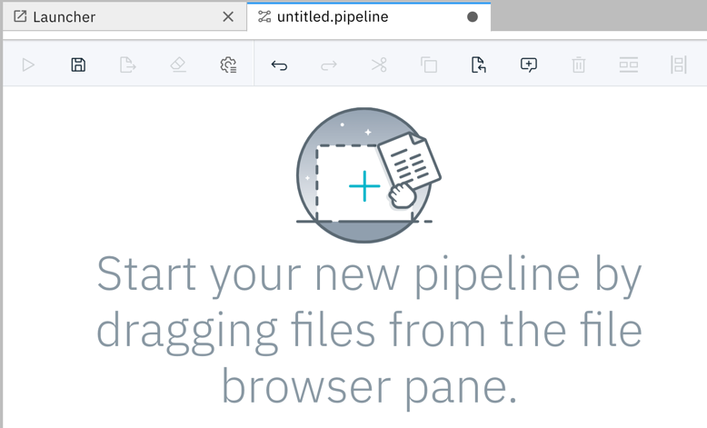

1. In the _File Browser_ pane, right click on the untitled pipeline and select &#x270E; _Rename_.

   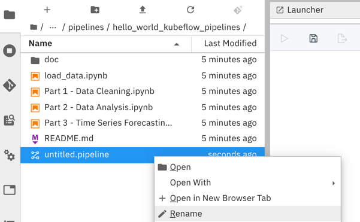

1. Change the pipeline name to `hello_world_kubeflow_pipelines`.

Next, you'll add a notebook to the pipeline that downloads an open data set archive from public cloud storage.

### Adding a notebook or Python script to the pipeline

1. From the _File Browser_ pane drag the `load_data.ipynb` notebook onto the canvas. If you  like, you can add the `load_data.py` Python script instead. The script provides the same functionality as the notebook. The instructions below assume that you've added the notebook to the pipeline but the steps you need to complete are identical.

   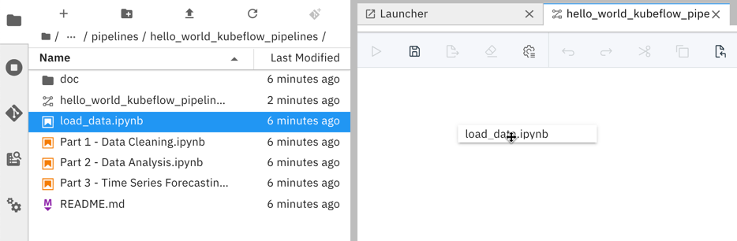

1. Right click on the `load_data` node to customize its execution properties.

   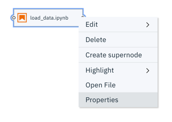

   The execution properties define the runtime environment, input artifacts (file dependencies and environment variables), and output files.

   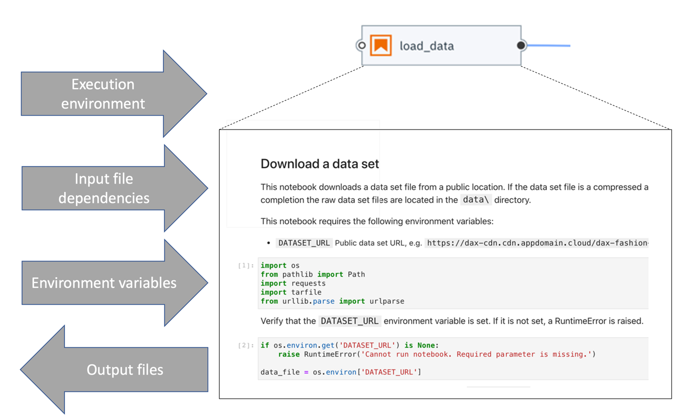

1. Notebooks or Python scripts are executed in Docker containers. 
   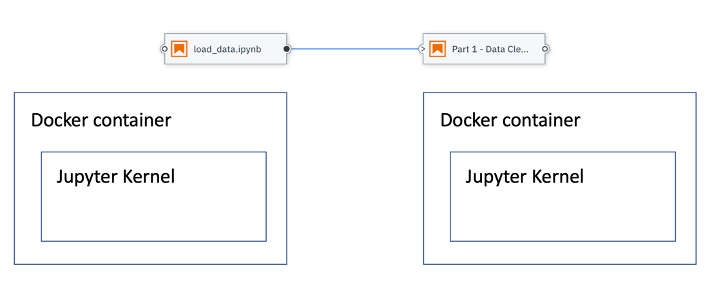

   When you configure a node you identify the _runtime image_, which will be used to instantiate the container. You can choose from a set of pre-configured public images or [provide your own](https://elyra.readthedocs.io/en/latest/user_guide/runtime-image-conf.html). If you provide your own image Python 3 and `curl` must be pre-installed. In this tutorial you'll use the stock `Pandas` image to run the notebook or script and all other notebooks.

   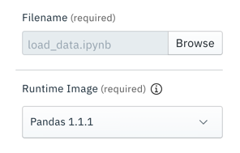

1. By default only the notebook or Python script is made available in the Docker container. If a notebook or script requires access to other files that are stored on your local machine you have to specify them as _file dependencies_. Files that have been declared as a dependency are uploaded to a cloud storage bucket together with the notebook or Python script and downloaded into the Docker image prior to notebook execution.

   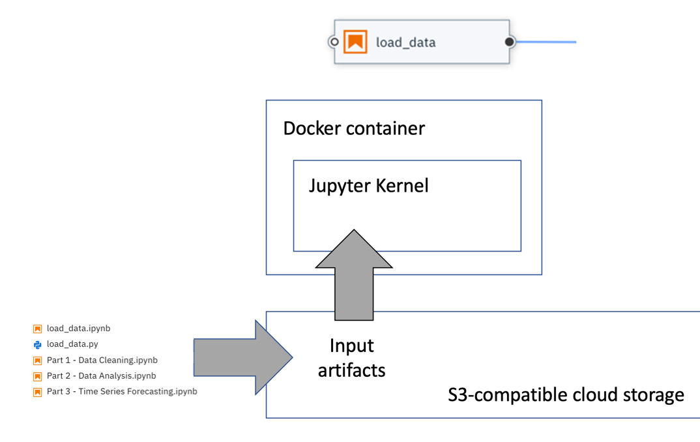

   The `load_data` notebook and Python script do not have any input file dependencies. Leave the input field empty.

   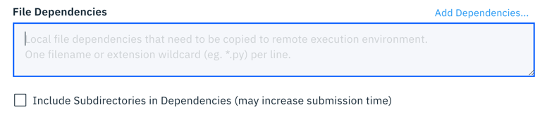

1. If a notebook or Python script references `environment variables` you can declare them, if required. The `load_data` notebook or script you have added to the pipeline uses environment variable `DATASET_URL` to determine the name and location of a compressed data set archive, which needs to be downloaded and extracted. Assign environment variable `DATASET_URL` the value `https://dax-cdn.cdn.appdomain.cloud/dax-noaa-weather-data-jfk-airport/1.1.4/noaa-weather-data-jfk-airport.tar.gz`, which is a time-series data set containing weather information.

   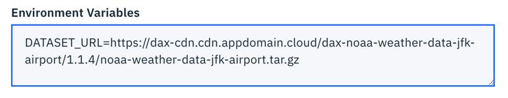

1. Each node in a pipeline is executed in an isolated Docker container. These Docker containers do not have access to a shared local file system and persisted output artifacts (such as data files or trained model files) that a notebook or Python script might produce. To make output artifacts accessible to other notebooks or scripts you have to declare them as _output files_ in the configuration of the node that produces them. Declared output artifacts are automatically uploaded to the pre-configured cloud object storage bucket after node  processing has completed and can subsequently be accessed by other notebooks or scripts in the pipeline by referencing the declared name.

   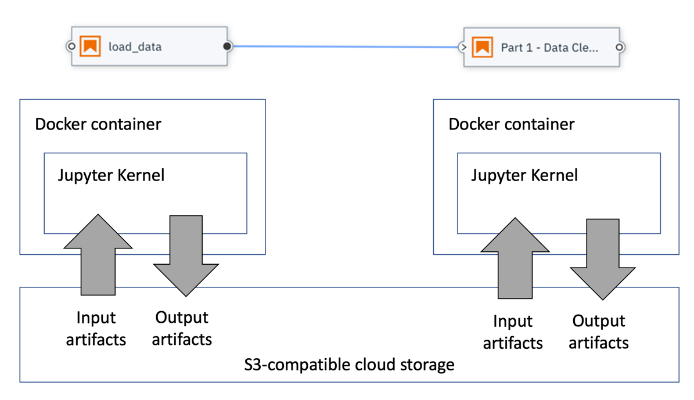
    
   The `load_data` node produces a data file named `data/noaa-weather-data-jfk-airport/jfk_weather.csv`, which we'll declare to make it accessible to the other nodes in this pipeline.

    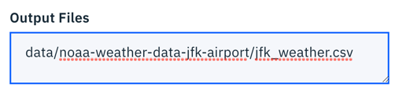

    > It is considered good pratice to specify paths that are relative to the notebook or script location.

1. Save the node configuration.

1. Select the `load_data` node and attach a comment to it.

   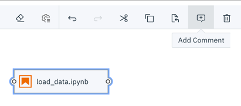

   The comment is automatically associated with the node.

   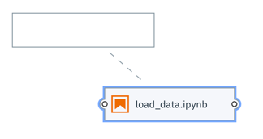

1. In the comment node enter a descriptive text, such as `Download the JFK Weather dataset archive and extract it`.

   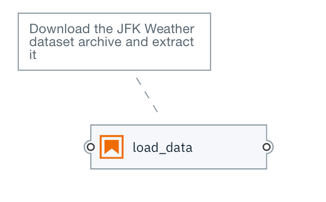

Next, you'll add a data pre-processing notebook to the pipeline and connect it with the first node in such a way that it is executed _after_ the first node. This notebook cleans the data in  `data/noaa-weather-data-jfk-airport/jfk_weather.csv`, which the `load_data` node produced, and stores the data in another CSV file.

### Adding a second notebook to the pipeline

1. Drag the `Part 1 - Data Cleaning.ipynb` notebook from the File Browser onto the canvas.
1. Customize the node's execution properties as follows:
   - Runtime image: `Pandas`
   - Output files: `data/noaa-weather-data-jfk-airport/jfk_weather_cleaned.csv`
1. Attach a comment node to the `Part 1 - Data Cleaning` node and provide a description, such as `Clean the dataset`. 
1. Connect the _output port_ of the `load_data` node to the _input port_ of the `Part 1 - Data Cleaning` node to establish a depency between the two notebooks.

   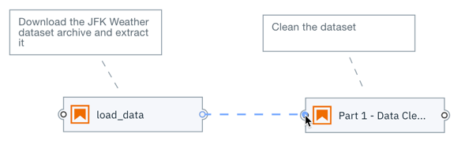

1. Save the pipeline.

   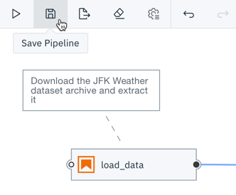

Before you can run a pipeline on Kubeflows Pipelines, you have to define a runtime environment configuration.

> You can run a pipeline locally right away using the default `run in-place locally` configuration, as illustrated in the [_Hello World_ tutorial](https://github.com/elyra-ai/examples/tree/master/pipelines/hello_world).

### Defining a runtime environment configuration

A runtime environment configuration in Elyra contains connectivity information for a Kubeflow Pipelines instance and S3-compatible cloud storage. In this tutorial you will use the UI to define the runtime environment configuration, but you can also use the CLI [as described in the documentation](https://elyra.readthedocs.io/en/latest/user_guide/runtime-conf.html).

1. From the sidebar on the left side (or the Pipeline editor tool bar) choose _Runtimes_ to open the runtime configuration pane.

   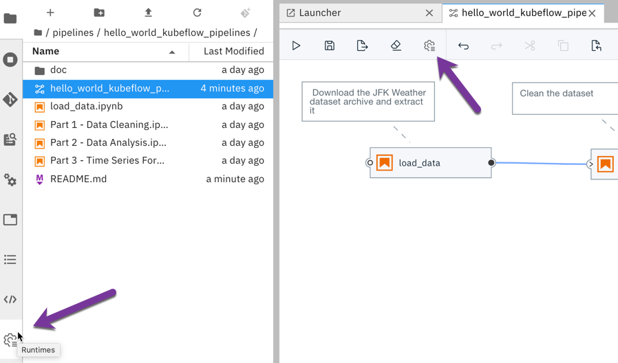

1. Click + to create a new configuration.

   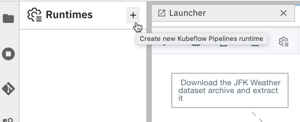

1. Enter a _Name_ and an optional _Description_ for the configuration.

1. Enter the connectivity information for your Kubeflows Pipelines instance and S3-compatible cloud storage. If access to your Kubeflows Pipelines instance is [secured using DEX](https://www.kubeflow.org/docs/started/k8s/kfctl-istio-dex/), provide the appropriate credentials.

   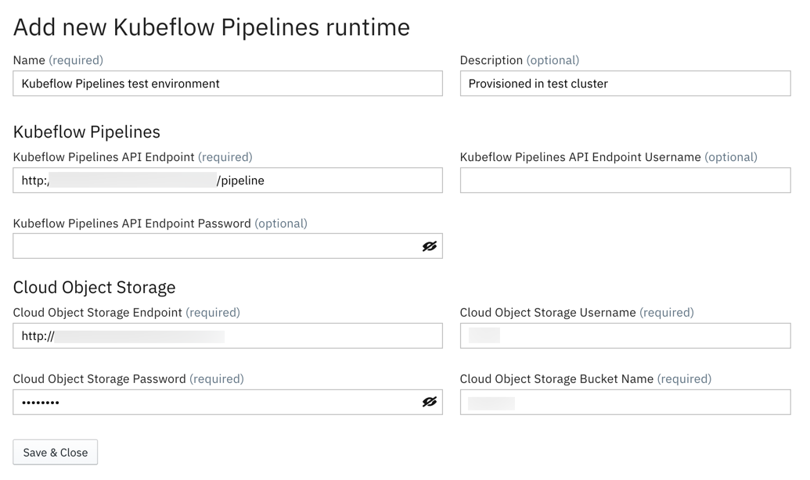

1. Save the runtime configuration.

   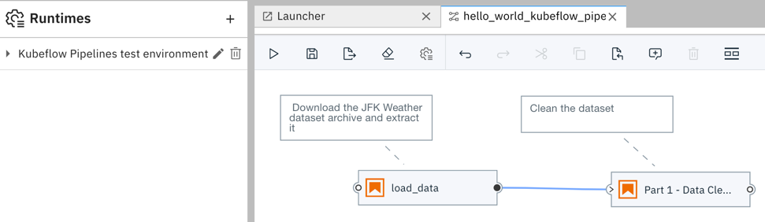

1. Expand the twistie in front of the configuration entry. The displayed links provide access to the configured Kubeflow Pipelines UI and the cloud storage UI.

   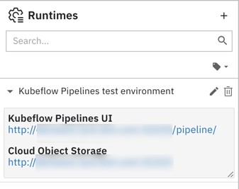

### Running a notebook pipeline on Kubeflow Pipelines

1. Run the pipeline.

   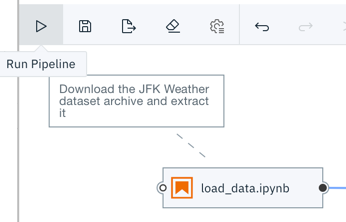

1. Enter `hello_kubeflows_world_pipeline` as _Pipeline name_.

1. From the _Runtime configuration_ drop down select the runtime configuration you've just created.

   

1. Start the pipeline run. The pipeline artifacts (notebooks, Python scripts and file input dependencies) are gathered, packaged, and uploaded to cloud storage. The pipeline is compiled and subsequently submitted to Kubeflow Pipelines for execution.

   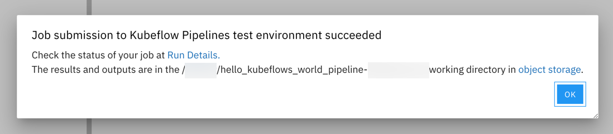

   The confirmation message contains two links:
    - _Run details_: provides access to the Kubeflow Pipelines UI where you monitor the pipeline execution progress.
    - _Object storage_: provides access to the object storage where you access the input artifacts and output artifacts.

### Monitoring a pipeline run

1. Open the _Run Details_ link. The _Experiments_ panel is displayed, depicting the in-progress execution graph for the pipeline. Only nodes that are currently executing or have already executed are displayed.

   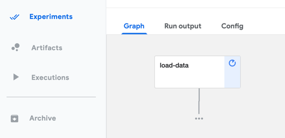

1. Select one of the displayed nodes. A side panel opens, displaying information about the pipeline.

1. Open the _Logs_ tab to access the node's execution log file.

   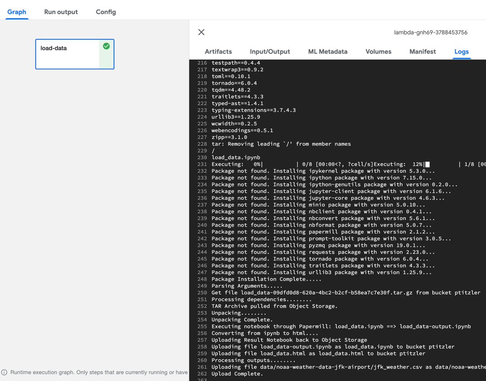

1. Wait for the pipeline run to finish.

   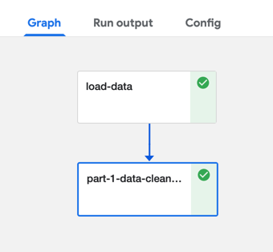

### Accessing the pipeline run outputs

Pipelines that execute on Kubeflow Pipelines store the pipeline run outputs (completed notebooks and Python scripts output and declared output files) in the cloud storage bucket you've configured in the runtime configuration.

1. Open the object storage link and, if required, log in. 

   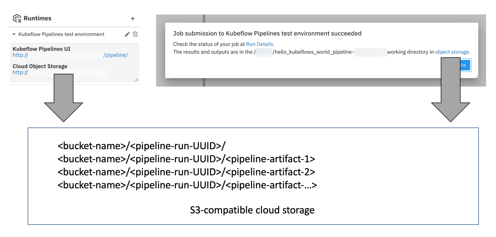

1. Navigate to the bucket you've specified in the runtime configuration to review the content.

   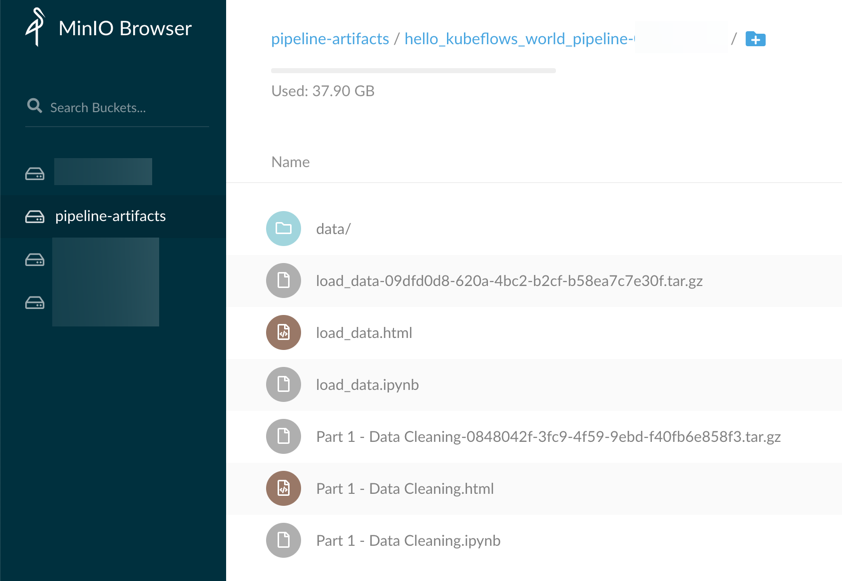

   If pipeline execution completed successfully the bucket contains for each node the following artifacts:
      - a `tar.gz` archive containing the input notebook or Python script and, if applicable, its declared file dependencies
      - if the node is associated with a notebook, the artifacts include the completed notebook with it's populated output cells and an HTML version of the completed notebook
      - if the node is associated with a Python script, the artifacts include the console output that the script produced
      - if applicable, the declared output files 

   For example, for the `load_data` notebook the following artifacts should be present:

   - `load_data-<UUID>.tar.gz` (input artifacts)
   - `load_data.ipynb` (output artifact) 
   - `load_data.html` (output artifact) 
   - `data/noaa-weather-data-jfk-airport/jfk_weather.csv` (output artifact)

   If you've included the `load_data` Python script in the pipeline, the following artifacts should be present:

   - `load_data-<UUID>.tar.gz` (input artifacts)
   - `load_data.log` (output artifact) 
   - `data/noaa-weather-data-jfk-airport/jfk_weather.csv` (output artifact)

### Next steps

This concludes the _Hello World Kubeflow Pipelines_ tutorial. You've learned how to 
- create a notebook pipeline
- add a node and configure its execution properties
- connect nodes to define the execution dependencies
- create a Kubeflow Pipelines runtime configuration
- run a pipeline on Kubeflow Pipelines
- monitor the pipeline run progress in the Kubeflow Pipelines UI
- access the pipeline run output on cloud storage

If you'd like you can extend the pipeline by adding two more notebooks, which can be executed in parallel after notebook `Part 1 - Data Cleaning.ipynb` was processed:
 - `Part 2 - Data Analysis.ipynb`
 - `Part 3 - Time Series Forecasting.ipynb`

Each of the notebooks can run in the `Pandas` Docker image and doesn't have any input dependencies, doesn't require any environment variables and doesn't produce an additional output files.

 
