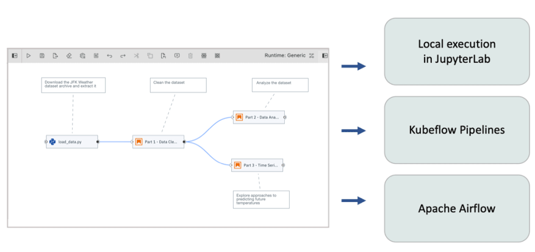
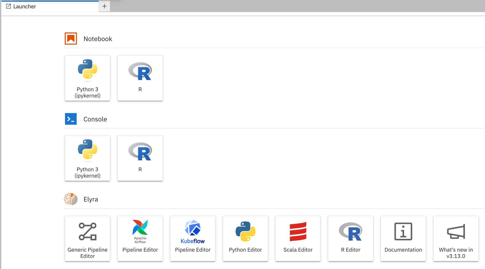
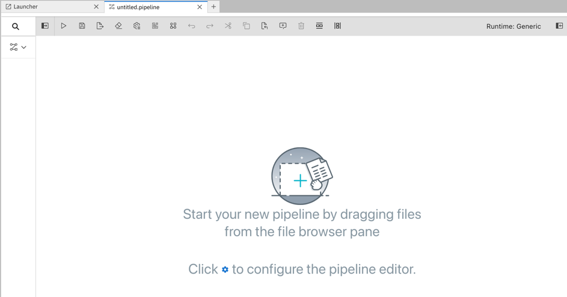
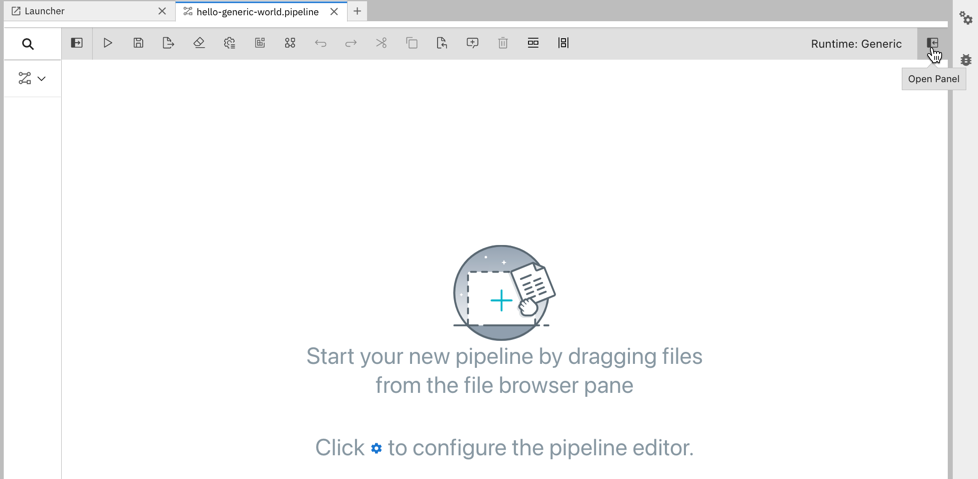
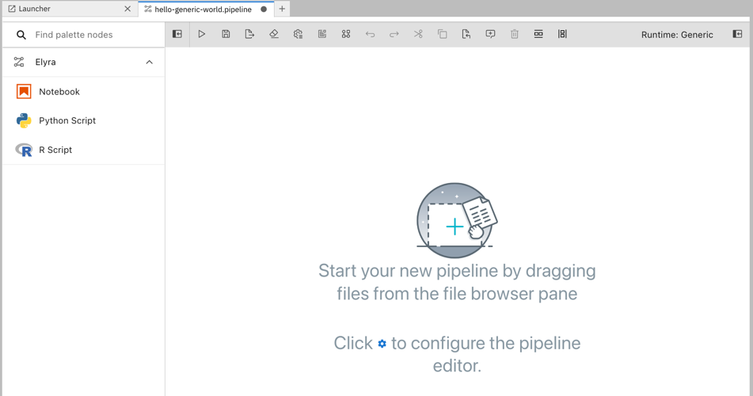
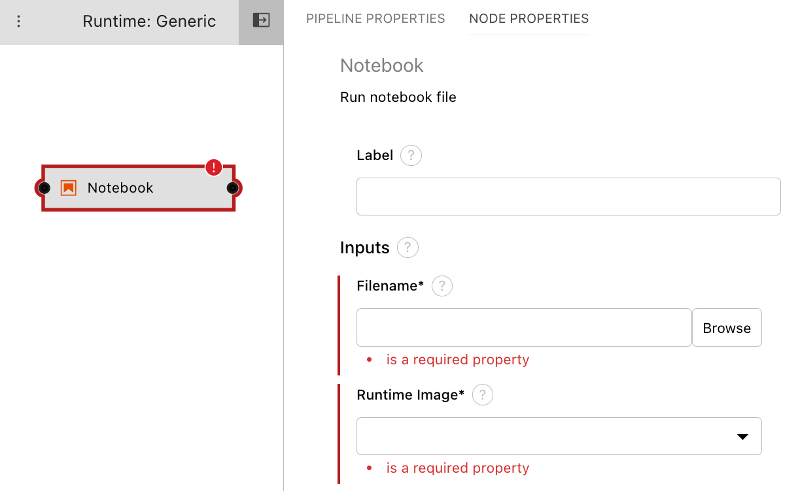
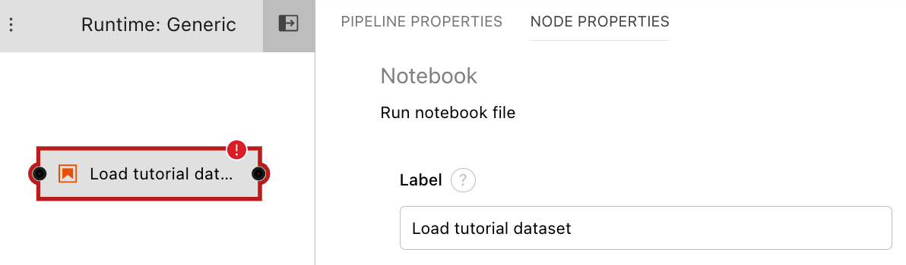
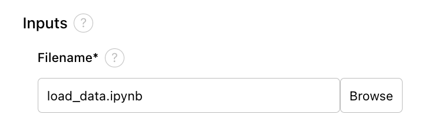
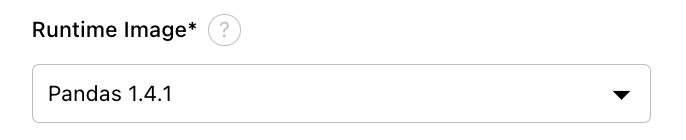
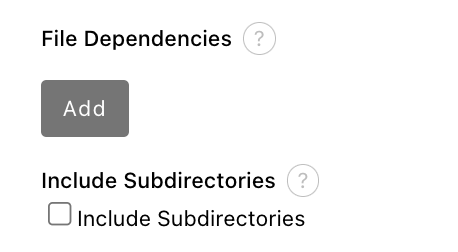

<!--

Copyright 2018-2022 Elyra Authors

Licensed under the Apache License, Version 2.0 (the "License");
you may not use this file except in compliance with the License.
You may obtain a copy of the License at

http://www.apache.org/licenses/LICENSE-2.0

Unless required by applicable law or agreed to in writing, software
distributed under the License is distributed on an "AS IS" BASIS,
WITHOUT WARRANTIES OR CONDITIONS OF ANY KIND, either express or implied.
See the License for the specific language governing permissions and
limitations under the License.

-->
## Getting started with generic pipelines

A [pipeline](https://elyra.readthedocs.io/en/latest/user_guide/pipelines.html) comprises one or more nodes that are (in many cases) connected with each other to define execution dependencies. Each node is implemented by a [component](https://elyra.readthedocs.io/en/latest/user_guide/pipeline-components.html) and typically performs only a single task, such as loading data, processing data, training a model, or sending an email.


A _generic pipeline_ comprises nodes that are implemented using _generic components_. In the current release Elyra includes generic components that run Jupyter notebooks, Python scripts, and R scripts. Generic components have in common that they are supported in every Elyra pipelines runtime environment: local/JupyterLab, Kubeflow Pipelines, and Apache Airflow.



In this introductory tutorial you will learn how to create a generic pipeline and run it in your local JupyterLab environment.


 When you run a pipeline in your local environment, each Jupyter notebook or script is executed in a Kernel on the machine where JupyterLab is running, such as your laptop. Since resources on that machine might be limited local pipeline execution might not always be a viable option.

 The [Run generic pipelines on Kubeflow Pipelines tutorial](https://github.com/elyra-ai/examples/tree/master/pipelines/run-generic-pipelines-on-kubeflow-pipelines) and [Run generic pipelines on Apache Airflow tutorial](https://github.com/elyra-ai/examples/tree/master/pipelines/run-generic-pipelines-on-apache-airflow) are similar to this tutorial but run the pipeline on Kubeflow Pipelines or Apache Airflow, enabling you to take advantage of shared compute resources in the cloud that might dramatically reduce pipeline processing time or allow for processing of much larger data volumes.

### Prerequisites

- [JupyterLab 3.x with the Elyra extension v3.x (or newer) installed](https://elyra.readthedocs.io/en/latest/getting_started/installation.html).

> The tutorial instructions were last updated using Elyra version 3.0.

### Setup

This tutorial uses the `introduction to generic pipelines` sample from the https://github.com/elyra-ai/examples GitHub repository.
1. Launch JupyterLab.    
   > **Note**: When you start JupyterLab using the `jupyter lab` command, it loads the contents of the current working directory.  
   > For examples, we recommend creating a new directory on your system and running the `jupyter lab` command from that directory.  
1. Open the _Git clone_ wizard (Git > Clone A Repository).
1. Enter `https://github.com/elyra-ai/examples.git` as _Clone URI_.
1. In the _File Browser_ navigate to `examples/pipelines/introduction-to-generic-pipelines`.

   
   
   The cloned repository includes a set of files that download an open [weather data set from the Data Asset Exchange](https://developer.ibm.com/exchanges/data/all/jfk-weather-data/), cleanse the data, analyze the data, and perform time-series predictions.

You are ready to start the tutorial.

### Create a generic pipeline

1. Open the _Launcher_ (File > New Launcher) if it is not already open.

   

1. Open the _Generic Pipeline Editor_ to create a new untitled generic pipeline.

   

1. In the JupyterLab _File Browser_ panel, right click on the untitled pipeline, and select &#x270E; _Rename_.

     

1. Change the pipeline name to `hello-generic-world`. 

   To help others understand the purpose of the pipeline you should add a description.

1. In the Visual Pipeline Editor open the properties panel on the right side.

   

1. Select the _Pipeline properties_ tab and enter a pipeline description.

   

1. Close the properties panel.

Next, you'll add a file to the pipeline that downloads an open data set archive from public cloud storage.

### Add a notebook or script to the pipeline

This tutorial includes a Jupyter notebook `load_data.ipynb` and a Python script `load_data.py` that perform the same data loading task. 

> For illustrative purposes the instructions use the notebook, but feel free to use the Python script. (The key takeaway is that you can mix and match notebooks and scripts, as desired.)

To add a notebook or script to the pipeline:

1. Expand the component palette panel on the left hand side. Note that there are multiple component entries, one for each supported file type.

   

1. Drag the _notebook_ component entry onto the canvas (or double click on a palette entry) and hover over the node. The error messages are indicating that the node is not yet configured properly.

   

1. Select the newly added node on the canvas, right click, and select _Open Properties_ from the context menu.

   

1. Configure the node properties.

   

   Some properties are only required when you plan to run the pipeline in a remote environment, such as Kubeflow Pipelines. However, it is considered good practice to always specify those properties to allow for easy migration from development (where you might run a pipeline locally) to test and production (where you would want to take advantage of resources that are not available to you in a local environment). Details are in the instructions below.

1. Assign the node a descriptive label. If you leave the label empty, the file name (e.g. `load_data.ipynb`) will be used.

   

1. Browse to the file location. Navigate to the `introduction-to-generic-pipelines` directory and select `load_data.ipynb`.

   

1. As _Runtime Image_ choose `Pandas`. The runtime image identifies the container image that is used to execute the notebook or Python script when the pipeline is run on Kubeflow Pipelines or Apache Airflow. This setting must always be specified but is ignored when you run the pipeline locally.

   

   If the container requires a specific minimum amount of resources during execution, you can specify them. 

   

   > If no custom requirements are defined, the defaults in the target runtime environment (Kubeflow Pipelines or Apache Airflow) are used.

   If a notebook or script requires access to local files, such as Python scripts, you can specify them as _File Dependencies_. When you run a pipeline locally this setting is ignored because the notebook or script can access all (readable) files in your workspace. However, it is considered good practice to explicitly declare file dependencies to make the pipeline also runnable in environments where notebooks or scripts are executed isolated from each other.

1. The `load_data` file does not have any input file dependencies. Leave the input field empty.

   

   If desired, you can customize additional inputs by defining environment variables.

1. Click _refresh_ to scan the file for environment variable references. Refer to the [best practices for file-based pipeline nodes](https://elyra.readthedocs.io/en/latest/user_guide/best-practices-file-based-nodes.html#environment-variables) to learn more about how Elyra discovers environment variables in notebooks and scripts.

   

   It appears that `load_data` references two environment variables i.e `DATASET_URL` and `ELYRA_RUNTIME_ENV`. The `DATASET_URL` requires to be set. This variable identifies the name and location of a data set file, which the notebook or script will download and decompress. The `ELYRA_RUNTIME_ENV` is optional. It can be set to `local`.  

1. Assign environment variable `DATASET_URL` the appropriate value as shown below:

   ```
   DATASET_URL=https://dax-cdn.cdn.appdomain.cloud/dax-noaa-weather-data-jfk-airport/1.1.4/noaa-weather-data-jfk-airport.tar.gz
   ```

    

    If a notebook or script generates files that other notebooks or scripts require access to, specify them as _Output Files_. This setting is ignored if you are running a pipeline locally because all notebooks or scripts in a pipeline have access to the same shared file system. However, it is considered good practice to declare these files to make the pipeline also runnable in environments where notebooks or scripts are executed in isolation from each other.

1.  Declare an output file named `data/noaa-weather-data-jfk-airport/jfk_weather.csv`, which other notebooks in this pipeline consume.

    

    > It is considered good pratice to specify paths that are relative to the notebook or script location.

1. Close the node's properties view.

1. Select the `load_data` node and attach a comment to it.

   

   The comment is automatically attached to the node.

1. In the comment node enter a descriptive text, such as `Download the data`.

   

Next, you'll add a data pre-processing notebook to the pipeline and connect it with the first notebook in such a way that it is executed _after_ the first notebook. This notebook cleans the data in  `data/noaa-weather-data-jfk-airport/jfk_weather.csv`, which `load_data` produced.

### Add a second file to the pipeline

Earlier in this tutorial you added a (notebook or Python script) file component to the canvas using the palette. You can also add Jupyter notebooks, Python scripts, or R scripts to the canvas by drag and drop from the JupyterLab File Browser.

1. From the JupyterLab File Browser drag and drop the `Part 1 - Data Cleaning.ipynb` notebook onto the canvas.

   

1. Customize the file's execution properties as follows:
   - Runtime image: `Pandas`
   - Output files: `data/noaa-weather-data-jfk-airport/jfk_weather_cleaned.csv`

1. Attach a comment to the `Part 1 - Data Cleaning` node and enter a description, such as `Clean the data`.

1. Connect the _output port_ of the `load_data` node to the _input port_ of the `Part 1 - Data Cleaning` node to establish a depency between the two notebooks.

   

1. Save the pipeline.

    

You are ready to run the pipeline.

### Run a generic pipeline from the pipeline editor

When you run a pipeline locally the files are executed on the machine where JupyterLab is running.

1. Click `Run pipeline`.

   

1. Accept the default values in the run dialog and start the run.

   

1. Monitor the pipeline run in the JupyterLab console.

   

   A message similar to the following is displayed in the pipeline editor window after the run completed.

    

### Inspect the pipeline run results

A _local pipeline run_ produces the following output artifacts:
- Each executed notebook is updated and includes the run results in the output cells.
- If any notebook persists data/files they are stored in the local file system.

You can access output artifacts from the _File Browser_. In the screen capture below the pipeline output artifacts are highlighted.

 

### Run a generic pipeline using the CLI

Elyra provides a [command line interface](https://elyra.readthedocs.io/en/latest/user_guide/command-line-interface.html) that you can use to manage metadata and work with pipelines.

To run a pipeline locally using the [`elyra-pipeline`](https://elyra.readthedocs.io/en/latest/user_guide/command-line-interface.html#working-with-pipelines) CLI:

1. Open a terminal window that has access to the Elyra installation.

   ```
   $ elyra-pipeline --help
      Usage: elyra-pipeline [OPTIONS] COMMAND [ARGS]...
   ```

1. Run the pipeline.

   ```
   $ elyra-pipeline run hello-generic-world.pipeline 
   ```

   > The CLI does not require JupyterLab to be running.

### Next steps

This concludes the introduction to generic pipelines tutorial. You've learned how to 
- create a generic pipeline
- add and configure Jupyter notebooks or scripts
- run the pipeline in a local environment from the pipeline editor
- run the pipeline in a local environment using the command line interface
- monitor the pipeline run progress
- inspect the pipeline run results

If you'd like you can extend the pipeline by adding two more notebooks, which can be executed in parallel after notebook `Part 1 - Data Cleaning.ipynb` was processed:
 - `Part 2 - Data Analysis.ipynb`
 - `Part 3 - Time Series Forecasting.ipynb`

Each of the notebooks can run in the `Pandas` container image and doesn't have any input dependencies, doesn't require any environment variables and doesn't produce any additional output files.

 


### Resources

- [_Pipelines_ topic in the Elyra _User Guide_](https://elyra.readthedocs.io/en/stable/user_guide/pipelines.html)
- [_Pipeline components_ topic in the Elyra _User Guide_](https://elyra.readthedocs.io/en/stable/user_guide/pipeline-components.html)
- [_Best practices for file-based pipeline nodes_ topic in the Elyra _User Guide_](https://elyra.readthedocs.io/en/stable/user_guide/best-practices-file-based-nodes.html)
- [_Command line interface_ topic in the Elyra _User Guide_](https://elyra.readthedocs.io/en/stable/user_guide/command-line-interface.html)
