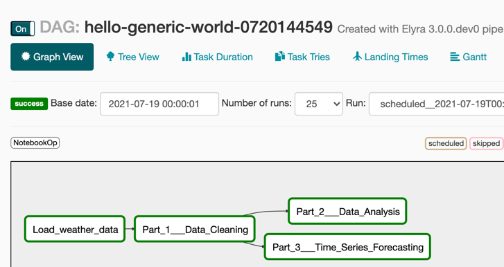

<!--

Copyright 2018-2022 Elyra Authors

Licensed under the Apache License, Version 2.0 (the "License");
you may not use this file except in compliance with the License.
You may obtain a copy of the License at

http://www.apache.org/licenses/LICENSE-2.0

Unless required by applicable law or agreed to in writing, software
distributed under the License is distributed on an "AS IS" BASIS,
WITHOUT WARRANTIES OR CONDITIONS OF ANY KIND, either express or implied.
See the License for the specific language governing permissions and
limitations under the License.

-->
## Run generic pipelines on Apache Airflow

A [pipeline](https://elyra.readthedocs.io/en/stable/user_guide/pipelines.html) comprises one or more nodes that are (in many cases) connected to define execution dependencies. Each node is implemented by a [component](https://elyra.readthedocs.io/en/stable/user_guide/pipeline-components.html) and typically performs only a single task, such as loading data, processing data, training a model, or sending an email.

A _generic pipeline_ comprises nodes that are implemented using _generic components_. In the current release Elyra includes generic components that run Jupyter notebooks, Python scripts, and R scripts. Generic components have in common that they are supported in every Elyra pipelines runtime environment: local/JupyterLab, Apache Airflow, and Kubeflow Pipelines.

The [_Introduction to generic pipelines_ tutorial](../introduction-to-generic-pipelines) outlines how to create a generic pipeline using the Visual Pipeline Editor. 

In this intermediate tutorial you will learn how to run a generic pipeline on Apache Airflow, monitor pipeline execution using the Apache Airflow GUI, and access the outputs.

The tutorial instructions were last updated using Elyra v3.0 and Apache Airflow v1.10.12.

### Prerequisites

- [JupyterLab 3.x with the Elyra extension v3.x (or newer) installed](https://elyra.readthedocs.io/en/stable/getting_started/installation.html).
- Access to a local or cloud deployment of Apache Airflow that has been [configured for use with Elyra](https://elyra.readthedocs.io/en/stable/recipes/configure-airflow-as-a-runtime.html).

> Apache Airflow version 2.x is currently not supported.

#### Information to collect before starting

Gather the following information:

- Apache Airflow API endpoint, e.g. `https://your-airflow-webserver:port`

Elyra currently supports Apache Airflow deployments that utilize GitHub or GitHub Enterprise for Directed Acyclic Graph ([DAG](https://airflow.apache.org/docs/apache-airflow/stable/concepts.html#dags)) storage. Collect the following information:

- GitHub server API endpoint, e.g. `https://api.github.com`
- Name and owner of the repository where DAGs are stored, e.g. `your-git-org/your-dag-repo`. This repository must exist.
- Branch in named repository, e.g. `test-dags`. This branch must exist.
- [Personal access token](https://docs.github.com/en/github/authenticating-to-github/creating-a-personal-access-token) that Elyra can use to push DAGs to the repository, e.g. `4d79206e616d6520697320426f6e642e204a616d657320426f6e64`

Elyra utilizes S3-compatible cloud storage to make data available to notebooks and Python scripts while they are executed. Any kind of cloud storage should work (e.g. IBM Cloud Object Storage or Minio) as long as it can be accessed from the machine where JupyterLab is running and the Apache Airflow cluster. Collect the following information:
- S3 compatible object storage endpoint, e.g. `http://minio-service.kubernetes:9000`
- S3 object storage username, e.g. `minio`
- S3 object storage password, e.g. `minio123`
- S3 object storage bucket, e.g. `airflow-task-artifacts`

### Setup

This tutorial uses the `run-generic-pipelines-on-apache-airflow` sample from the https://github.com/elyra-ai/examples GitHub repository.

1. Launch JupyterLab.
1. Open the _Git clone_ wizard (Git > Clone A Repository).
1. Enter `https://github.com/elyra-ai/examples.git` as _Clone URI_.
1. In the _File Browser_ navigate to `examples/pipelines/run-generic-pipelines-on-apache-airflow`.

   
   
   The cloned repository includes a set of Jupyter notebooks and a Python script that download a weather data set from an [open data directory called the Data Asset Exchange](https://developer.ibm.com/exchanges/data/all/jfk-weather-data/), cleanse the data, analyze the data, and perform time-series predictions. The repository also includes a pipeline named `hello-generic-world` that runs the files in the appropriate order.

You are ready to start the tutorial.

### Review the generic pipeline

1. Open the `hello-generic-world` pipeline file.

   

1. Right click generic node `Load weather data` and select _Open Properties_ to review its configuration.

   

   A generic node configuration identifies the runtime environment, input artifacts (file to be executed, file dependencies and environment variables), and output files.

   

   Each generic node is executed in a separate container, which is instantiated using the configured _runtime image_.

   

   All nodes in this tutorial pipeline are configured to utilize a pre-configured public container image that has Python and the `Pandas` package preinstalled. For your own pipelines you should always utilize custom-built container images that have the appropriate prerequisites installed. Refer to the [_runtime image configuration_ topic in the User Guide](https://elyra.readthedocs.io/en/stable/user_guide/runtime-image-conf.html) for more information. 

   If the container requires a specific minimum amount of resources during execution, you can specify them. For example, to speed up model training, you might want to make GPUs available. 

   

   > If no custom resource requirements are defined, the defaults in the Apache Airflow environment are used.

   Containers in which the notebooks or scripts are executed don't share a file system. Elyra utilizes S3-compatible cloud storage to facilitate the transfer of files from the JupyterLab environment to the containers and between containers.

   

   Therefore you must declare files that the notebook or script requires and declare files that are being produced. The node you are inspecting does not have any file input dependecies but it does produce an output file.

   

   Notebooks and scripts can be parameterized using environment variables. The node you are looking at requires a variable that identifies the download location of a data file.

   

   Refer to [_Best practices for file-based pipeline nodes_](https://elyra.readthedocs.io/en/stable/user_guide/best-practices-file-based-nodes.html) in the _User Guide_ to learn more about considerations for each configuration setting.

### Define a runtime environment configuration

A [runtime configuration](https://elyra.readthedocs.io/en/stable/user_guide/runtime-conf.html) in Elyra contains connectivity information for an Apache Airflow instance and S3-compatible cloud storage. In this tutorial you will use the GUI to define the configuration, but you can also use the CLI.

1. From the pipeline editor tool bar (or the JupyterLab sidebar on the left side) choose _Runtimes_ to open the runtime management panel.

   

1. Click **+** and _New Apache Airflow runtime_ to create a new configuration for your Apache Airflow deployment.

1. Enter a _name_ and a _description_ for the configuration and optionally assign _tags_ to support searching.

   

1. Enter the Apache Airflow server URL, the Kubernetes namespace where Airflow is deployed, and details for the DAG GitHub repository that Airflow is monitoring.

   

   Refer to the [runtime configuration documentation](https://elyra.readthedocs.io/en/stable/user_guide/runtime-conf.html#apache-airflow-configuration-settings) for a description of each input field.

1. Enter the connectivity information for your  S3-compatible cloud storage:
   - The _cloud object storage endpoint_ URL, e.g. `https://minio-service.kubeflow:9000`
   - _Username_, e.g. `minio`
   - _Password_, e.g. `minio123`
   - _Bucket name_, where Elyra will store the pipeline input and output artifacts, e.g. `my-elyra-artifact-bucket`

   

   > Refer to [this topic](https://elyra.readthedocs.io/en/stable/user_guide/runtime-conf.html#cloud-object-storage-credentials-secret-cos-secret) for important information about the Cloud Object Storage credentials secret.

1. Save the runtime configuration. 

1. Expand the twistie in front of the configuration entry.

   

   The displayed links provide access to the configured Apache Airflow GUI and the cloud storage UI (if one is available at the specified URL). Open the links to confirm connectivity.

### Run a generic pipeline on Apache Airflow

You can run pipelines from the Visual Pipeline Editor or using the [`elyra-pipeline` command line interface](https://elyra.readthedocs.io/en/stable/user_guide/pipelines.html#running-a-pipeline-using-the-command-line).

1. Open the run wizard.

     

1. The _Pipeline Name_ is pre-populated with the pipeline file name. The specified name is used to name the DAG in Apache Airflow.

1. Select `Apache Airflow` as _Runtime platform_.

   

1. From the _Runtime configuration_ drop down select the runtime configuration you just created.

1. Start the pipeline run. The pipeline artifacts (notebooks, scripts and file input dependencies) are gathered, packaged, and uploaded to cloud storage. Elyra generates a DAG and pushes it to the GitHub repository branch that you've specified in the runtime configuration.

   The DAG name is derived from the pipeline name and concatenated with the current timestamp. Therefore the GitHub repository contains a DAG file for each pipeline run that you initiate from the Visual Pipeline Editor or the Elyra CLI.

   

   The confirmation message contains three links:
    - _GitHub repository_: Opens the GitHub repository location where the DAG was saved.

      

      > If this link returns a 404 error, make sure you are logged in to GitHub and your id is authorized to access the repository.

    - _Run details_: Links to the Apache Airflow GUI where you monitor the pipeline execution progress.
    - _Object storage_: Links to cloud storage bucket where the input artifacts and output artifacts are stored.

1. Open the run details and object storage links in a new browser tab or window.

### Monitor the DAG run

Elyra does not provide a monitoring interface for Apache Airflow. However, it does provide a link to the Apache Airflow GUI.

1. Open the _Run Details_ link to access the Apache Airflow GUI. 

   

   The generated DAG is configured to run only once. When the DAG is executed depends on how frequently Apache Airflow polls the GitHub repository for changes. 

1. Click on the `hello-generic-world` DAG and select the _Graph View_ to access the task information.

   

1. Click on any completed task and open the log file.

   

   Note that the task is implemented using the [`NotebookOp` operator](https://github.com/elyra-ai/airflow-notebook), which downloads the compressed input artifact archive from the cloud storage bucket, extracts the archive, processes the notebook or script, and uploads the output artifacts to the cloud storage bucket.

1. Wait for the DAG run to finish.

### Access the pipeline run outputs

The DAG run outputs (completed notebooks, script output, and declared output files) are persisted in the cloud storage bucket you've configured in the runtime configuration.

Elyra does not automatically download the output artifacts to your JupyterLab environment from the cloud storage bucket after DAG execution has completed. Therefore you have to use an S3 client, or, if configured, the cloud storage's web GUI to access the artifacts.

1. Navigate to the bucket you've specified in the runtime configuration to review the content. 

   

   The bucket contains, for each node, the following artifacts, which are prefixed with the DAG name:
      - a `tar.gz` archive containing the notebook or script, and, if applicable, its declared input file dependencies
      - if the node is associated with a notebook, the artifacts include the completed notebook with it's populated output cells and an HTML version of the completed notebook
      - if the node is associated with a script, the artifacts include the console output that the script produced
      - if applicable, the declared output files 

   For example, for the `load_data` notebook that was executed by the `Load weather data` node, the following artifacts should be present:

   - `load_data-<UUID>.tar.gz` (input artifacts)
   - `load_data.ipynb` (output artifact) 
   - `load_data.html` (output artifact) 
   - `data/noaa-weather-data-jfk-airport/jfk_weather.csv` (output artifact)

1. Download the output artifacts to your local machine and inspect them.

## Export the pipeline as an Apache Airflow DAG

When you run a pipeline from the pipeline, Elyra generates a DAG and uploads it to the configured GitHub repository. If desired, you can customize the DAG by exporting the pipeline instead:

1. Open the pipeline in the Visual Pipeline Editor.
1. Click the _Export Pipeline_ button.

   

1. Select _Apache Airflow_ and the _Runtime configuration_ you've created and export the pipeline.

   

   > An exported pipeline comprises of two parts: the DAG Python code and the input artifact archives that were uploaded to cloud storage.

1. Locate the generated `hello_generic_pipeline.py` Python script in the JupyterLab File Browser.

1. Open the Python script and briefly review the generated code in the Python editor.

   

1. To run the DAG, push the file manually to the GitHub repository.

### Next steps

This concludes the _Run generic pipelines on Apache Airflow_ tutorial. You've learned how to 
- create an Apache Airflow runtime configuration
- run a pipeline on Apache Airflow
- monitor the pipeline run progress in the Apache Airflow GUI
- access the pipeline run output on cloud storage
- export a pipeline as a DAG

### Resources

- [_Pipelines_ topic in the Elyra _User Guide_](https://elyra.readthedocs.io/en/stable/user_guide/pipelines.html)
- [_Pipeline components_ topic in the Elyra _User Guide_](https://elyra.readthedocs.io/en/stable/user_guide/pipeline-components.html)
- [_Best practices for file-based pipeline nodes_ topic in the Elyra _User Guide_](https://elyra.readthedocs.io/en/stable/user_guide/best-practices-file-based-nodes.html)
- [_Runtime configuration_ topic in the Elyra _User Guide_](https://elyra.readthedocs.io/en/stable/user_guide/runtime-conf.html)
- [_Runtime image configuration_ topic in the Elyra _User Guide_](https://elyra.readthedocs.io/en/stable/user_guide/runtime-image-conf.html)
- [_Command line interface_ topic in the Elyra _User Guide_](https://elyra.readthedocs.io/en/stable/user_guide/command-line-interface.html)
