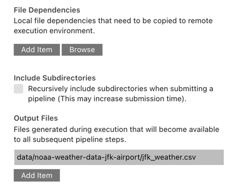

<!--

Copyright 2018-2020 Elyra Authors

Licensed under the Apache License, Version 2.0 (the "License");
you may not use this file except in compliance with the License.
You may obtain a copy of the License at

http://www.apache.org/licenses/LICENSE-2.0

Unless required by applicable law or agreed to in writing, software
distributed under the License is distributed on an "AS IS" BASIS,
WITHOUT WARRANTIES OR CONDITIONS OF ANY KIND, either express or implied.
See the License for the specific language governing permissions and
limitations under the License.

-->
## Run generic pipelines on Kubeflow Pipelines

A [pipeline](https://elyra.readthedocs.io/en/stable/user_guide/pipelines.html) comprises one or more nodes that are (in many cases) connected to define execution dependencies. Each node is implemented by a [component](https://elyra.readthedocs.io/en/stable/user_guide/pipeline-components.html) and typically performs only a single task, such as loading data, processing data, training a model, or sending an email.

A _generic pipeline_ comprises nodes that are implemented using _generic components_. In the current release Elyra includes generic components that run Jupyter notebooks, Python scripts, and R scripts. Generic components have in common that they are supported in every Elyra pipelines runtime environment: local/JupyterLab, Kubeflow Pipelines, and Apache Airflow.

The [_Introduction to generic pipelines_ tutorial](../introduction-to-generic-pipelines) outlines how to create a generic pipeline using the Visual Pipeline Editor. 

In this intermediate tutorial you will learn how to run a generic pipeline on Kubeflow Pipelines, monitor pipeline execution using the Kubeflow Central Dashboard, and access the outputs.

The tutorial instructions were last updated using Elyra v3.0 and Kubeflow v1.3.0.

### Prerequisites

- [JupyterLab 3.x with the Elyra extension v3.x (or newer) installed](https://elyra.readthedocs.io/en/stable/getting_started/installation.html).
- Access to a [local](https://elyra.readthedocs.io/en/stable/recipes/deploying-kubeflow-locally-for-dev.html) or [cloud](https://www.kubeflow.org/docs/started/installing-kubeflow/) Kubeflow Pipelines deployment.

#### Information to collect before starting

Collect the following information for your Kubeflow Pipelines installation:
- API endpoint, e.g. `http://kubernetes-service.ibm.com/pipeline`
- Namespace, for a multi-user, auth-enabled Kubeflow installation, e.g. `mynamespace`
- Username, for a multi-user, auth-enabled Kubeflow installation, e.g. `jdoe`
- Password, for a multi-user, auth-enabled Kubeflow installation, e.g. `passw0rd`
- Workflow engine type, which should be `Argo` or `Tekton`. Contact your administrator if you are unsure which engine your deployment utilizes.

Elyra utilizes S3-compatible cloud storage to make data available to notebooks and scripts while they are executed. Any kind of cloud storage should work (e.g. IBM Cloud Object Storage or Minio) as long as it can be accessed from the machine where JupyterLab is running and from the Kubeflow Pipelines cluster. Collect the following information:
- S3 compatible object storage endpoint, e.g. `http://minio-service.kubernetes:9000`
- S3 object storage username, e.g. `minio`
- S3 object storage password, e.g. `minio123`
- S3 object storage bucket, e.g. `pipelines-artifacts`

### Setup

This tutorial uses the `run-generic-pipelines-on-kubeflow-pipelines` sample from the https://github.com/elyra-ai/examples GitHub repository.

1. Launch JupyterLab.
1. Open the _Git clone_ wizard (Git > Clone A Repository).
1. Enter `https://github.com/elyra-ai/examples.git` as _Clone URI_.
1. In the _File Browser_ navigate to `examples/pipelines/run-generic-pipelines-on-kubeflow-pipelines`.

   
   
   The cloned repository includes a set of Jupyter notebooks and a Python script that download a weather data set from an [open data directory called the Data Asset Exchange](https://developer.ibm.com/exchanges/data/all/jfk-weather-data/), cleanse the data, analyze the data, and perform time-series predictions. The repository also includes a pipeline named `hello-generic-world` that runs the files in the appropriate order.

You are ready to start the tutorial.

### Review the generic pipeline

1. Open the `hello-generic-world` pipeline file.

   

1. Right click generic node `Load weather data` and select _Open Properties_ to review its configuration.

   

   A generic node configuration identifies the runtime environment, input artifacts (file to be executed, file dependencies and environment variables), and output files.

   

   Each generic node is executed in a separate container, which is instantiated using the configured _runtime image_.

   

   All nodes in this tutorial pipeline are configured to utilize a pre-configured public container image that has Python and the `Pandas` package preinstalled. For your own pipelines you should always utilize custom-built container images that have the appropriate prerequisites installed. Refer to the [_runtime image configuration_ topic in the User Guide](https://elyra.readthedocs.io/en/stable/user_guide/runtime-image-conf.html) for more information. 

   If the container requires a specific minimum amount of resources during execution, you can specify them. For example, to speed up model training, you might want to make GPUs available. 

   

   > If no custom resource requirements are defined, the defaults in the Kubeflow Pipeline environment are used.

   Containers in which the notebooks or scripts are executed don't share a file system. Elyra utilizes S3-compatible cloud storage to facilitate the transfer of files from the JupyterLab environment to the containers and between containers.

   

   Therefore you must declare files that the notebook or script requires and declare files that are being produced. The node you are inspecting does not have any file input dependecies but it does produce an output file.

   

   Notebooks and scripts can be parameterized using environment variables. The node you are looking at requires a variable that identifies the download location of a data file.

   

   Refer to [_Best practices for file-based pipeline nodes_](https://elyra.readthedocs.io/en/stable/user_guide/best-practices-file-based-nodes.html) in the _User Guide_ to learn more about considerations for each configuration setting.

### Define a runtime environment configuration

A [runtime configuration](https://elyra.readthedocs.io/en/stable/user_guide/runtime-conf.html) in Elyra contains connectivity information for a Kubeflow Pipelines instance and S3-compatible cloud storage. In this tutorial you will use the GUI to define the configuration, but you can also use the CLI.

1. From the pipeline editor tool bar (or the JupyterLab sidebar on the left side) choose _Runtimes_ to open the runtime management panel.

   

1. Click **+** and _New Kubeflow Pipelines runtime_ to create a new configuration for your Kubeflow Pipelines deployment.

1. Enter a _name_ and a _description_ for the configuration and optionally assign _tags_ to support searching.

   

1. Enter the connectivity information for your Kubeflows Pipelines deployment:
   - _Kubeflow Pipelines API endpoint_, e.g. `https://kubernetes-service.ibm.com/pipeline`
     > Do not specify the namespace in the API endpoint.
   - _User namespace_ used to run pipelines, e.g. `mynamespace`
   - User credentials if the deployment is multi-user, auth enabled using Dex.
   - Workflow _engine_ type, which is either `Argo` (default) or `Tekton`. Check with an administrator if you are unsure which workflow engine your deployment utilizes.

   

   Refer to the [runtime configuration documentation](https://elyra.readthedocs.io/en/stable/user_guide/runtime-conf.html#configuration-settings) for a description of each input field.

1. Enter the connectivity information for your  S3-compatible cloud storage:
   - The _cloud object storage endpoint_ URL, e.g. `https://minio-service.kubeflow:9000`
   - _Username_, e.g. `minio`
   - _Password_, e.g. `minio123`
   - _Bucket name_, where Elyra will store the pipeline input and output artifacts, e.g. `test-bucket`

   

   > Refer to [this topic](https://elyra.readthedocs.io/en/stable/user_guide/runtime-conf.html#cloud-object-storage-credentials-secret-cos-secret) for important information about the optional credentials secret.

1. Save the runtime configuration. 

1. Expand the twistie in front of the configuration entry.

   

   The displayed links provide access to the configured Kubeflow Pipelines Central Dashboard and the cloud storage UI (if one is available at the specified URL). Open the links to confirm connectivity.

   > If you are accessing the Kubeflow Pipelines Dashboard for the first time an error might be raised (e.g. "`Failed to retrieve list of pipelines`") if namespaces are configured. To resolve this issue, manually open the Kubeflow Pipelines Central Dashboard (e.g. `https://kubernetes-service.ibm.com/` instead of `https://kubernetes-service.ibm.com/pipeline`) and select a namespace, and then try opening the link again. 

### Run a generic pipeline on Kubeflow Pipelines

You can run pipelines from the Visual Pipeline Editor or using the [`elyra-pipeline` command line interface](https://elyra.readthedocs.io/en/stable/user_guide/pipelines.html#running-a-pipeline-using-the-command-line).

1. Open the run wizard.

     

1. The _Pipeline Name_ is pre-populated with the pipeline file name. The specified name is used to name the pipeline and experiment in Kubeflow Pipelines.

1. Select `Kubeflow Pipelines` as _Runtime platform_.

   

1. From the _Runtime configuration_ drop down select the runtime configuration you just created.

1. Start the pipeline run. The pipeline artifacts (notebooks, Python scripts and file input dependencies) are gathered, packaged, and uploaded to cloud storage. The pipeline is compiled, uploaded to Kubeflow Pipelines, and executed in an experiment.

   > Elyra automatically creates a Kubeflow Pipelines experiment using the pipeline name. For example, if you named the pipeline `hello-generic-world`, Elyra creates an experiment named `hello-generic-world`.

   Each time you run a pipeline with the same name, it is uploaded as a new version, allowing for comparison between pipeline runs. 

   

   The confirmation message contains two links:
    - _Run details_: provides access to the Kubeflow Pipelines UI where you monitor the pipeline execution progress.
    - _Object storage_: provides access to the cloud storage where you access the input artifacts and output artifacts. (This link might not work if the configured cloud storage does not have a GUI interface or if the URL is different from the endpoint URL you've configured.)

### Monitor the pipeline run

Elyra does not provide a monitoring interface for Kubeflow Pipelines. However, it does provide a link to the Kubeflow Central Dashboard's pipeline runs panel.

1. Open the _Run Details_ link. The _runs_ panel is displayed, depicting the in-progress execution graph for the pipeline. Only nodes that are currently executing or have already executed are displayed. Note that the run name is derived from the pipeline name and a timestamp, e.g. `hello-generic-world-0716111722`.

   

1. Select the first node. A side panel opens, displaying information about the node.

1. Open the _Logs_ tab to access the node's execution log file.

   

   Output that notebooks or scripts produce is captured by Elyra and automatically uploaded to the cloud storage bucket you've specified in the runtime configuration.

   If desired, you can visualize results directly in the Kubeflow Pipelines UI. For example, if a notebook trains a classification model, you could visualize its accuracy using a confusion matrix by producing metadata in Kubeflow Pipelines output viewer compatible format.

1. Wait until node processing has completed before continuing.

1. Open the _Visualizations_ tab. For illustrative purposes the first node that runs the `load_data` notebook produces metadata in markdown format, which identifies the data set download location.

   

   > The code that produces the metadata is located in the notebook's last code cell.

   Refer to [_Visualizing output from your notebooks or Python scripts in the Kubeflow Pipelines UI_](https://elyra.readthedocs.io/en/stable/recipes/visualizing-output-in-the-kfp-ui.html) to learn more about adding visualizations.

1. Wait for the pipeline run to finish.

   

### Access the pipeline run outputs

Pipelines that execute on Kubeflow Pipelines store the pipeline run outputs (completed notebooks, script output, and declared output files) in the cloud storage bucket you've configured in the runtime configuration.

1. Open the object storage link and, if required, log in. 

1. Navigate to the bucket that you've specified in the runtime configuration to review the content. Note that the bucket contains a "directory" with the pipeline's Kubeflow run name, e.g. `hello-generic-world-0716111722`.

   

   The bucket contains for each node the following artifacts:
      - a `tar.gz` archive containing the original notebook or script and, if applicable, its declared file dependencies
      - if the node is associated with a notebook, the artifacts include the completed notebook with it's populated output cells and an HTML version of the completed notebook
      - if the node is associated with a script, the artifacts include the console output that the script produced
      - if applicable, the declared output files 

   For example, for the `load_data` notebook the following artifacts should be present:

   - `load_data-<UUID>.tar.gz` (input artifacts)
   - `load_data.ipynb` (output artifact) 
   - `load_data.html` (output artifact) 
   - `data/noaa-weather-data-jfk-airport/jfk_weather.csv` (output artifact)

1. Download the output artifacts to your local machine and inspect them.

## Export the pipeline to a Kubeflow Pipelines Static Configuration File

When you run a pipeline from the pipeline editor, Elyra compiles the pipeline, uploads the compiled pipeline, creates an experiment, and runs the experiment. If you want to run the pipeline at a later time outside of Elyra, you can export it.

1. Open the pipeline in the Pipeline Editor.
1. Click the _Export Pipeline_ button.

   

1. Select _Kubeflow Pipelines_ as the runtime platform, then select the runtime configuration_ you've created. Export the pipeline.

   

   > An exported pipeline comprises of two parts: the pipeline definition and the input artifact archives that were uploaded to cloud storage. 
   
   > In order to run the exported pipeline, the generated YAML-formatted static configuration file must be manually uploaded using the Kubeflow Pipelines Dashboard. Elyra compiles the pipeline for the engine (`Argo` or `Tekton`) that you've defined in the runtime configuration.

1. Locate the generated `hello-generic-world.yaml` configuration file in the _File Browser_.

1. Open the exported file and briefly review the content. 

   

    Note the references to the artifacts archives and the embedded cloud storage connectivity information. (Not shown in the screen capture above). If you've preconfigured a Kubernetes secret and specified its name in the runtime configuration, only the secret name is stored in the exported files.

### Next steps

This concludes the _Run generic pipelines on Kubeflow Pipelines_ tutorial. You've learned how to 
- create a Kubeflow Pipelines runtime configuration
- run a pipeline on Kubeflow Pipelines
- monitor the pipeline run progress in the Kubeflow Pipelines Central Dashboard
- review output visualizations a notebook or script produces 
- access the pipeline run output on cloud storage
- export a pipeline to a Kubeflow Pipelines native format

### Resources

- [_Pipelines_ topic in the Elyra _User Guide_](https://elyra.readthedocs.io/en/stable/user_guide/pipelines.html)
- [_Pipeline components_ topic in the Elyra _User Guide_](https://elyra.readthedocs.io/en/stable/user_guide/pipeline-components.html)
- [_Best practices for file-based pipeline nodes_ topic in the Elyra _User Guide_](https://elyra.readthedocs.io/en/stable/user_guide/best-practices-file-based-nodes.html)
- [_Runtime configuration_ topic in the Elyra _User Guide_](https://elyra.readthedocs.io/en/stable/user_guide/runtime-conf.html)
- [_Runtime image configuration_ topic in the Elyra _User Guide_](https://elyra.readthedocs.io/en/stable/user_guide/runtime-image-conf.html)
- [_Command line interface_ topic in the Elyra _User Guide_](https://elyra.readthedocs.io/en/stable/user_guide/command-line-interface.html)
