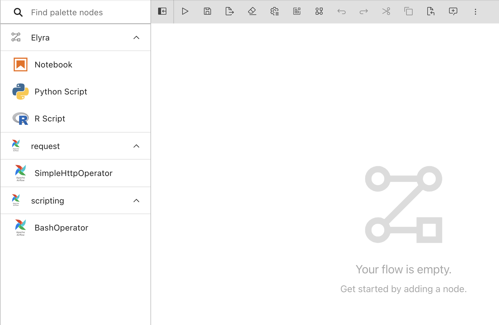
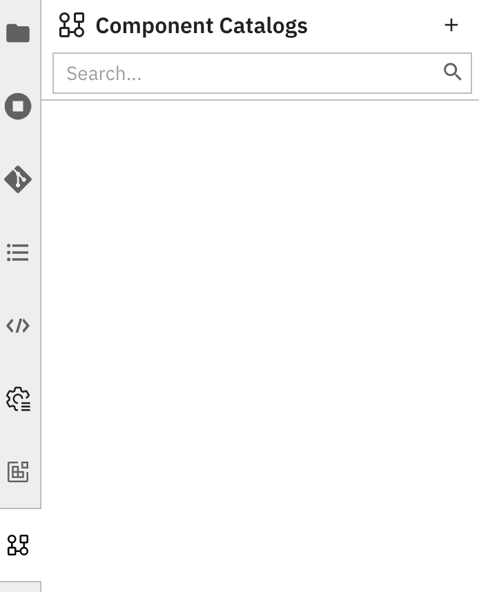
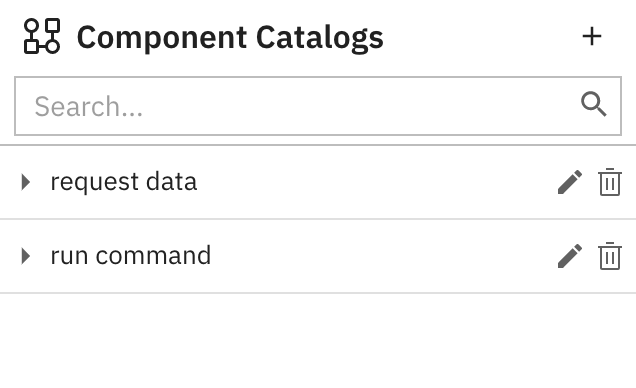
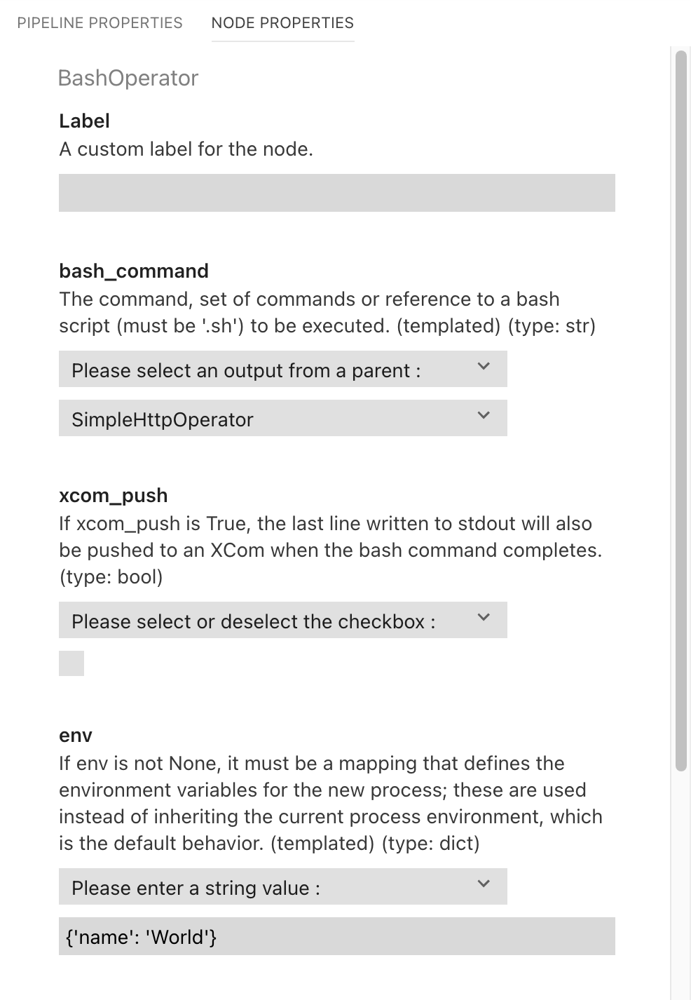
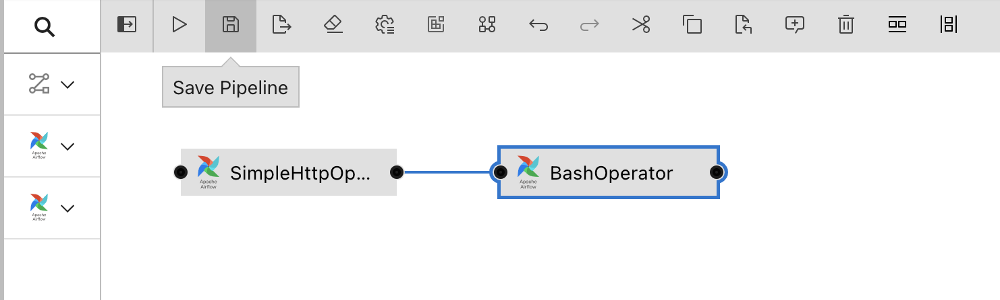

<!--

Copyright 2021-2022 Elyra Authors

Licensed under the Apache License, Version 2.0 (the "License");
you may not use this file except in compliance with the License.
You may obtain a copy of the License at

http://www.apache.org/licenses/LICENSE-2.0

Unless required by applicable law or agreed to in writing, software
distributed under the License is distributed on an "AS IS" BASIS,
WITHOUT WARRANTIES OR CONDITIONS OF ANY KIND, either express or implied.
See the License for the specific language governing permissions and
limitations under the License.

-->
## Run pipelines on Apache Airflow

A [pipeline](https://elyra.readthedocs.io/en/stable/user_guide/pipelines.html) comprises one or more nodes that are (in many cases) connected to define execution dependencies. Each node is implemented by a [component](https://elyra.readthedocs.io/en/stable/user_guide/pipeline-components.html) and typically performs only a single task, such as loading data, processing data, training a model, or sending an email. Note that in Apache Airflow components are called operators, but for the sake of consistency the Elyra documentation refers to them as components.

A _generic pipeline_ comprises nodes that are implemented using _generic components_. Elyra includes generic components that run Jupyter notebooks, Python scripts, and R scripts. Generic components have in common that they are supported in every Elyra pipelines runtime environment: local/JupyterLab, Kubeflow Pipelines, and Apache Airflow.

The following tutorials cover generic pipelines:
- [Introduction to generic pipelines](../introduction-to-generic-pipelines)
- [Run generic pipelines on Kubeflow Pipelines](../run-generic-pipelines-on-kubeflow-pipelines)
- [Run generic pipelines on Apache Airflow](../run-generic-pipelines-on-apache-airflow)

A _runtime specific_ pipeline comprises nodes that are implemented using generic components or _custom components_. Custom components are runtime specific and user-provided.

In this intermediate tutorial you will learn how to add [Apache Airflow components](https://airflow.apache.org/docs/apache-airflow/stable/howto/operator/index.html) to Elyra and how to utilize them in pipelines.


The features described in this tutorial require Elyra v3.3 or later. The tutorial instructions were last updated using Elyra v3.3.0 and Airflow v1.10.12.

### Prerequisites

- [JupyterLab 3.x with Elyra extension v3.3 (or later) installed](https://elyra.readthedocs.io/en/stable/getting_started/installation.html).
- Access to an [Apache Airflow deployment](https://elyra.readthedocs.io/en/stable/recipes/configure-airflow-as-a-runtime.html).

Some familiarity with Apache Airflow and Apache Airflow operators (i.e., components) is required to complete the tutorial. If you are new to Elyra, please review the [_Run generic pipelines on Apache Airflow_](../run-generic-pipelines-on-apache-airflow) tutorial. It introduces concepts and tasks that are used in this tutorial, but not explained here to avoid content duplication.

#### Information to collect before starting

Collect the following information for your Apache Airflow installation:
- API endpoint, e.g. `http://your-airflow-webserver:port`
- GitHub API endpoint, e.g. `https://api.github.com` if the repository is hosted on GitHub
- GitHub DAG repository name, e.g. `your-git-org/your-dag-repo`
- GitHub DAG repository branch, e.g. `main`
- GitHub access token, e.g. `4d79206e616d6520697320426f6e642e204a616d657320426f6e64`.

Detailed instructions for setting up a DAG repository and generating an access token can be found in [the User Guide](https://elyra.readthedocs.io/en/latest/recipes/configure-airflow-as-a-runtime.html#setting-up-a-dag-repository-on-github).

Elyra utilizes S3-compatible cloud storage to make data available to notebooks and scripts while they are executed. Any kind of S3-based cloud storage should work (e.g. IBM Cloud Object Storage or Minio) as long as it can be accessed from the machine where JupyterLab/Elyra is running and from the Apache Airflow cluster. 

Collect the following information:
- S3 compatible object storage endpoint, e.g. `http://minio-service.kubernetes:9000`
- S3 object storage username, e.g. `minio`
- S3 object storage password, e.g. `minio123`
- S3 object storage bucket, e.g. `pipelines-artifacts`

### Tutorial setup

#### Create a runtime configuration

Create a runtime environment configuration for your Apache Airflow installation as described in [_Runtime configuration_ topic in the User Guide](https://elyra.readthedocs.io/en/stable/user_guide/runtime-conf.html) or the [_Run generic pipelines on Apache Airflow_ tutorial](https://github.com/elyra-ai/examples/tree/master/pipelines/run-generic-pipelines-on-apache-airflow).

#### Create a new connection id
One of the components used in this tutorial utilizes a pre-configured `http_conn_id`, which is set in the completed tutorial pipeline to `http_github`.

You must configure a connection with that id in order for the pipeline run to succeed:
 1. Open the Airflow GUI
 1. Navigate to `Admin` > `Connections`
 1. Create a new connection, specifying the following:
    - Connection id:   `http_github`
    - Connection type: `HTTP`
    - Host: `https://api.github.com`
    - Schema: `https` 
    

    
#### Clone the tutorial artifacts
This tutorial uses the `run-pipelines-on-apache-airflow` sample from the https://github.com/elyra-ai/examples GitHub repository.

1. Launch JupyterLab.
1. Open the _Git clone_ wizard (Git > Clone A Repository).
1. Enter `https://github.com/elyra-ai/examples.git` as _Clone URI_.
1. In the _File Browser_ navigate to `examples/pipelines/run-pipelines-on-apache-airflow`.

   
   
   The cloned repository includes the resources needed to run the tutorial pipeline.

You are ready to start the tutorial.

### Add custom components via component catalog

Elyra stores information about custom components in component catalogs and makes those components available in the Visual Pipeline Editor's palette. Components can be grouped into categories to make them more easily discoverable.



Custom components are [managed in the JupyterLab UI](https://elyra.readthedocs.io/en/stable/user_guide/pipeline-components.html#managing-pipeline-components) using the **Pipeline components** panel. You access the panel by:
   - Selecting `Component Catalogs` from the JupyterLab sidebar.
   - Clicking the `Open Component Catalogs` button in the pipeline editor toolbar.
   - Searching for `Manage URL Component Catalog`, `Manage Filesystem Component Catalog`, or `Manage Directory Component Catalog` in the [JupyterLab command palette](https://jupyterlab.readthedocs.io/en/stable/user/commands.html).

> You can automate the component management tasks using the [`elyra-metadata install component-catalogs` CLI command](https://elyra.readthedocs.io/en/stable/user_guide/pipeline-components.html#managing-custom-components-using-the-elyra-cli). 

The component catalog can access component specifications that are stored in the local file system or on remote sources. In this tutorial 'local' refers to the file system where JupyterLab/Elyra is running. For example, if you've installed Elyra on your laptop, local refers to the laptop's file system. If you've installed Elyra in a container image, local refers to the container's file system.

#### Add components from local sources

To add component specifications to the registry that are stored locally:

1. Open the **Component Catalogs** panel using one of the approaches mentioned above.

   

1. Add a new component catalog entry by clicking `+` and selecting `New Filesystem Component Catalog`.
   The first tutorial component you are adding to the registry makes an HTTP Request.
1. Enter or select the following:
   - **Name**: `request data`
   - **Description**: `request data from GitHub API`
   - **Runtime**: `APACHE_AIRFLOW`
   - **Category Names**: `request`
   - **Base Directory**: `.../examples/pipelines/run-pipelines-on-apache-airflow/components` (on Windows: `...\examples\pipelines\run-pipelines-on-apache-airflow\components`)
   - **Paths**: `http_operator.py` 

     > Note: Replace `...` with the path to the location where you cloned the Elyra example repository. The base directory can include `~` or `~user` to indicate the home directory. The concatenation of the base directory and each path must resolve to an absolute path or Elyra won't be able to locate the specified files.
1. Save the component catalog entry.

There are two approaches you can take to add multiple _related_ component specifications to the registry:
- Specify multiple `Path` values.
- Store the related specifications in the same directory and use the `Directory` **catalog type**. Elyra searches the directory for specifications. Check the **Include Subdirectories** checkbox to search subdirectories for component specifications as well.

> Refer to the descriptions in the linked documentation topic for details and examples. 

Locally stored component specifications have the advantage that they can be quickly loaded by Elyra. If you need to share component specifications with other users, ensure that the given **Paths** are the same relative paths across installations. The **Base Directory** can differ across installations.

#### Add components from remote sources

The `URL Component Catalog` type only supports web resources that can be downloaded using HTTP `GET` requests, which don't require authentication.

To add component specifications to the catalog that are stored remotely:

1. Open the **Pipeline components** panel.
1. Add a second component catalog entry, this time selecting `New URL Component Catalog` from the dropdown menu. This component executes a given bash command.
1. Enter the following information:
   - **Name**: `run command`
   - **Description**: `run a shell script`
   - **Runtime**: `APACHE_AIRFLOW`
   - **Category Names**: `scripting`
   - **URLs**: `https://raw.githubusercontent.com/elyra-ai/examples/master/pipelines/run-pipelines-on-apache-airflow/components/bash_operator.py`
1. Save the component catalog entry.

The catalog is now populated with the custom components you'll use in the tutorial pipeline.



Next, you'll create a pipeline that uses the registered components.

### Create a pipeline

The pipeline editor's palette is populated from the component catalog. To use the components in a pipeline:

1. Open the JupyterLab Launcher.
1. Click the `Apache Airflow pipeline editor` tile to open the Visual Pipeline Editor for Apache Airflow.
1. Expand the palette panel. Two new component categories are displayed (`request` and `scripting`), each containing one component entry that you added:

   
   
1. Drag the '`SimpleHttpOperator`' component onto the canvas to create the first pipeline node.
1. Drag the '`BashOperator`' component onto the canvas to create a second node and connect the two nodes as shown.

   

   The components require inputs, which you need to specify to render the nodes functional.
1. Open the properties of the '`SimpleHttpOperator`' node:
      - select the node and expand (&#8612;) the properties slideout panel on the right OR
      - right click on the node and select `Open Properties`
    
   


1. Review the node properties. The properties are a combination of Elyra metadata and information that was extracted from the [component's specification](https://raw.githubusercontent.com/elyra-ai/examples/master/pipelines/run-pipelines-on-apache-airflow/components/http_operator.py):
   ```
   class SimpleHttpOperator(BaseOperator):
    """
    Calls an endpoint on an HTTP system to execute an action

    :param http_conn_id: The connection to run the operator against
    :type http_conn_id: str
    :param endpoint: The relative part of the full url. (templated)
    :type endpoint: str
    :param method: The HTTP method to use, default = "POST"
    :type method: str
    :param data: The data to pass. POST-data in POST/PUT and params
        in the URL for a GET request. (templated)
    :type data: For POST/PUT, depends on the content-type parameter,
        for GET a dictionary of key/value string pairs
    :param headers: The HTTP headers to be added to the GET request
    :type headers: a dictionary of string key/value pairs
    :param response_check: A check against the 'requests' response object.
        Returns True for 'pass' and False otherwise.
   ...
   ```

   The Elyra properties include:

   - `Label`: If specified, the value is used as node name in the pipeline instead of the component name. Use labels to resolve naming conflicts that might arise if a pipeline uses the same component multiple times. For example, if a pipeline utilizes  the '`SimpleHttpOperator`' component to make two requests, you could override the node name by specifying '`HTTP Request 1`' and '`HTTP Request 2`' as labels:

      

   - `Component source`: A read-only property that identifies source information about a component, such as the type of catalog in which this component is stored and any unique identifying information. This property is displayed for informational purposes only.

1. Enter the following values for the `SimpleHttpOperator` properties:
   
   - `endpoint` -> `/repos/elyra-ai/examples/contents/pipelines/run-pipelines-on-apache-airflow/resources/command.txt`
      - Since this property is implicity required in the operator specification file, the pipeline editor displays a red bar and enforces the constraint. 
      
      
     
   - `method` -> `GET`
   - `data` -> `{"ref": "master"}`
      - This information tells the GitHub API which branch to use when returning the file contents
   - `headers` -> `{"Accept": "Accept:application/vnd.github.v3.raw"}`
      - This tells the API what format the returned data should be
      - In this case, we want the raw GitHub file
   - `xcom_push` -> check the checkbox for `True`
      - This property indicates to Airflow whether we want to pass on the output of this component (in this case, the file contents of our requested file) to be accessed by later nodes in the pipeline
   - `http_conn_id` -> `http_github`
      - This property tells the Airflow instance which `Connection` id it will use as the API base URL
      - This property was configured in the above section, [_Create a new connection id_ ](#create-a-new-connection-id)


   


1. Open the properties of the '`BashOperator`' node. The [specification for the underlying component looks as follows](https://raw.githubusercontent.com/elyra-ai/examples/master/pipelines/run-pipelines-on-apache-airflow/components/bash_operator.py):
   ```
   class BashOperator(BaseOperator):
    """
    Execute a Bash script, command or set of commands.
    ...

    :param bash_command: The command, set of commands or reference to a
        bash script (must be '.sh') to be executed. (templated)
    :type bash_command: str
    :param xcom_push: If xcom_push is True, the last line written to stdout
        will also be pushed to an XCom when the bash command completes.
    :type xcom_push: bool
    :param env: If env is not None, it must be a mapping that defines the
        environment variables for the new process; these are used instead
        of inheriting the current process environment, which is the default
        behavior. (templated)
    :type env: dict
    :param output_encoding: Output encoding of bash command
    :type output_encoding: str
   ...
   ```
   
   In Apache Airflow, the output of a component can be used as a property value for any downstream node. (A downstream node is a node that is connected to and executed after the node in question). The pipeline editor renders a selector widget for each property that allows you to choose between two options as a value:
   
   - A raw value, entered manually
     
   - The output of an upstream node
    
   

1. The contents of the file requested by the `SimpleHttpOperator` are made available to the downstream nodes in the pipeline by setting the `xcom_push` property of `SimpleHttpOperator` to True. This output value will be the input of the `bash_command` property. Choose '`Please select an output from a parent :`' from the dropdown menu and select `SimpleHttpOperator`. 
   
   Since the '`BashOperator`' node is only connected to one upstream node ('`SimpleHttpOperator`'), you can only choose the output of that node. If a node is connected to multiple upstream nodes, you can choose the output of any of these nodes as input, as shown in this example:

    

   The output of the `EmailOperator` node cannot be consumed by the '`SlackAPIPostOperator`' node, because the two nodes are not connected in this pipeline. Ensure that the `xcom_push` property is set to `True` for any node whose output will be used in a subsequent node.
   
   > Elyra intentionally only supports explicit dependencies between nodes to avoid potential usability issues.
   
1. The bash command requested and returned by the `SimpleHttpOperator` node includes an environment variable called `name` that can be set by the `env` property of the `BashOperator`. Enter `{'name': 'World'}` as the value for this field. You can use another name in place of 'World', if desired.

   

1. Save the pipeline.

   

1. Rename the pipeline to something meaningful:
   - right click on the pipeline editor tab and select `Rename Pipeline...` OR
   - in the JupyterLab File Browser right click on the `.pipeline` file

   

Next, let's run the pipeline!

### Run the pipeline
    
To run the pipeline on Apache Airflow:
    
1. Click the `Run` button in the pipeline editor toolbar.

   

   > You can also use the `elyra-pipeline submit` command to [run the pipeline using the command line interface](https://elyra.readthedocs.io/en/stable/user_guide/command-line-interface.html#running-pipelines).

1. In the _run pipeline_ dialog select the runtime configuration you created [when you completed the setup for this tutorial](#create-a-runtime-configuration).

1. Start the pipeline run and monitor its execution progress in the Apache Airflow Dashboard.

   

    You can also click the `GitHub Repository` link to inspect the DAG, if desired.

1. Review the logs of each pipeline task. The output of the '`BashOperator`' node should show that `Hello, World` is printed in the log.

   

   > Elyra does not store custom component outputs in cloud storage. (It only does this for [generic pipeline components](https://elyra.readthedocs.io/en/stable/user_guide/pipeline-components.html#overview).) To access the output of custom components use the Apache Airflow Dashboard.

### Next steps

This concludes the _Run pipelines on Apache Airflow_ tutorial. You've learned how to 
- add custom Apache Airflow components to the Elyra component registry
- create a pipeline from custom components

### Resources

- [_Creating a custom operator_ topic in the Apache Airflow documentation](https://airflow.apache.org/docs/apache-airflow/stable/howto/custom-operator.html)
- [_Pipelines_ topic in the Elyra _User Guide_](https://elyra.readthedocs.io/en/stable/user_guide/pipelines.html)
- [_Pipeline components_ topic in the Elyra _User Guide_](https://elyra.readthedocs.io/en/stable/user_guide/pipeline-components.html)
- [_Component catalog connector marketplace_](https://github.com/elyra-ai/examples/tree/master/component-catalog-connectors)
- [_Requirements and best practices for custom pipeline components_ topic in the Elyra _User Guide_](https://elyra.readthedocs.io/en/stable/user_guide/best-practices-custom-pipeline-components.html)
- [_Command line interface_ topic in the Elyra _User Guide_](https://elyra.readthedocs.io/en/stable/user_guide/command-line-interface.html)
