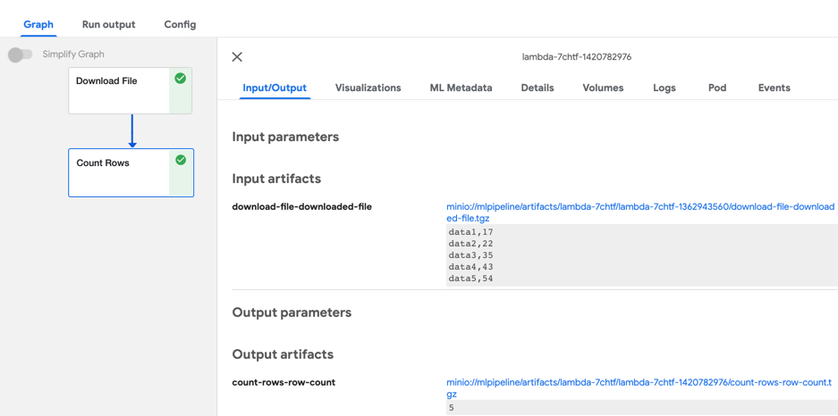

<!--

Copyright 2021-2021 Elyra Authors

Licensed under the Apache License, Version 2.0 (the "License");
you may not use this file except in compliance with the License.
You may obtain a copy of the License at

http://www.apache.org/licenses/LICENSE-2.0

Unless required by applicable law or agreed to in writing, software
distributed under the License is distributed on an "AS IS" BASIS,
WITHOUT WARRANTIES OR CONDITIONS OF ANY KIND, either express or implied.
See the License for the specific language governing permissions and
limitations under the License.

-->
## Run pipelines on Kubeflow Pipelines

A [pipeline](https://elyra.readthedocs.io/en/stable/user_guide/pipelines.html) comprises one or more nodes that are (in many cases) connected to define execution dependencies. Each node is implemented by a [component](https://elyra.readthedocs.io/en/stable/user_guide/pipeline-components.html) and typically performs only a single task, such as loading data, processing data, training a model, or sending an email.

A _generic pipeline_ comprises nodes that are implemented using _generic components_. Elyra includes generic components that run Jupyter notebooks, Python scripts, and R scripts. Generic components have in common that they are supported in every Elyra pipelines runtime environment: local/JupyterLab, Kubeflow Pipelines, and Apache Airflow.

The following tutorials cover generic pipelines:
- [Introduction to generic pipelines](../introduction-to-generic-pipelines)
- [Run generic pipelines on Kubeflow Pipelines](../run-generic-pipelines-on-kubeflow-pipelines)
- [Run generic pipelines on Apache Airflow](../run-generic-pipelines-on-apache-airflow)

A _runtime specific_ pipeline comprises nodes that are implemented using generic components or _custom components_. Custom components are runtime specific and user-provided.

In this intermediate tutorial you will learn how to add [Kubeflow Pipelines components](https://www.kubeflow.org/docs/components/pipelines/sdk/component-development/) to Elyra and how to utilize them in pipelines.


The features described in this tutorial require Elyra v3.3 or later. The tutorial instructions were last updated using Elyra v3.3.0 and Kubeflow v1.4.1.

> Elyra does not support [Kubeflow Pipelines Python function-based components](https://www.kubeflow.org/docs/components/pipelines/sdk/python-function-components/).

### Prerequisites

- [JupyterLab 3.x with the Elyra extension v3.3 (or later) installed](https://elyra.readthedocs.io/en/stable/getting_started/installation.html).
- Access to a [local](https://elyra.readthedocs.io/en/stable/recipes/deploying-kubeflow-locally-for-dev.html) or [cloud](https://www.kubeflow.org/docs/started/installing-kubeflow/) Kubeflow Pipelines deployment.

Some familiarity with Kubeflow Pipelines and Kubeflow Pipelines components is required to complete the tutorial. If you are new to Elyra, please review the [_Run generic pipelines on Kubeflow Pipelines_](../run-generic-pipelines-on-kubeflow-pipelines) tutorial. It introduces concepts and tasks that are used in this tutorial, but not explained here to avoid content duplication.

#### Information to collect before starting

Collect the following information for your Kubeflow Pipelines installation:
- API endpoint, e.g. `http://kubernetes-service.ibm.com/pipeline`
- Namespace, for a multi-user, auth-enabled Kubeflow installation, e.g. `mynamespace`
- Username, for a multi-user, auth-enabled Kubeflow installation, e.g. `jdoe`
- Password, for a multi-user, auth-enabled Kubeflow installation, e.g. `passw0rd`
- Workflow engine type, which should be `Argo` or `Tekton`. Contact your administrator if you are unsure which engine your deployment utilizes.

Elyra utilizes S3-compatible cloud storage to make data available to notebooks and scripts while they are executed. Any kind of S3-based cloud storage should work (e.g. IBM Cloud Object Storage or Minio) as long as it can be accessed from the machine where JupyterLab/Elyra is running and from the Kubeflow Pipelines cluster. 

Collect the following information:
- S3 compatible object storage endpoint, e.g. `http://minio-service.kubernetes:9000`
- S3 object storage username, e.g. `minio`
- S3 object storage password, e.g. `minio123`
- S3 object storage bucket, e.g. `pipelines-artifacts`

### Tutorial setup

#### Create a runtime configuration

Create a runtime environment configuration for your Kubeflow Pipelines installation as described in [_Runtime configuration_ topic in the User Guide](https://elyra.readthedocs.io/en/stable/user_guide/runtime-conf.html) or the [_Run generic pipelines on Kubeflow Pipelines_ tutorial](https://github.com/elyra-ai/examples/tree/master/pipelines/run-generic-pipelines-on-kubeflow-pipelines#define-a-runtime-environment-configuration).

#### Clone the tutorial artifacts
This tutorial uses the `run-pipelines-on-kubeflow-pipelines` sample from the https://github.com/elyra-ai/examples GitHub repository.

1. Launch JupyterLab.
1. Open the _Git clone_ wizard (Git > Clone A Repository).
1. Enter `https://github.com/elyra-ai/examples.git` as _Clone URI_.
1. In the _File Browser_ navigate to `examples/pipelines/run-pipelines-on-kubeflow-pipelines`.

   
   
   The cloned repository includes a set of custom component specifications that you will add to the Elyra component catalog and use in a pipeline. The '`Download File`' component downloads a file from a web resource. The '`Count Rows`' component counts the lines in a row-based file.

You are ready to start the tutorial.

### Add custom components via component catalog

Elyra stores information about custom components in [component catalogs](https://elyra.readthedocs.io/en/stable/user_guide/pipeline-components.html#component-catalogs) and makes those components available in the Visual Pipeline Editor's palette. Components can be grouped into categories to make them more easily discoverable.


Custom components are [managed in the JupyterLab UI](https://elyra.readthedocs.io/en/stable/user_guide/pipeline-components.html#managing-pipeline-components) using the **Pipeline components** panel. You access the panel by:
   - Selecting `Pipeline Components` from the JupyterLab sidebar.
   - Clicking the `Open Pipeline Components` button in the pipeline editor toolbar.
   - Searching for `Manage pipeline components` in the [JupyterLab command palette](https://jupyterlab.readthedocs.io/en/stable/user/commands.html).

> You can automate the component management tasks using the [`elyra-metadata install component-catalog` CLI command](https://elyra.readthedocs.io/en/stable/user_guide/pipeline-components.html#managing-custom-components-using-the-elyra-cli). 

The component catalog can access component specifications that are stored in the local file system or on remote sources. In this tutorial, 'local' refers to the file system where JupyterLab/Elyra is running. For example, if you've installed Elyra on your laptop, 'local' refers to the laptop's file system. If you've installed Elyra in a container image, 'local' refers to the container's file system.

#### Add components from the local file system

Use locally stored component specifications if there is no (immediate) need to share the specification with other users, such as during initial development.

1. Open the **Pipeline components** panel using one of the approaches mentioned above.

   

   Note that the palette may already [include a few example components](https://github.com/elyra-ai/examples/tree/master/component-catalog-connectors/kfp-example-components-connector), depending on how you installed Elyra. These examples are included for illustrative purposes to help you get started but you won't use them in this tutorial.
1. Add a new component catalog entry by clicking `+` and `New Filesystem Component Catalog`.
   The first tutorial component you are adding counts the number of rows in a file.
1. Enter or select the following:
   - **Name**: `analyze data`
   - **Description**: `analyze row based data`
   - **Runtime Type**: `KUBEFLOW_PIPELINES`
   - **Category**: `analyze`
   - **Base Directory**: 
`.../examples/pipelines/run-pipelines-on-kubeflow-pipelines/components` (on Windows: `...\examples\pipelines\run-pipelines-on-kubeflow-pipelines\components`)

     > Note: Replace `...` with the path to the location where you cloned the Elyra example repository. The base directory can include `~` or `~user` to indicate the home directory. The concatenation of the base directory and each path must resolve to an absolute path or Elyra won't be able to locate the specified files.
   - **Paths**: `count-rows.yaml`
1. Save the component catalog entry.

There are two approaches you can take to add multiple related component specifications:

- Specify multiple **Path** values.
- Store the related specifications in the same directory and use the `Directory` **catalog type**. Elyra searches the directory for specifications. Check the **Include Subdirectories** checkbox to search subdirectories for component specifications as well.

> Refer to the descriptions in the linked documentation topic for details and examples.

Locally stored component specifications have the advantage that they can be quickly loaded by Elyra. If you need to share component specifications with other users, ensure that the given **Paths** are the same relative paths across installations. The **Base Directory** can differ across installations.

#### Add components from web sources

The `URL Component Catalog` type only supports web resources that can be downloaded using HTTP `GET` requests, which don't require authentication.

To add component specifications to the catalog that are stored on the web:

1. Open the **Pipeline components** panel.
1. Add a new component catalog entry by clicking `+` and `New URL Component Catalog`.
1. Enter the following information:
   - **Name**: `download data`
   - **Description**: `download data from public sources`
   - **Runtime**: `KUBEFLOW_PIPELINES`
   - **Category Names**: `download`
   - **URLs**: `https://raw.githubusercontent.com/elyra-ai/examples/master/pipelines/run-pipelines-on-kubeflow-pipelines/components/download-file.yaml`
1. Save the component catalog entry.

The catalog is now populated with the custom components you'll use in the tutorial pipeline.


Next, you'll create a pipeline that uses the registered components.

### Create a pipeline

The pipeline editor's palette is populated from the component catalog. To use the components in a pipeline:

1. Open the JupyterLab Launcher.
1. Click the `Kubeflow Pipeline Editor` tile to open the Visual Pipeline Editor for Kubeflow Pipelines.
1. Expand the palette panel. Two new component categories are displayed (`analyze` and `download`), each containing one component entry that you added:

   
   
1. Drag the '`Download File`' component onto the canvas to create the first pipeline node.
1. Drag the '`Count Rows`' component onto the canvas to create a second node and connect the two nodes as shown.

   

   Note that each node is tagged with an error icon. Hover over each node and review the error messages. The components require inputs, which you need to specify to render the nodes functional.
1. Open the properties of the '`Download File`' node:
      - select the node and expand (&#8612;) the properties slideout panel on the right OR
      - right click on the node and select `Open Properties` 

   

1. Review the node properties. The properties are a combination of Elyra metadata and information that was extracted from the [component's specification](https://raw.githubusercontent.com/elyra-ai/examples/master/pipelines/run-pipelines-on-kubeflow-pipelines/components/download-file.yaml):
   ```
   name: Download File
   description: Downloads a file from a public HTTP/S URL using a GET request.

   inputs:
   - {name: URL, type: String, optional: false, description: 'File URL'}

   outputs:
   - {name: downloaded file, type: String, description: 'Content of the downloaded file.'}
   ...
   ```

   The component requires one input ('`URL`') and produces one output ('`downloaded file`'), which is the content of the downloaded file.

   The node properties include:

   - `Label` (Elyra property): If specified, the value is used as node name in the pipeline instead of the component name. Use labels to resolve naming conflicts that might arise if a pipeline uses the same component multiple times. For example, if a pipeline utilizes  the '`Download File`' component to download two files, you could override the node name by specifying '`Download labels`' and '`Download observations`' as labels:

      

   - `URL`: This is a required input of the '`Download File`' component:
      ```
      inputs:
      - {name: URL, type: String, optional: false, description: 'File URL'}
      ```
      The pipeline editor renders component inputs using an editable widget, such as a text box, and, if one was provided, displays input's description. Since this property is marked in the specification as required, the pipeline editor enforces the constraint.

       
   - `downloaded file`: This is an output of the '`Download File`' component:
      ```
      outputs:
      - {name: downloaded file, type: String, description: 'Content of the downloaded file.'}
      ```
      The pipeline editor renders outputs using read-only widgets.

      

   - `Component source`: A read-only property that identifies the location from where the component specification was loaded. This property is displayed for informational purposes only.   

1. Enter `https://raw.githubusercontent.com/elyra-ai/examples/master/pipelines/run-pipelines-on-kubeflow-pipelines/data/data.csv` as value for the `URL` input property.

   

1. Open the properties of the '`Count Rows`' node. The [specification for the underlying component looks as follows](https://raw.githubusercontent.com/elyra-ai/examples/master/pipelines/run-pipelines-on-kubeflow-pipelines/components/count-rows.yaml):
   ```
   name: Count Rows
   description: Count the number of rows in the input file

   inputs:
   - {name: input file, type: String, optional: false, description: 'Row-based file to be analyzed'}

   outputs:
   - {name: row count, type: String, description: 'Number of rows in the input file.'}
   ...
   implementation:
   ...
    command: [
      python3, 
      /pipelines/component/src/count-rows.py,
      --input-file-path,
      {inputPath: input file},
   ...
   ```

   The component requires one input ('`input file`') and produces one output ('`row count`'), which is the number of rows in this file.

   Note that Kubeflow Pipelines passes the input to the implementing Python script as a file handle:

   ```
   --input-file-path,
      {inputPath: input file},
   ```   

   The pipeline editor takes this as a cue and renders a selector widget for this input:

   
   
   Since the '`Count Rows`' node is only connected to one upstream node ('`Download File`'), you can only choose from the outputs of that node. (An upstream node is a node that is connected to and executed before the node in question.) 

   If a node is connected to multiple upstream nodes, you can choose the output of any of these nodes as input, as shown in this example:

    

   The output of the second download node ('`Download Metadata`') cannot be consumed by the '`Count Rows`' node, because the two nodes are not connected in this pipeline. 
   
   > Elyra intentionally only supports explicit dependencies between nodes to avoid potential usability issues.

1. Save the pipeline.

   

1. Rename the pipeline to something meaningful:
   - right click on the pipeline editor tab and select `Rename Pipeline...` OR
   - in the JupyterLab File Browser right click on the `.pipeline` file

   

Next, you run the pipeline.

### Run the pipeline
    
To run the pipeline on Kubeflow Pipelines:
    
1. Click the `Run` button in the pipeline editor toolbar.

   

   > You can also use the `elyra-pipeline submit` command to [run the pipeline using the command line interface](https://elyra.readthedocs.io/en/stable/user_guide/command-line-interface.html#running-pipelines).

1. In the _run pipeline_ dialog select the runtime configuration you created [when you completed the setup for this tutorial](#create-a-runtime-configuration).

1. Start the pipeline run and monitor the execution progress in the Kubeflow Pipelines Central Dashboard.

   

1. Review the outputs of each pipeline task. The output of the '`Count Rows`' node should indicate that the downloaded file contains five rows.

   

   > Elyra does not store custom component outputs in cloud storage. (It only does this for [generic pipeline components](https://elyra.readthedocs.io/en/stable/user_guide/pipeline-components.html#overview).) To access the output of custom components use the Kubeflow Central Dashboard.

### Next steps

This concludes the _Run pipelines on Kubeflow Pipelines_ tutorial. You've learned how to 
- add custom Kubeflow Pipelines components
- create a pipeline from custom components

### Resources

- [_Building Components_ topic in the Kubeflow Pipelines documentation](https://www.kubeflow.org/docs/components/pipelines/sdk/component-development/)
- [_Pipelines_ topic in the Elyra _User Guide_](https://elyra.readthedocs.io/en/stable/user_guide/pipelines.html)
- [_Pipeline components_ topic in the Elyra _User Guide_](https://elyra.readthedocs.io/en/stable/user_guide/pipeline-components.html)
- [_Requirements and best practices for custom pipeline components_ topic in the Elyra _User Guide_](https://elyra.readthedocs.io/en/stable/user_guide/best-practices-custom-pipeline-components.html)
- [Example component catalog connectors](https://github.com/elyra-ai/examples/tree/master/component-catalog-connectors)
- [Component catalog directory](https://github.com/elyra-ai/examples/blob/master/component-catalog-connectors/connector-directory.md)
- [_Command line interface_ topic in the Elyra _User Guide_](https://elyra.readthedocs.io/en/stable/user_guide/command-line-interface.html)
