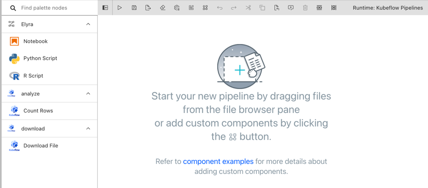
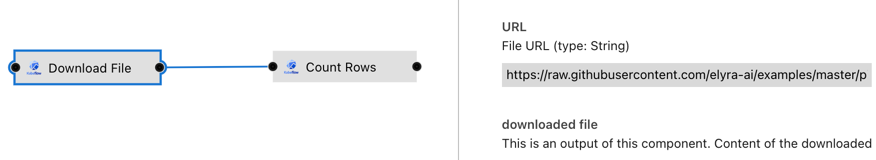
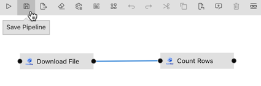

<!--

Copyright 2021-2021 Elyra Authors

Licensed under the Apache License, Version 2.0 (the "License");
you may not use this file except in compliance with the License.
You may obtain a copy of the License at

http://www.apache.org/licenses/LICENSE-2.0

Unless required by applicable law or agreed to in writing, software
distributed under the License is distributed on an "AS IS" BASIS,
WITHOUT WARRANTIES OR CONDITIONS OF ANY KIND, either express or implied.
See the License for the specific language governing permissions and
limitations under the License.

-->
## Run pipelines on Kubeflow Pipelines

A [pipeline](https://elyra.readthedocs.io/en/stable/user_guide/pipelines.html) comprises one or more nodes that are (in many cases) connected to define execution dependencies. Each node is implemented by a [component](https://elyra.readthedocs.io/en/stable/user_guide/pipeline-components.html) and typically performs only a single task, such as loading data, processing data, training a model, or sending an email.

A _generic pipeline_ comprises nodes that are implemented using _generic components_. In the current release Elyra includes generic components that run Jupyter notebooks, Python scripts, and R scripts. Generic components have in common that they are supported in every Elyra pipelines runtime environment: local/JupyterLab, Kubeflow Pipelines, and Apache Airflow.

The [_Introduction to generic pipelines_ tutorial](../introduction-to-generic-pipelines) outlines how to create a generic pipeline using the Visual Pipeline Editor. 

In this intermediate tutorial you will learn how to add custom Kubeflow components to Elyra and how to utilize them in pipelines.

The tutorial instructions were last updated using Elyra v3.2.0 and Kubeflow v1.3.0.

### Prerequisites

- [JupyterLab 3.x with the Elyra extension v3.x (or newer) installed](https://elyra.readthedocs.io/en/stable/getting_started/installation.html).
- Access to a [local](https://elyra.readthedocs.io/en/stable/recipes/deploying-kubeflow-locally-for-dev.html) or [cloud](https://www.kubeflow.org/docs/started/cloud/) Kubeflow Pipelines deployment.

#### Information to collect before starting

Collect the following information for your Kubeflow Pipelines installation:
- API endpoint, e.g. `http://kubernetes-service.ibm.com/pipeline`
- Namespace, for a multi-user, auth-enabled Kubeflow installation, e.g. `mynamespace`
- Username, for a multi-user, auth-enabled Kubeflow installation, e.g. `jdoe`
- Password, for a multi-user, auth-enabled Kubeflow installation, e.g. `passw0rd`
- Workflow engine type, which should be `Argo` or `Tekton`. Contact your administrator if you are unsure which engine your deployment utilizes.

Elyra utilizes S3-compatible cloud storage to make data available to notebooks and scripts while they are executed. Any kind of cloud storage should work (e.g. IBM Cloud Object Storage or Minio) as long as it can be accessed from the machine where JupyterLab is running and from the Kubeflow Pipelines cluster. Collect the following information:
- S3 compatible object storage endpoint, e.g. `http://minio-service.kubernetes:9000`
- S3 object storage username, e.g. `minio`
- S3 object storage password, e.g. `minio123`
- S3 object storage bucket, e.g. `pipelines-artifacts`

### Setup

#### Create a runtime configuration

Create a runtime environment configuration for your Kubeflow Pipelines installation as described in [_Runtime configuration_ topic in the User Guide](https://elyra.readthedocs.io/en/stable/user_guide/runtime-conf.html) or the [_Run generic pipelines on Kubeflow Pipelines_ tutorial](https://github.com/elyra-ai/examples/tree/master/pipelines/run-generic-pipelines-on-kubeflow-pipelines#define-a-runtime-environment-configuration) tutorial.

#### Clone the tutorial artifacts
This tutorial uses the `run-pipelines-on-kubeflow-pipelines` sample from the https://github.com/elyra-ai/examples GitHub repository.

1. Launch JupyterLab.
1. Open the _Git clone_ wizard (Git > Clone A Repository).
1. Enter `https://github.com/elyra-ai/examples.git` as _Clone URI_.
1. In the _File Browser_ navigate to `examples/pipelines/run-pipelines-on-kubeflow-pipelines`.

   
   
   The cloned repository includes a set of custom component specifications that you will add to the Elyra component registry and use in a pipeline. The `Download File` component downloads a file from a web resource. The `Count Lines` component counts the lines in a row-based file. For illustrative purposes the source for both tutorial components is also included in the `components` directory.

You are ready to start the tutorial.

### Add custom components to the registry

Custom components are [managed in the JupyterLab UI](https://elyra.readthedocs.io/en/latest/user_guide/pipeline-components.html#managing-pipeline-components) using the **Pipeline components** panel. You access the panel by:
   - Selecting `Pipeline Components` from the JupyterLab sidebar.
   - Clicking the `Open Pipeline Components` button in the pipeline editor toolbar.
   - Searching for `Manage pipeline components` in the [JupyterLab command palette](https://jupyterlab.readthedocs.io/en/stable/user/commands.html).

> To automate the tasks in this tutorial use the [`elyra-metadata install component-registry` CLI command](https://elyra.readthedocs.io/en/latest/user_guide/pipeline-components.html#managing-custom-components-using-the-elyra-cli). 

Elyra can utilize component specifications that are stored in the local file system or remotely. In this tutorial 'local' refers to the file system where JupyterLab/Elyra is running. For example, if you've installed Elyra on your laptop, local refers to the laptop's file system. If you've installed Elyra in a container image, local refers to the container's file system.

#### Add components from local sources

Elyra can load component specifications from the local file system. Use locally stored component specifications if there is no (immediate) need to share the specification with other users, such as during initial development. To add local component specifications:

1. Open the **Pipeline components** panel.
   
1. Add a new component registry entry by clicking `+`.
1. Enter the following information:
   - **Name**: `analyze data`
   - **Description**: `analyze row based data`
   - **Category**: `analyze`
   - **Runtime**: `kfp`
   - **Location type**: `Filename`
   - **Path**: `.../examples/pipelines/run-pipelines-on-kubeflow-pipelines/components/count-lines.yaml` (on Windows: `...\examples\pipelines\run-pipelines-on-kubeflow-pipelines\components\count-lines.yaml`)

     > Note: Replace `...` with the path to the location where you cloned the Elyra example repository. Path entries must specified as absolute paths or Elyra won't be able to locate the specified files.
1. Save the component registry entry.

There are two approaches you can take to add multiple _related_ component specifications to the registry:
- Specify multiple `Path` values.
- Store the related specifications in the same directory and use the `Directory` **Location type**. Elyra searches the directory (but not subdirectories) for specifications.

Locally stored component specifications have the advantage that they can be quickly loaded by Elyra. However, they cannot be shared between multiple JupyterLab deployments and therefore require duplication. If you need to share component specifications consider storing them on a remote source.

#### Add components from remote sources

Remote component sources make it possible in Elyra to share component specifications between users that use different JupyterLab deployments. Initially Elyra only supports web resources that can be downloaded using HTTP `GET` requests that don't require authentication.   

1. Open the **Pipeline components** panel.
1. Add a new component registry.
1. Enter the following information:
   - **Name**: `download data`
   - **Description**: `download data from public sources`
   - **Category**: `download`
   - **Runtime**: `kfp`
   - **Location type**: `URL`
   - **Path**: `https://raw.githubusercontent.com/elyra-ai/examples/master/pipelines/run-pipelines-on-kubeflow-pipelines/components/download-file.yaml`
1. Save the component registry entry.

Next, you'll create a pipeline that utilizes the registered components.

### Create a pipeline

Once components were added to the registry you can access them from the pipeline editor's palette. 

1. Open the JupyterLab Launcher.
1. Click the `Kubeflow pipeline editor` tile to open the Visual Pipeline Editor for Kubeflow Pipelines.
1. Expand the palette panel. Two new component categories are displayed (`analyze` and `download`), each containing one component entry:
   
1. Drag the `Download File` component onto the canvas to create the first pipeline node.
1. Drag the `Count Lines` component onto the canvas to create a second node and connect the two nodes as shown.
   
   Note the problem icons that are attached to each node. Hover over each node and review the error messages: they require input values that you need to specify.
1. Open the properties of the `Download File` node (right click on the node and select `Open Properties`).
1. This node requires one input - the URL of a file. Enter `https://raw.githubusercontent.com/elyra-ai/examples/master/pipelines/run-pipelines-on-kubeflow-pipelines/data/data.csv`.
   
1. Open the properties of the `Count Lines` node.
1. This node also requires one input - the content of a file to be analyzed. TODO (requires [PR 2094](https://github.com/elyra-ai/elyra/pull/2094))
   

1. Save the pipeline.
   

1. Rename the pipeline to something meaningful. (Right click on the pipeline editor tab and select `Rename Pipeline...`.)
   

Next, you run the pipeline.

### Run the pipeline

1. Click the `Run` button in the pipeline editor toolbar.
   
1. In the run dialog select the runtime configuration you've created when you've completed the setup for this tutorial.
1. Run the pipeline and monitor it's execution progress in the Kubeflow Pipelines Central Dashboard.
   

### Next steps

This concludes the _Run pipelines on Kubeflow Pipelines_ tutorial. You've learned how to 
- add custom Kubeflow Pipelines components to the Elyra component registry
- create a pipeline from custom components

### Resources

- [_Pipelines_ topic in the Elyra _User Guide_](https://elyra.readthedocs.io/en/stable/user_guide/pipelines.html)
- [_Pipeline components_ topic in the Elyra _User Guide_](https://elyra.readthedocs.io/en/stable/user_guide/pipeline-components.html)