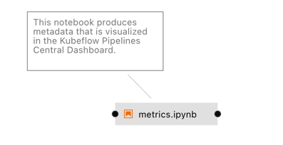

<!--

Copyright 2018-2020 Elyra Authors

Licensed under the Apache License, Version 2.0 (the "License");
you may not use this file except in compliance with the License.
You may obtain a copy of the License at

http://www.apache.org/licenses/LICENSE-2.0

Unless required by applicable law or agreed to in writing, software
distributed under the License is distributed on an "AS IS" BASIS,
WITHOUT WARRANTIES OR CONDITIONS OF ANY KIND, either express or implied.
See the License for the specific language governing permissions and
limitations under the License.

-->
##  Visualize output from notebooks or scripts in the Kubeflow Pipelines Central Dashboard

This pipeline illustrates how to visualize metrics in the Kubeflow Pipelines Central Dashboard, as described in the [Visualizing output from your notebooks or Python scripts in the Kubeflow Pipelines UI](https://elyra.readthedocs.io/en/latest/recipes/visualizing-output-in-the-kfp-ui.html) topic in the Elyra documentation.

For this pipeline to produce the expected results 
- Open `visualize_metrics.pipeline` in JupyterLab with the Elyra version 3 or later installed
- Review the `metrics.ipynb` notebook
- Run the pipeline on Kubeflow Pipelines 1.0 or later